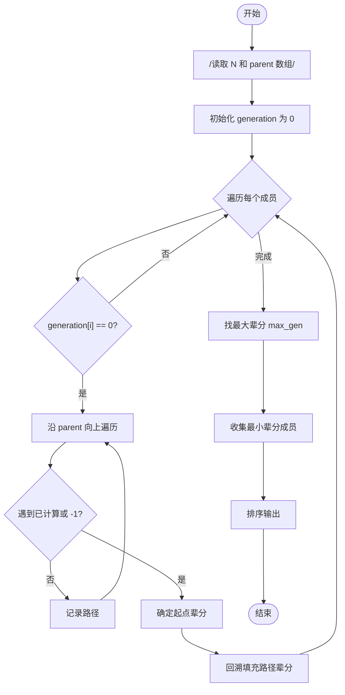
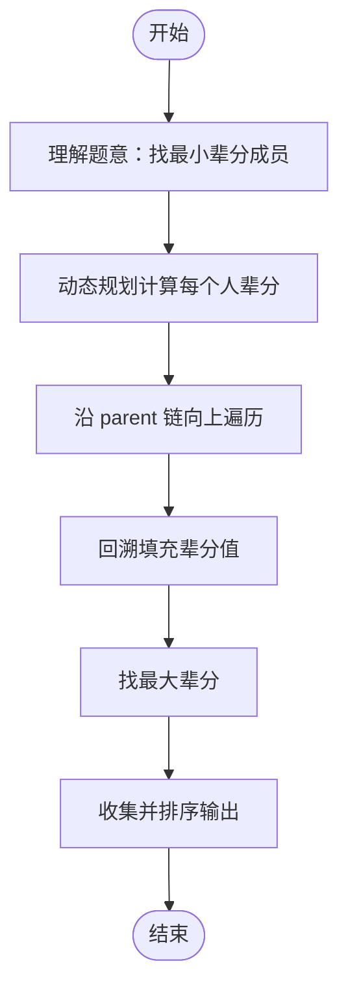

# L2-026 - 小字辈（25 分）

- **时间限制**: 400 ms
- **内存限制**: 65536 KB
- **代码长度限制**: 16 KB

---

## 题目描述

本题给定一个庞大家族的家谱，要请你给出最小一辈的名单。

### 输入格式:

输入在第一行给出家族人口总数 N（不超过 100 000 的正整数） —— 简单起见，我们把家族成员从 1 到 N 编号。随后第二行给出 N 个编号，其中第 i 个编号对应第 i 位成员的父/母。家谱中辈分最高的老祖宗对应的父/母编号为 -1。一行中的数字间以空格分隔。

### 输出格式:

首先输出最小的辈分（老祖宗的辈分为 1，以下逐级递增）。然后在第二行按递增顺序输出辈分最小的成员的编号。编号间以一个空格分隔，行首尾不得有多余空格。

### 输入样例:

```in
9
2 6 5 5 -1 5 6 4 7
```

### 输出样例:

```out
4
1 9
```

## 示例

### 示例 1

**输入:**
```
9
2 6 5 5 -1 5 6 4 7
```

**输出:**
```
4
1 9
```

---

## 题目详解

### 一、解题思路

本题的 R 实现采用以下方法：读取标准输入后建立题目所需的数据结构，按约束执行核心计算并输出结果。

### 二、代码流程说明

1. 读取并解析标准输入，转换为题目所需的数据结构。
2. 按题意执行核心算法，维护中间状态并处理边界情况。
3. 整理计算结果，按照输出格式生成答案。

### 三、代码实现

```r
# 实现原理：读取标准输入后建立题目所需的数据结构，按约束执行核心计算并输出结果。
# 处理流程：读取输入 -> 建立状态 -> 执行算法 -> 按题目格式输出。
# 关键变量和循环均直接对应题目中的数据、约束或操作。

# 读取并解析标准输入。
v <- scan(file = "stdin", quiet = TRUE)
n <- v[1]
par <- v[2:(n + 1)]
root <- which(par == -1)
dep <- rep(0, n)
dep[root] <- 1
q <- root
# 按题目约束遍历当前数据，更新中间状态。
while (length(q)) {
    u <- q[1]
    q <- q[-1]
    ch <- which(par == u)
    dep[ch] <- dep[u] + 1
    q <- c(q, ch)
}
d <- max(dep)
# 严格按照题目规定的输出格式输出答案。
cat(d, "\n", sep = "")
cat(paste(which(dep == d), collapse = " "), "\n", sep = "")
```

### 四、代码流程图



### 五、解题流程图



### 六、常见易错点

- 题目描述、输入格式、输出格式和输入输出样例必须保持原文不变。
- R 语言下标从 1 开始，注意编号转换和空输入边界。
- 输出时严格保留题目规定的空格、换行和小数位数。
