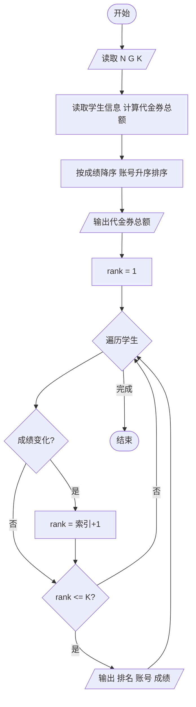
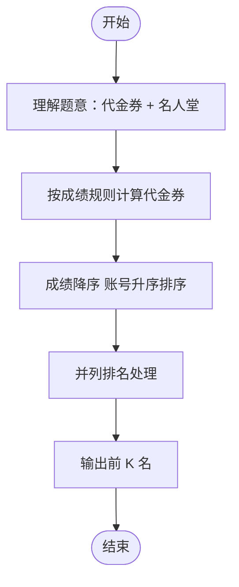

# L2-027 - 名人堂与代金券（25 分）

- **时间限制**: 150 ms
- **内存限制**: 65536 KB
- **代码长度限制**: 16 KB

---

## 题目描述

对于在中国大学MOOC（http://www.icourse163.org/ ）学习“数据结构”课程的学生，想要获得一张合格证书，总评成绩必须达到 60 分及以上，并且有另加福利：总评分在 [G, 100] 区间内者，可以得到 50 元 PAT 代金券；在 [60, G) 区间内者，可以得到 20 元PAT代金券。全国考点通用，一年有效。同时任课老师还会把总评成绩前 K 名的学生列入课程“名人堂”。本题就请你编写程序，帮助老师列出名人堂的学生，并统计一共发出了面值多少元的 PAT 代金券。

### 输入格式:

输入在第一行给出 3 个整数，分别是 N（不超过 10 000 的正整数，为学生总数）、G（在 (60,100) 区间内的整数，为题面中描述的代金券等级分界线）、K（不超过 100 且不超过 N 的正整数，为进入名人堂的最低名次）。接下来 N 行，每行给出一位学生的账号（长度不超过15位、不带空格的字符串）和总评成绩（区间 [0, 100] 内的整数），其间以空格分隔。题目保证没有重复的账号。

### 输出格式:

首先在一行中输出发出的 PAT 代金券的总面值。然后按总评成绩非升序输出进入名人堂的学生的名次、账号和成绩，其间以 1 个空格分隔。需要注意的是：成绩相同的学生享有并列的排名，排名并列时，按账号的字母序升序输出。

### 输入样例:

```in
10 80 5
cy@zju.edu.cn 78
cy@pat-edu.com 87
1001@qq.com 65
uh-oh@163.com 96
test@126.com 39
anyone@qq.com 87
zoe@mit.edu 80
jack@ucla.edu 88
bob@cmu.edu 80
ken@163.com 70
```

### 输出样例:

```out
360
1 uh-oh@163.com 96
2 jack@ucla.edu 88
3 anyone@qq.com 87
3 cy@pat-edu.com 87
5 bob@cmu.edu 80
5 zoe@mit.edu 80
```

## 示例

### 示例 1

**输入:**
```
10 80 5
cy@zju.edu.cn 78
cy@pat-edu.com 87
1001@qq.com 65
uh-oh@163.com 96
test@126.com 39
anyone@qq.com 87
zoe@mit.edu 80
jack@ucla.edu 88
bob@cmu.edu 80
ken@163.com 70
```

**输出:**
```
360
1 uh-oh@163.com 96
2 jack@ucla.edu 88
3 anyone@qq.com 87
3 cy@pat-edu.com 87
5 bob@cmu.edu 80
5 zoe@mit.edu 80
```

---

## 题目详解

### 一、解题思路

本题的 R 实现采用以下方法：先解析数据并按题目规定的关键字排序，再进行顺序处理和格式化输出。

### 二、代码流程说明

1. 读取并解析标准输入，转换为题目所需的数据结构。
2. 按题意执行核心算法，维护中间状态并处理边界情况。
3. 整理计算结果，按照输出格式生成答案。

### 三、代码实现

```r
# 实现原理：先解析数据并按题目规定的关键字排序，再进行顺序处理和格式化输出。
# 处理流程：读取输入 -> 建立状态 -> 执行算法 -> 按题目格式输出。
# 关键变量和循环均直接对应题目中的数据、约束或操作。

# 读取并解析标准输入。
v <- scan(file = "stdin", what = "", quiet = TRUE)
n <- as.integer(v[1])
goal <- as.integer(v[2])
k <- as.integer(v[3])
p <- 4
id <- character(n)
sc <- integer(n)
# 按题目约束遍历当前数据，更新中间状态。
for (i in seq_len(n)) {
    id[i] <- v[p]
    sc[i] <- as.integer(v[p + 1])
    p <- p + 2
}
coupon <- sum(ifelse(sc >= goal, 50, ifelse(sc >= 60, 20, 0)))
# 执行核心排序、状态转移或选择逻辑。
ord <- order(-sc, id)
rank_ord <- integer(n)
rank_ord[1] <- 1L
if (n > 1L) for (j in 2:n) rank_ord[j] <- if (sc[ord[j]] == sc[ord[j -
    1]]) rank_ord[j - 1L] else j
rank <- integer(n)
rank[ord] <- rank_ord
sel <- ord[rank_ord <= k]
# 严格按照题目规定的输出格式输出答案。
cat(coupon, "\n", sep = "")
for (i in sel) cat(paste(rank[i], id[i], sc[i]), "\n", sep = "")
```

### 四、代码流程图



### 五、解题流程图



### 六、常见易错点

- 题目描述、输入格式、输出格式和输入输出样例必须保持原文不变。
- R 语言下标从 1 开始，注意编号转换和空输入边界。
- 输出时严格保留题目规定的空格、换行和小数位数。
