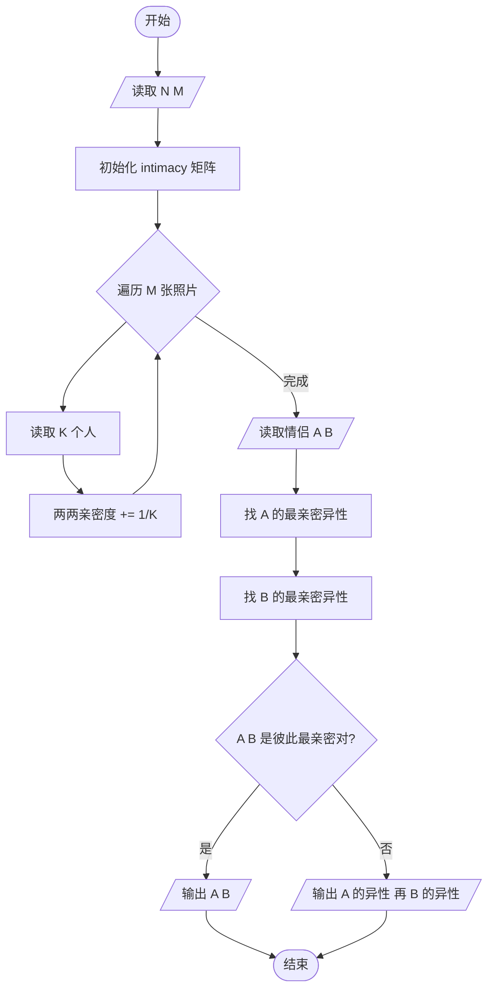
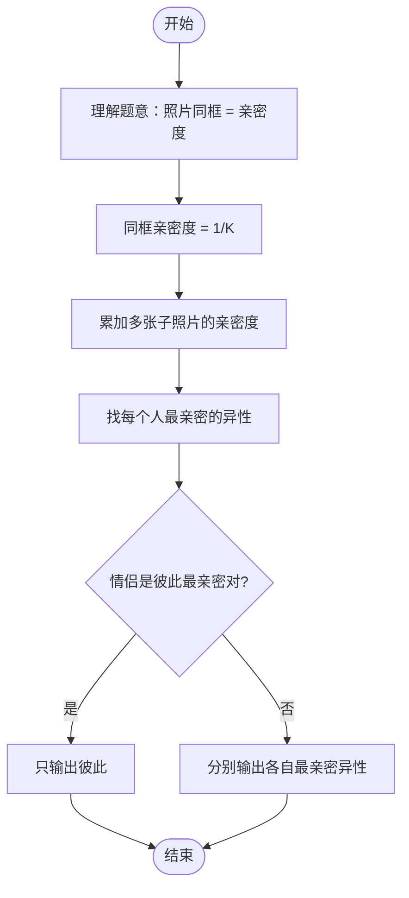

# L2-028 - 秀恩爱分得快（25 分）

- **时间限制**: 500 ms
- **内存限制**: 65536 KB
- **代码长度限制**: 16 KB

---

## 题目描述

古人云：秀恩爱，分得快。

互联网上每天都有大量人发布大量照片，我们通过分析这些照片，可以分析人与人之间的亲密度。如果一张照片上出现了 K 个人，这些人两两间的亲密度就被定义为 1/K。任意两个人如果同时出现在若干张照片里，他们之间的亲密度就是所有这些同框照片对应的亲密度之和。下面给定一批照片，请你分析一对给定的情侣，看看他们分别有没有亲密度更高的异性朋友？

### 输入格式:

输入在第一行给出 2 个正整数：N（不超过1000，为总人数——简单起见，我们把所有人从 0 到 N-1 编号。为了区分性别，我们用编号前的负号表示女性）和 M（不超过1000，为照片总数）。随后 M 行，每行给出一张照片的信息，格式如下：

```
K P[1] ... P[K]
```

其中 K（$$\le$$ 500）是该照片中出现的人数，P[1] ~ P[K] 就是这些人的编号。最后一行给出一对异性情侣的编号 A 和 B。同行数字以空格分隔。题目保证每个人只有一个性别，并且不会在同一张照片里出现多次。

### 输出格式:

首先输出 `A PA`，其中 `PA` 是与 `A` 最亲密的异性。如果 `PA` 不唯一，则按他们编号的绝对值递增输出；然后类似地输出 `B PB`。但如果 `A` 和 `B` 正是彼此亲密度最高的一对，则只输出他们的编号，无论是否还有其他人并列。

### 输入样例 1:

```in
10 4
4 -1 2 -3 4
4 2 -3 -5 -6
3 2 4 -5
3 -6 0 2
-3 2
```

### 输出样例 1:

```out
-3 2
2 -5
2 -6
```

### 输入样例 2:

```in
4 4
4 -1 2 -3 0
2 0 -3
2 2 -3
2 -1 2 
-3 2
```

### 输出样例 2:

```out
-3 2
```

## 示例

### 示例 1

**输入:**
```
10 4
4 -1 2 -3 4
4 2 -3 -5 -6
3 2 4 -5
3 -6 0 2
-3 2
```

**输出:**
```
-3 2
2 -5
2 -6
```

### 示例 2

**输入:**
```
4 4
4 -1 2 -3 0
2 0 -3
2 2 -3
2 -1 2 
-3 2
```

**输出:**
```
-3 2
```

---

## 题目详解

### 一、解题思路

本题的 R 实现采用以下方法：将输入组织为矩阵或表格，按题目定义的行、列和状态关系完成计算。

### 二、代码流程说明

1. 读取并解析标准输入，转换为题目所需的数据结构。
2. 按题意执行核心算法，维护中间状态并处理边界情况。
3. 整理计算结果，按照输出格式生成答案。

### 三、代码实现

```r
# 实现原理：将输入组织为矩阵或表格，按题目定义的行、列和状态关系完成计算。
# 处理流程：读取输入 -> 建立状态 -> 执行算法 -> 按题目格式输出。
# 关键变量和循环均直接对应题目中的数据、约束或操作。

# 读取并解析标准输入。
v <- scan(file = "stdin", what = "", quiet = TRUE)
n <- as.integer(v[1])
m <- as.integer(v[2])
p <- 3
g <- matrix(0, n, n)
sgn <- integer(n)
# 按题目约束遍历当前数据，更新中间状态。
for (i in seq_len(m)) {
    z <- as.integer(v[p])
    p <- p + 1
    ids <- integer(z)
    for (j in seq_len(z)) {
        s <- v[p]
        p <- p + 1
        ids[j] <- abs(as.integer(s)) + 1
        sgn[ids[j]] <- if (substr(s, 1, 1) == "-")
            -1
        else 1
    }
    for (a in seq_len(z)) for (b in seq_len(a - 1)) {
        g[ids[a], ids[b]] <- g[ids[a], ids[b]] + 1/z
        g[ids[b], ids[a]] <- g[ids[b], ids[a]] + 1/z
    }
}
a <- abs(as.integer(v[p])) + 1
b <- abs(as.integer(v[p + 1])) + 1
best <- function(x) {
    z <- which(sgn != 0 & sgn != sgn[x])
    mx <- if (length(z))
        max(g[x, z])
    else 0
    list(mx, z[abs(g[x, z] - mx) < 1e-09])
}
la <- best(a)
lb <- best(b)
fmt <- function(x) paste0(if (sgn[x] < 0) "-" else "", x - 1)
# 严格按照题目规定的输出格式输出答案。
if (b %in% la[[2]] && a %in% lb[[2]]) cat(paste(v[p], v[p + 1]), "\n",
    sep = "") else {
    for (x in la[[2]]) cat(paste(v[p], fmt(x)), "\n", sep = "")
    for (x in lb[[2]]) cat(paste(v[p + 1], fmt(x)), "\n", sep = "")
}
```

### 四、代码流程图



### 五、解题流程图



### 六、常见易错点

- 题目描述、输入格式、输出格式和输入输出样例必须保持原文不变。
- R 语言下标从 1 开始，注意编号转换和空输入边界。
- 输出时严格保留题目规定的空格、换行和小数位数。
