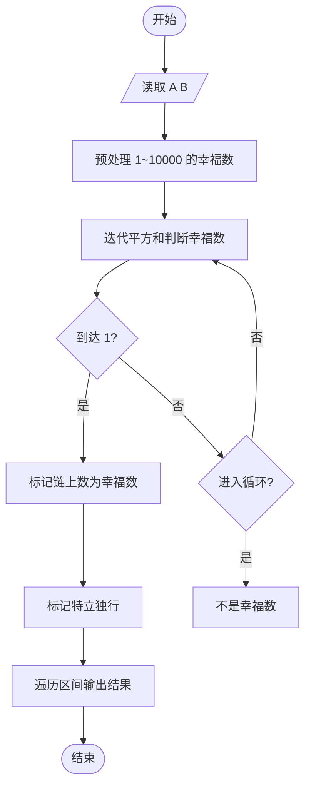
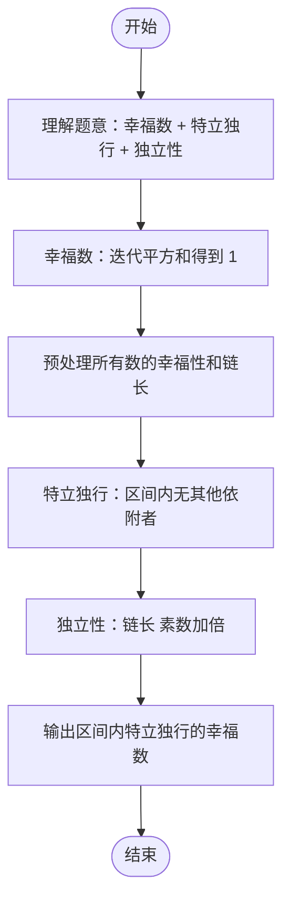

# L2-029 - 特立独行的幸福（25 分）

- **时间限制**: 400 ms
- **内存限制**: 65536 KB
- **代码长度限制**: 16 KB

---

## 题目描述

对一个十进制数的各位数字做一次平方和，称作一次迭代。如果一个十进制数能通过若干次迭代得到 1，就称该数为幸福数。1 是一个幸福数。此外，例如 19 经过 1 次迭代得到 82，2 次迭代后得到 68，3 次迭代后得到 100，最后得到 1。则 19 就是幸福数。显然，在一个幸福数迭代到 1 的过程中经过的数字都是幸福数，它们的幸福是依附于初始数字的。例如 82、68、100 的幸福是依附于 19 的。而一个**特立独行**的幸福数，是在一个有限的区间内不依附于任何其它数字的；其**独立性**就是依附于它的的幸福数的个数。如果这个数还是个素数，则其独立性加倍。例如 19 在区间[1, 100] 内就是一个特立独行的幸福数，其独立性为 $$2\times 4 = 8$$。

另一方面，如果一个大于1的数字经过数次迭代后进入了死循环，那这个数就不幸福。例如 29 迭代得到 85、89、145、42、20、4、16、37、58、89、…… 可见 89 到 58 形成了死循环，所以 29 就不幸福。

本题就要求你编写程序，列出给定区间内的所有特立独行的幸福数和它的独立性。

### 输入格式:

输入在第一行给出闭区间的两个端点：$$1<A<B\le 10^4$$。

### 输出格式:

按递增顺序列出给定闭区间 $$[A,B]$$ 内的所有特立独行的幸福数和它的独立性。每对数字占一行，数字间以 1 个空格分隔。

如果区间内没有幸福数，则在一行中输出 `SAD`。

### 输入样例 1:

```in
10 40
```

### 输出样例 1:

```out
19 8
23 6
28 3
31 4
32 3
```

**注意：**样例中，10、13 也都是幸福数，但它们分别依附于其他数字（如 23、31 等等），所以不输出。其它数字虽然其实也依附于其它幸福数，但因为那些数字不在给定区间 [10, 40] 内，所以它们在给定区间内是特立独行的幸福数。

### 输入样例 2:

```in
110 120
```

### 输出样例 2:

```out
SAD
```

## 示例

### 示例 1

**输入:**
```
10 40
```

**输出:**
```
19 8
23 6
28 3
31 4
32 3
```

### 示例 2

**输入:**
```
110 120
```

**输出:**
```
SAD
```

---

## 题目详解

### 一、解题思路

本题的 R 实现采用以下方法：反复计算各位数字平方和判断数字是否幸福，并统计区间内幸福数被其他区间数字到达的次数，筛出独立幸福数。

### 二、代码流程说明

1. 读取并解析标准输入，转换为题目所需的数据结构。
2. 按题意执行核心算法，维护中间状态并处理边界情况。
3. 整理计算结果，按照输出格式生成答案。

### 三、代码实现

```r
# 实现原理：反复计算各位数字平方和判断数字是否幸福，并统计区间内幸福数被其他区间数字到达的次数，筛出独立幸福数。
# 处理流程：读取输入 -> 建立状态 -> 执行算法 -> 按题目格式输出。
# 关键变量和循环均直接对应题目中的数据、约束或操作。

# 读取并解析标准输入。
v <- scan(file = "stdin", quiet = TRUE)
a <- v[1]
b <- v[2]
nextv <- function(x) sum(as.integer(strsplit(as.character(x),
    "")[[1]])^2)
happy <- function(x) {
    seen <- integer()
    chain <- integer()
# 按题目约束遍历当前数据，更新中间状态。
    while (x != 1 && !x %in% seen) {
        seen <- c(seen, x)
        x <- nextv(x)
        chain <- c(chain, x)
    }
    c(x == 1, chain)
}
info <- lapply(a:b, happy)
dep <- integer(length(info))
for (i in seq_along(info)) if (info[[i]][1] == 1) for (y in info[[i]][-1]) if (y >=
    a && y <= b && info[[y - a + 1]][1] == 1) dep[y - a + 1] <- 1
out <- character()
prime <- function(x) {
    x > 1 && all(x%%seq_len(floor(sqrt(x)))[-1] != 0)
}
for (i in seq_along(info)) if (info[[i]][1] == 1 && !dep[i]) out <- c(out,
    paste(a + i - 1, length(info[[i]]) - 1 + if (prime(a + i -
        1)) length(info[[i]]) - 1 else 0))
# 严格按照题目规定的输出格式输出答案。
if (length(out)) cat(paste(out, collapse = "\n"), "\n", sep = "") else cat("SAD\n")
```

### 四、代码流程图



### 五、解题流程图



### 六、常见易错点

- 题目描述、输入格式、输出格式和输入输出样例必须保持原文不变。
- R 语言下标从 1 开始，注意编号转换和空输入边界。
- 输出时严格保留题目规定的空格、换行和小数位数。
