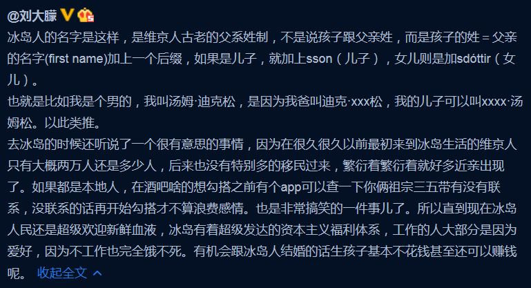
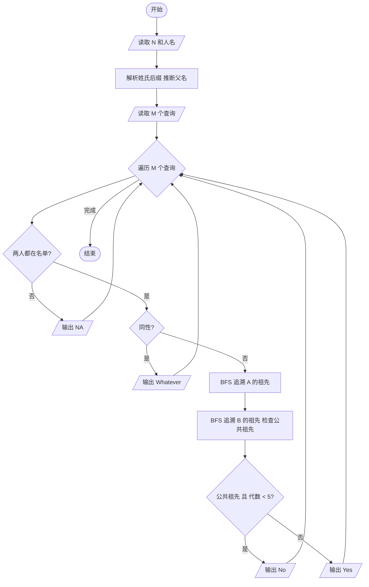
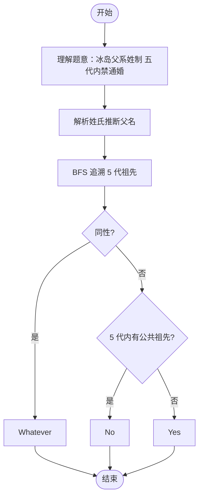

# L2-030 - 冰岛人（25 分）

- **时间限制**: 400 ms
- **内存限制**: 65536 KB
- **代码长度限制**: 16 KB

---

## 题目描述

2018年世界杯，冰岛队因1:1平了强大的阿根廷队而一战成名。好事者发现冰岛人的名字后面似乎都有个“松”（son），于是有网友科普如下：



冰岛人沿用的是维京人古老的父系姓制，孩子的姓等于父亲的名加后缀，如果是儿子就加 sson，女儿则加 sdottir。因为冰岛人口较少，为避免近亲繁衍，本地人交往前先用个 App 查一下两人祖宗若干代有无联系。本题就请你实现这个 App 的功能。

### 输入格式:

输入首先在第一行给出一个正整数 $$N$$（$$1 < N \le 10^5$$），为当地人口数。随后 $$N$$ 行，每行给出一个人名，格式为：`名 姓（带性别后缀）`，两个字符串均由不超过 20 个小写的英文字母组成。维京人后裔是可以通过姓的后缀判断其性别的，其他人则是在姓的后面加 `m` 表示男性、`f` 表示女性。题目保证给出的每个维京家族的起源人都是男性。

随后一行给出正整数 $$M$$，为查询数量。随后 $$M$$ 行，每行给出一对人名，格式为：`名1 姓1 名2 姓2`。注意：这里的`姓`是不带后缀的。四个字符串均由不超过 20 个小写的英文字母组成。

题目保证不存在两个人是同名的。

### 输出格式:

对每一个查询，根据结果在一行内显示以下信息：

- 若两人为异性，且五代以内无公共祖先，则输出 `Yes`；
- 若两人为异性，但五代以内（不包括第五代）有公共祖先，则输出 `No`；
- 若两人为同性，则输出 `Whatever`；
- 若有一人不在名单内，则输出 `NA`。

所谓“五代以内无公共祖先”是指两人的公共祖先（如果存在的话）必须比任何一方的曾祖父辈分高。

### 输入样例:

```in
15
chris smithm
adam smithm
bob adamsson
jack chrissson
bill chrissson
mike jacksson
steve billsson
tim mikesson
april mikesdottir
eric stevesson
tracy timsdottir
james ericsson
patrick jacksson
robin patricksson
will robinsson
6
tracy tim james eric
will robin tracy tim
april mike steve bill
bob adam eric steve
tracy tim tracy tim
x man april mikes
```

### 输出样例:

```out
Yes
No
No
Whatever
Whatever
NA
```

## 示例

### 示例 1

**输入:**
```
15
chris smithm
adam smithm
bob adamsson
jack chrissson
bill chrissson
mike jacksson
steve billsson
tim mikesson
april mikesdottir
eric stevesson
tracy timsdottir
james ericsson
patrick jacksson
robin patricksson
will robinsson
6
tracy tim james eric
will robin tracy tim
april mike steve bill
bob adam eric steve
tracy tim tracy tim
x man april mikes
```

**输出:**
```
Yes
No
No
Whatever
Whatever
NA
```

---

## 题目详解

### 一、解题思路

本题的 R 实现采用以下方法：读取标准输入后建立题目所需的数据结构，按约束执行核心计算并输出结果。

### 二、代码流程说明

1. 读取并解析标准输入，转换为题目所需的数据结构。
2. 按题意执行核心算法，维护中间状态并处理边界情况。
3. 整理计算结果，按照输出格式生成答案。

### 三、代码实现

```r
# 实现原理：读取标准输入后建立题目所需的数据结构，按约束执行核心计算并输出结果。
# 处理流程：读取输入 -> 建立状态 -> 执行算法 -> 按题目格式输出。
# 关键变量和循环均直接对应题目中的数据、约束或操作。

# 读取并解析标准输入。
v <- scan(file = "stdin", what = "", quiet = TRUE)
n <- as.integer(v[1])
p <- 2
people <- list()
parents <- list()
# 按题目约束遍历当前数据，更新中间状态。
for (i in seq_len(n)) {
    first <- v[p]
    last <- v[p + 1]
    p <- p + 2
    if (grepl("sson$", last)) {
        base <- substr(last, 1, nchar(last) - 4)
        gender <- "M"
        par <- base
    }
    else if (grepl("sdottir$", last)) {
        base <- substr(last, 1, nchar(last) - 7)
        gender <- "F"
        par <- base
    }
    else if (grepl("m$", last)) {
        base <- substr(last, 1, nchar(last) - 1)
        gender <- "M"
        par <- NA
    }
    else {
        base <- substr(last, 1, nchar(last) - 1)
        gender <- "F"
        par <- NA
    }
    people[[paste(first, base, sep = ",")]] <- c(gender, par)
    parents[[first]] <- par
}
anc <- function(x) {
    z <- x
    seen <- x
    for (i in 1:3) {
        p <- parents[[x]]
        if (is.null(p) || is.na(p) || p %in% seen)
            break
        seen <- c(seen, p)
        x <- p
    }
    seen
}
q <- as.integer(v[p])
p <- p + 1
for (i in seq_len(q)) {
    f1 <- v[p]
    b1 <- v[p + 1]
    f2 <- v[p + 2]
    b2 <- v[p + 3]
    p <- p + 4
    x <- people[[paste(f1, b1, sep = ",")]]
    y <- people[[paste(f2, b2, sep = ",")]]
    if (is.null(x) || is.null(y))
# 严格按照题目规定的输出格式输出答案。
        cat("NA\n")
    else if (x[1] == y[1])
        cat("Whatever\n")
    else cat(if (length(intersect(anc(f1), anc(f2))) == 0)
        "Yes"
    else "No", "\n", sep = "")
}
```

### 四、代码流程图



### 五、解题流程图



### 六、常见易错点

- 题目描述、输入格式、输出格式和输入输出样例必须保持原文不变。
- R 语言下标从 1 开始，注意编号转换和空输入边界。
- 输出时严格保留题目规定的空格、换行和小数位数。
