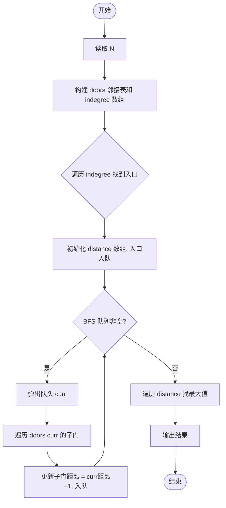
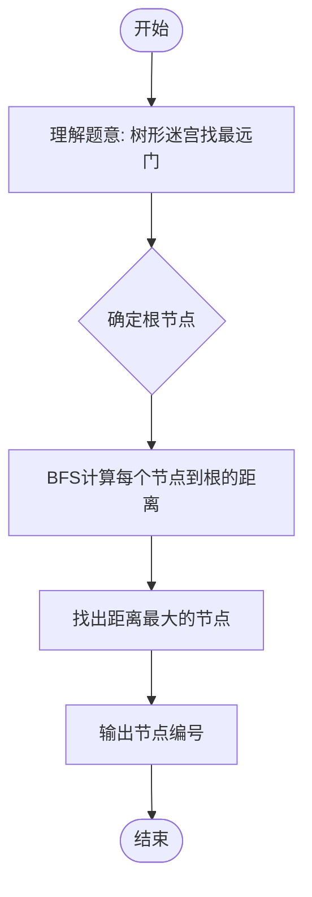

# L2-031 - 深入虎穴（25 分）

- **时间限制**: 400 ms
- **内存限制**: 65536 KB
- **代码长度限制**: 16 KB

---

## 题目描述

著名的王牌间谍 007 需要执行一次任务，获取敌方的机密情报。已知情报藏在一个地下迷宫里，迷宫只有一个入口，里面有很多条通路，每条路通向一扇门。每一扇门背后或者是一个房间，或者又有很多条路，同样是每条路通向一扇门…… 他的手里有一张表格，是其他间谍帮他收集到的情报，他们记下了每扇门的编号，以及这扇门背后的每一条通路所到达的门的编号。007 发现不存在两条路通向同一扇门。

内线告诉他，情报就藏在迷宫的最深处。但是这个迷宫太大了，他需要你的帮助 —— 请编程帮他找出距离入口最远的那扇门。

### 输入格式:

输入首先在一行中给出正整数 $$N$$（$$< 10^5$$），是门的数量。最后 $$N$$ 行，第 $$i$$ 行（$$1\le i \le N$$）按以下格式描述编号为 $$i$$ 的那扇门背后能通向的门：

```
K D[1] D[2] ... D[K]
```
其中 `K` 是通道的数量，其后是每扇门的编号。

### 输出格式:

在一行中输出距离入口最远的那扇门的编号。题目保证这样的结果是唯一的。

### 输入样例:

```in
13
3 2 3 4
2 5 6
1 7
1 8
1 9
0
2 11 10
1 13
0
0
1 12
0
0
```

### 输出样例:

```out
12
```

## 示例

### 示例 1

**输入:**
```
13
3 2 3 4
2 5 6
1 7
1 8
1 9
0
2 11 10
1 13
0
0
1 12
0
0
```

**输出:**
```
12
```

---

## 题目详解

### 一、解题思路

本题的 R 实现采用以下方法：读取标准输入后建立题目所需的数据结构，按约束执行核心计算并输出结果。

### 二、代码流程说明

1. 读取并解析标准输入，转换为题目所需的数据结构。
2. 按题意执行核心算法，维护中间状态并处理边界情况。
3. 整理计算结果，按照输出格式生成答案。

### 三、代码实现

```r
# 实现原理：读取标准输入后建立题目所需的数据结构，按约束执行核心计算并输出结果。
# 处理流程：读取输入 -> 建立状态 -> 执行算法 -> 按题目格式输出。
# 关键变量和循环均直接对应题目中的数据、约束或操作。

# 读取并解析标准输入。
v <- scan(file = "stdin", quiet = TRUE)
n <- v[1]
p <- 2
g <- vector("list", n + 1L)
has <- integer(n + 1L)
# 按题目约束遍历当前数据，更新中间状态。
for (i in seq_len(n)) {
    z <- v[p]
    p <- p + 1
    g[[i]] <- if (z)
        v[p:(p + z - 1)]
    else integer()
    p <- p + z
    if (length(g[[i]]))
        has[g[[i]]] <- 1
}
root <- which(!has[seq_len(n)])[1]
best <- c(0, root)
st <- list(c(root, 0))
while (length(st)) {
    x <- st[[1]]
    st <- st[-1]
    if (x[2] > best[1])
        best <- c(x[2], x[1])
    for (y in g[[x[1]]]) st <- append(st, list(c(y, x[2] + 1)))
}
# 严格按照题目规定的输出格式输出答案。
cat(best[2], "\n", sep = "")
```

### 四、代码流程图



### 五、解题流程图



### 六、常见易错点

- 题目描述、输入格式、输出格式和输入输出样例必须保持原文不变。
- R 语言下标从 1 开始，注意编号转换和空输入边界。
- 输出时严格保留题目规定的空格、换行和小数位数。
