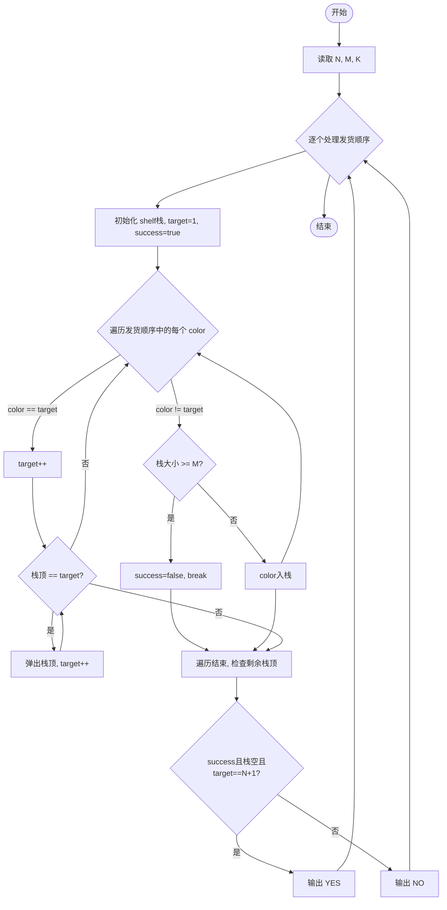
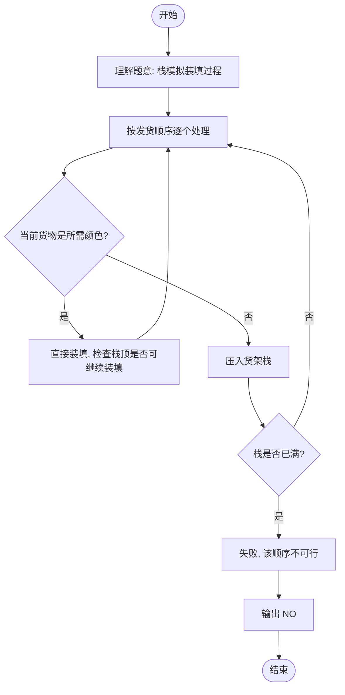

# L2-032 - 彩虹瓶（25 分）

- **时间限制**: 400 ms
- **内存限制**: 65536 KB
- **代码长度限制**: 16 KB

---

## 题目描述


彩虹瓶的制作过程（并不）是这样的：先把一大批空瓶铺放在装填场地上，然后按照一定的顺序将每种颜色的小球均匀撒到这批瓶子里。

假设彩虹瓶里要按顺序装 N 种颜色的小球（不妨将顺序就编号为 1 到 N）。现在工厂里有每种颜色的小球各一箱，工人需要一箱一箱地将小球从工厂里搬到装填场地。如果搬来的这箱小球正好是可以装填的颜色，就直接拆箱装填；如果不是，就把箱子先码放在一个临时货架上，码放的方法就是一箱一箱堆上去。当一种颜色装填完以后，先看看货架顶端的一箱是不是下一个要装填的颜色，如果是就取下来装填，否则去工厂里再搬一箱过来。

如果工厂里发货的顺序比较好，工人就可以顺利地完成装填。例如要按顺序装填 7 种颜色，工厂按照 7、6、1、3、2、5、4 这个顺序发货，则工人先拿到 7、6 两种不能装填的颜色，将其按照 7 在下、6 在上的顺序堆在货架上；拿到 1 时可以直接装填；拿到 3 时又得临时码放在 6 号颜色箱上；拿到 2 时可以直接装填；随后从货架顶取下 3 进行装填；然后拿到 5，临时码放到 6 上面；最后取了 4 号颜色直接装填；剩下的工作就是顺序从货架上取下 5、6、7 依次装填。

但如果工厂按照 3、1、5、4、2、6、7 这个顺序发货，工人就必须要愤怒地折腾货架了，因为装填完 2 号颜色以后，不把货架上的多个箱子搬下来就拿不到 3 号箱，就不可能顺利完成任务。

另外，货架的容量有限，如果要堆积的货物超过容量，工人也没办法顺利完成任务。例如工厂按照 7、6、5、4、3、2、1 这个顺序发货，如果货架够高，能码放 6 只箱子，那还是可以顺利完工的；但如果货架只能码放 5 只箱子，工人就又要愤怒了……

本题就请你判断一下，工厂的发货顺序能否让工人顺利完成任务。

### 输入格式:

输入首先在第一行给出 3 个正整数，分别是彩虹瓶的颜色数量 $$N$$（$$1 < N \le 10^3$$）、临时货架的容量 $$M$$（$$< N$$）、以及需要判断的发货顺序的数量 $$K$$。

随后 $$K$$ 行，每行给出 $$N$$ 个数字，是 1 到$$N$$ 的一个排列，对应工厂的发货顺序。

一行中的数字都以空格分隔。

### 输出格式:

对每个发货顺序，如果工人可以愉快完工，就在一行中输出 `YES`；否则输出 `NO`。

### 输入样例:

```in
7 5 3
7 6 1 3 2 5 4
3 1 5 4 2 6 7
7 6 5 4 3 2 1
```

### 输出样例:

```out
YES
NO
NO
```

## 示例

### 示例 1

**输入:**
```
7 5 3
7 6 1 3 2 5 4
3 1 5 4 2 6 7
7 6 5 4 3 2 1
```

**输出:**
```
YES
NO
NO
```

---

## 题目详解

### 一、解题思路

本题的 R 实现采用以下方法：读取标准输入后建立题目所需的数据结构，按约束执行核心计算并输出结果。

### 二、代码流程说明

1. 读取并解析标准输入，转换为题目所需的数据结构。
2. 按题意执行核心算法，维护中间状态并处理边界情况。
3. 整理计算结果，按照输出格式生成答案。

### 三、代码实现

```r
# 实现原理：读取标准输入后建立题目所需的数据结构，按约束执行核心计算并输出结果。
# 处理流程：读取输入 -> 建立状态 -> 执行算法 -> 按题目格式输出。
# 关键变量和循环均直接对应题目中的数据、约束或操作。

# 读取并解析标准输入。
v <- scan(file = "stdin", quiet = TRUE)
n <- v[1]
m <- v[2]
t <- v[3]
p <- 4
out <- character()
# 按题目约束遍历当前数据，更新中间状态。
for (k in seq_len(t)) {
    a <- v[p:(p + n - 1)]
    p <- p + n
    st <- numeric()
    ok <- TRUE
    want <- 1
    for (x in a) {
        if (x == want)
            want <- want + 1
        else {
            if (length(st) >= m) {
                ok <- FALSE
                break
            }
            st <- c(st, x)
        }
        while (length(st) && tail(st, 1) == want) {
            st <- head(st, -1)
            want <- want + 1
        }
    }
    while (length(st) && tail(st, 1) == want) {
        st <- head(st, -1)
        want <- want + 1
    }
    out <- c(out, if (ok && want == n + 1) "YES" else "NO")
}
# 严格按照题目规定的输出格式输出答案。
cat(paste(out, collapse = "\n"), "\n", sep = "")
```

### 四、代码流程图



### 五、解题流程图



### 六、常见易错点

- 题目描述、输入格式、输出格式和输入输出样例必须保持原文不变。
- R 语言下标从 1 开始，注意编号转换和空输入边界。
- 输出时严格保留题目规定的空格、换行和小数位数。
