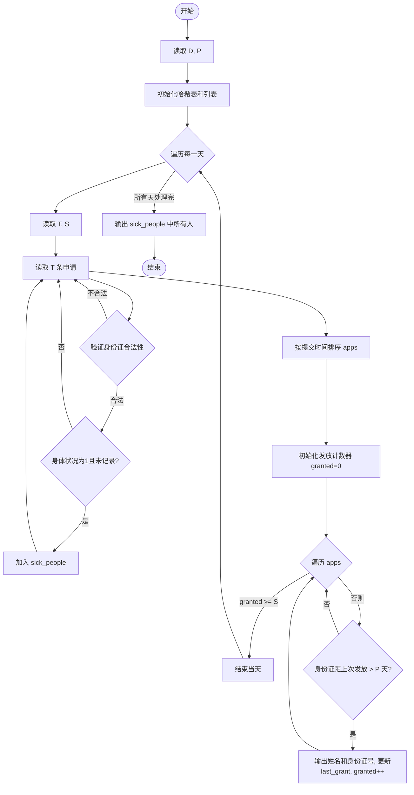
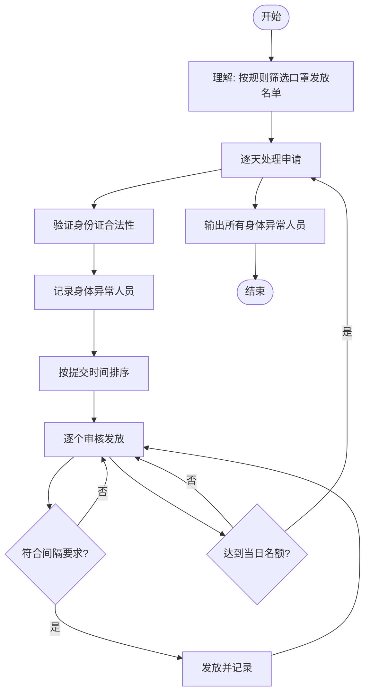

# L2-034 - 口罩发放（25 分）

- **时间限制**: 400 ms
- **内存限制**: 65536 KB
- **代码长度限制**: 16 KB

---

## 题目描述

为了抗击来势汹汹的  COVID19 新型冠状病毒，全国各地均启动了各项措施控制疫情发展，其中一个重要的环节是口罩的发放。

某市出于给市民发放口罩的需要，推出了一款小程序让市民填写信息，方便工作的开展。小程序收集了各种信息，包括市民的姓名、身份证、身体情况、提交时间等，但因为数据量太大，需要根据一定规则进行筛选和处理，请你编写程序，按照给定规则输出口罩的寄送名单。

### 输入格式:

输入第一行是两个正整数 $$D$$ 和 $$P$$（$$1 \le D, P \le 30$$），表示有 $$D$$ 天的数据，市民两次获得口罩的时间至少需要间隔 $$P$$ 天。

接下来 $$D$$ 块数据，每块给出一天的申请信息。第 $$i$$ 块数据（$$i=1, \cdots , D$$）的第一行是两个整数 $$T_i$$ 和 $$S_i$$（$$1 \le T_i \le 1000, 0 \le S_i \le 1000$$），表示在第 $$i$$ 天有 $$T_i$$ 条申请，总共有 $$S_i$$ 个口罩发放名额。随后 $$T_i$$ 行，每行给出一条申请信息，格式如下：
```
姓名 身份证号 身体情况 提交时间
```
给定数据约束如下：
* `姓名` 是一个长度不超过 10 的不包含空格的非空字符串；
* `身份证号` 是一个长度不超过 20 的非空字符串；
* `身体情况` 是 0 或者 1，0 表示自觉良好，1 表示有相关症状；
* `提交时间` 是 hh:mm，为24小时时间（由 ``00:00`` 到 ``23:59``。例如 09:08。）。注意，给定的记录的提交时间不一定有序；
* `身份证号` 各不相同，同一个身份证号被认为是同一个人，数据保证同一个身份证号姓名是相同的。

能发放口罩的记录要求如下：
* `身份证号` 必须是 18 位的**数字**（可以包含前导0）；
* 同一个身份证号若在第 $$i$$ 天申请成功，则接下来的 $$P$$ 天不能再次申请。也就是说，若第 $$i$$ 天申请成功，则等到第 $$i + P + 1$$ 天才能再次申请；
* 在上面两条都符合的情况下，按照提交时间的先后顺序发放，直至全部记录处理完毕或 $$S_i$$ 个名额用完。如果提交时间相同，则按照在列表中出现的先后顺序决定。

### 输出格式:

对于每一天的申请记录，每行输出一位得到口罩的人的姓名及身份证号，用一个空格隔开。顺序按照发放顺序确定。

在输出完发放记录后，你还需要输出有合法记录的、身体状况为 1 的申请人的姓名及身份证号，用空格隔开。顺序按照申请记录中出现的顺序确定，同一个人只需要输出一次。

### 输入样例:

```in
4 2
5 3
A 123456789012345670 1 13:58
B 123456789012345671 0 13:58
C 12345678901234567 0 13:22
D 123456789012345672 0 03:24
C 123456789012345673 0 13:59
4 3
A 123456789012345670 1 13:58
E 123456789012345674 0 13:59
C 123456789012345673 0 13:59
F F 0 14:00
1 3
E 123456789012345674 1 13:58
1 1
A 123456789012345670 0 14:11
```

### 输出样例:

```out
D 123456789012345672
A 123456789012345670
B 123456789012345671
E 123456789012345674
C 123456789012345673
A 123456789012345670
A 123456789012345670
E 123456789012345674
```

## 样例解释：

输出中，第一行到第三行是第一天的部分；第四、五行是第二天的部分；第三天没有符合要求的市民；第六行是第四天的部分。最后两行按照出现顺序输出了可能存在身体不适的人员。

<br/>

**题面于 2025.3.18 更新，感谢郑州经贸学院席玮辰同学指出的题面错误！**

## 示例

### 示例 1

**输入:**
```
4 2
5 3
A 123456789012345670 1 13:58
B 123456789012345671 0 13:58
C 12345678901234567 0 13:22
D 123456789012345672 0 03:24
C 123456789012345673 0 13:59
4 3
A 123456789012345670 1 13:58
E 123456789012345674 0 13:59
C 123456789012345673 0 13:59
F F 0 14:00
1 3
E 123456789012345674 1 13:58
1 1
A 123456789012345670 0 14:11
```

**输出:**
```
D 123456789012345672
A 123456789012345670
B 123456789012345671
E 123456789012345674
C 123456789012345673
A 123456789012345670
A 123456789012345670
E 123456789012345674
```

---

## 题目详解

### 一、解题思路

本题的 R 实现采用以下方法：将输入组织为矩阵或表格，按题目定义的行、列和状态关系完成计算。

### 二、代码流程说明

1. 读取并解析标准输入，转换为题目所需的数据结构。
2. 按题意执行核心算法，维护中间状态并处理边界情况。
3. 整理计算结果，按照输出格式生成答案。

### 三、代码实现

```r
# 实现原理：将输入组织为矩阵或表格，按题目定义的行、列和状态关系完成计算。
# 处理流程：读取输入 -> 建立状态 -> 执行算法 -> 按题目格式输出。
# 关键变量和循环均直接对应题目中的数据、约束或操作。

# 读取并解析标准输入。
x <- readLines("stdin", warn = FALSE)
q <- as.integer(strsplit(x[1], " ", fixed = TRUE)[[1]])
d <- q[1]
period <- q[2]
p <- 2
all <- list()
last <- list()
ans <- character()
valid <- function(s) nchar(s) == 18 && grepl("^[0-9]+$", s)
# 按题目约束遍历当前数据，更新中间状态。
for (day in seq_len(d)) {
    z <- as.integer(strsplit(x[p], " ", fixed = TRUE)[[1]])
    p <- p + 1
    rows <- list()
    for (j in seq_len(z[1])) {
        w <- strsplit(x[p], " ", fixed = TRUE)[[1]]
        p <- p + 1
        t <- as.integer(strsplit(w[4], ":", fixed = TRUE)[[1]])
        rows[[j]] <- list(time = t[1] * 60 + t[2], order = j,
            name = w[1], id = w[2], ill = w[3])
        all[[length(all) + 1]] <- w
    }
# 执行核心排序、状态转移或选择逻辑。
    ord <- order(vapply(rows, `[[`, numeric(1), "time"), vapply(rows,
        `[[`, integer(1), "order"))
    for (j in ord) {
        w <- rows[[j]]
        id <- w$id
        if (z[2] > 0 && valid(id) && (is.null(last[[id]]) ||
            day > last[[id]] + period)) {
            ans <- c(ans, paste(w$name, id))
            last[[id]] <- day
            z[2] <- z[2] - 1
        }
    }
}
seen <- character()
for (w in all) if (w[3] == "1" && valid(w[2]) && !w[2] %in% seen) {
    ans <- c(ans, paste(w[1], w[2]))
    seen <- c(seen, w[2])
}
# 严格按照题目规定的输出格式输出答案。
cat(paste(ans, collapse = "\n"), "\n", sep = "")
```

### 四、代码流程图



### 五、解题流程图



### 六、常见易错点

- 题目描述、输入格式、输出格式和输入输出样例必须保持原文不变。
- R 语言下标从 1 开始，注意编号转换和空输入边界。
- 输出时严格保留题目规定的空格、换行和小数位数。
