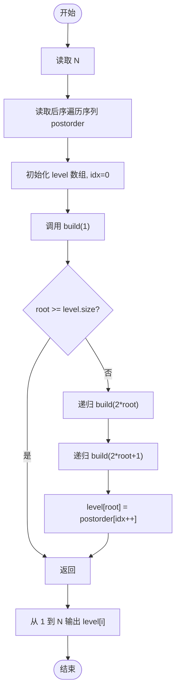
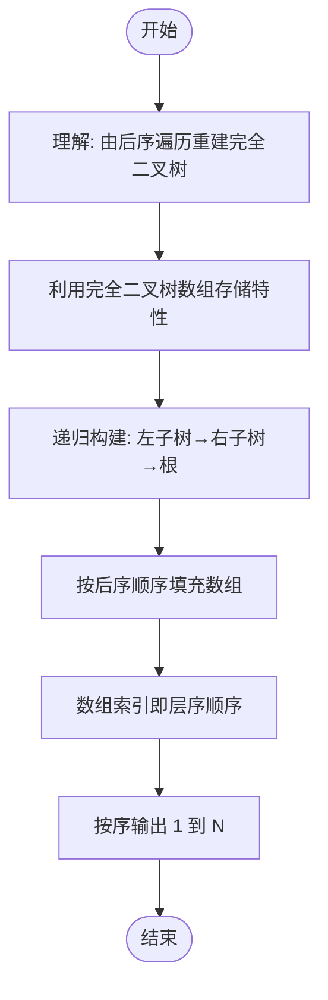

# L2-035 - 完全二叉树的层序遍历（25 分）

- **时间限制**: 400 ms
- **内存限制**: 65536 KB
- **代码长度限制**: 16 KB

---

## 题目描述

一个二叉树，如果每一个层的结点数都达到最大值，则这个二叉树就是**完美二叉树**。对于深度为 $$D$$ 的，有 $$N$$ 个结点的二叉树，若其结点对应于相同深度完美二叉树的层序遍历的前 $$N$$ 个结点，这样的树就是**完全二叉树**。

给定一棵完全二叉树的后序遍历，请你给出这棵树的层序遍历结果。

### 输入格式:

输入在第一行中给出正整数 $$N$$（$$\le 30$$），即树中结点个数。第二行给出后序遍历序列，为 $$N$$ 个不超过 100 的正整数。同一行中所有数字都以空格分隔。

### 输出格式:

在一行中输出该树的层序遍历序列。所有数字都以 1 个空格分隔，行首尾不得有多余空格。

### 输入样例:

```in
8
91 71 2 34 10 15 55 18
```

### 输出样例:

```out
18 34 55 71 2 10 15 91
```

## 示例

### 示例 1

**输入:**
```
8
91 71 2 34 10 15 55 18
```

**输出:**
```
18 34 55 71 2 10 15 91
```

---

## 题目详解

### 一、解题思路

本题的 R 实现采用以下方法：读取标准输入后建立题目所需的数据结构，按约束执行核心计算并输出结果。

### 二、代码流程说明

1. 读取并解析标准输入，转换为题目所需的数据结构。
2. 按题意执行核心算法，维护中间状态并处理边界情况。
3. 整理计算结果，按照输出格式生成答案。

### 三、代码实现

```r
# 实现原理：读取标准输入后建立题目所需的数据结构，按约束执行核心计算并输出结果。
# 处理流程：读取输入 -> 建立状态 -> 执行算法 -> 按题目格式输出。
# 关键变量和循环均直接对应题目中的数据、约束或操作。

# 读取并解析标准输入。
v <- scan(file = "stdin", quiet = TRUE)
n <- v[1]
a <- v[2:(n + 1)]
out <- numeric(n)
p <- 1
dfs <- function(i) {
    if (i > n)
        return()
    dfs(2 * i)
    dfs(2 * i + 1)
    out[i] <<- a[p]
    p <<- p + 1
}
dfs(1)
# 严格按照题目规定的输出格式输出答案。
cat(paste(out, collapse = " "), "\n", sep = "")
```

### 四、代码流程图



### 五、解题流程图



### 六、常见易错点

- 题目描述、输入格式、输出格式和输入输出样例必须保持原文不变。
- R 语言下标从 1 开始，注意编号转换和空输入边界。
- 输出时严格保留题目规定的空格、换行和小数位数。
