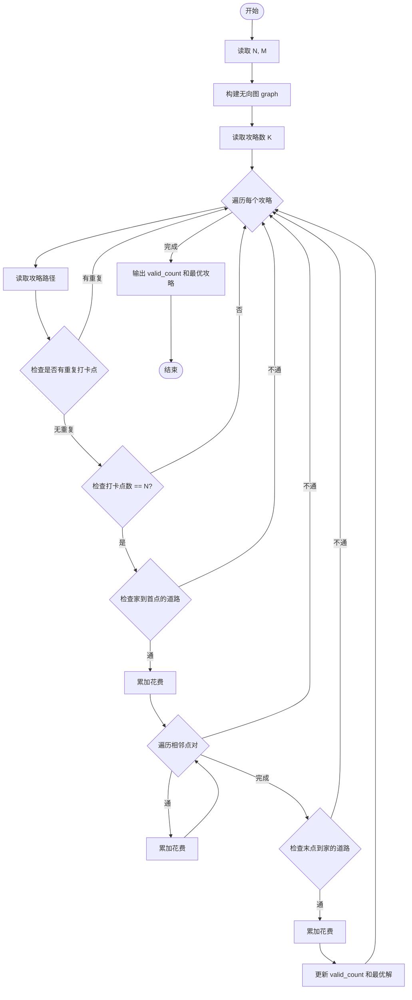
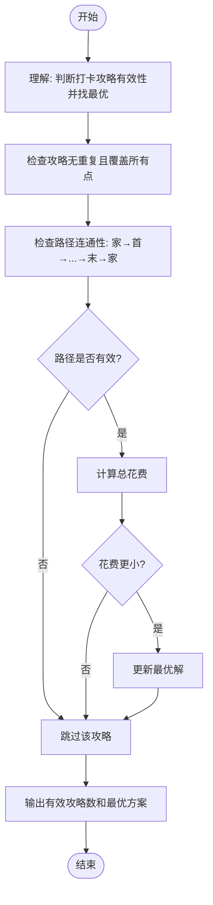

# L2-036 - 网红点打卡攻略（25 分）

- **时间限制**: 400 ms
- **内存限制**: 65536 KB
- **代码长度限制**: 16 KB

---

## 题目描述

一个旅游景点，如果被带火了的话，就被称为“网红点”。大家来网红点游玩，俗称“打卡”。在各个网红点打卡的快（省）乐（钱）方法称为“攻略”。你的任务就是从一大堆攻略中，找出那个能在每个网红点打卡仅一次、并且路上花费最少的攻略。

### 输入格式:

首先第一行给出两个正整数：网红点的个数 $$N$$（$$1 < N\le 200$$）和网红点之间通路的条数 $$M$$。随后 $$M$$ 行，每行给出有通路的两个网红点、以及这条路上的旅行花费（为正整数），格式为“网红点1 网红点2 费用”，其中网红点从 1 到 $$N$$ 编号；同时也给出你家到某些网红点的花费，格式相同，其中你家的编号固定为 `0`。

再下一行给出一个正整数 $$K$$，是待检验的攻略的数量。随后 $$K$$ 行，每行给出一条待检攻略，格式为：

$$n$$ $$V_1$$ $$V_2$$ $$\cdots$$ $$V_n$$

其中 $$n (\le 200)$$ 是攻略中的网红点数，$$V_i$$ 是路径上的网红点编号。这里假设你从家里出发，从 $$V_1$$ 开始打卡，最后从 $$V_n$$ 回家。

### 输出格式:

在第一行输出满足要求的攻略的个数。

在第二行中，首先输出那个能在每个网红点打卡仅一次、并且路上花费最少的攻略的序号（从 1 开始），然后输出这个攻略的总路费，其间以一个空格分隔。如果这样的攻略不唯一，则输出序号最小的那个。

题目保证至少存在一个有效攻略，并且总路费不超过 $$10^9$$。

### 输入样例:

```in
6 13
0 5 2
6 2 2
6 0 1
3 4 2
1 5 2
2 5 1
3 1 1
4 1 2
1 6 1
6 3 2
1 2 1
4 5 3
2 0 2
7
6 5 1 4 3 6 2
6 5 2 1 6 3 4
8 6 2 1 6 3 4 5 2
3 2 1 5
6 6 1 3 4 5 2
7 6 2 1 3 4 5 2
6 5 2 1 4 3 6
```

### 输出样例:

```out
3
5 11
```

## 样例说明：

第 2、3、4、6 条都不满足攻略的基本要求，即不能做到从家里出发，在每个网红点打卡仅一次，且能回到家里。所以满足条件的攻略有 3 条。

第 1 条攻略的总路费是：(0->5) 2 + (5->1) 2 + (1->4) 2 + (4->3) 2 + (3->6) 2 + (6->2) 2 + (2->0) 2 = 14；

第 5 条攻略的总路费同理可算得：1 + 1 + 1 + 2 + 3 + 1 + 2 = 11，是一条更省钱的攻略；

第 7 条攻略的总路费同理可算得：2 + 1 + 1 + 2 + 2 + 2 + 1 = 11，与第 5 条花费相同，但序号较大，所以不输出。

## 示例

### 示例 1

**输入:**
```
6 13
0 5 2
6 2 2
6 0 1
3 4 2
1 5 2
2 5 1
3 1 1
4 1 2
1 6 1
6 3 2
1 2 1
4 5 3
2 0 2
7
6 5 1 4 3 6 2
6 5 2 1 6 3 4
8 6 2 1 6 3 4 5 2
3 2 1 5
6 6 1 3 4 5 2
7 6 2 1 3 4 5 2
6 5 2 1 4 3 6
```

**输出:**
```
3
5 11
```

---

## 题目详解

### 一、解题思路

本题的 R 实现采用以下方法：将输入组织为矩阵或表格，按题目定义的行、列和状态关系完成计算。

### 二、代码流程说明

1. 读取并解析标准输入，转换为题目所需的数据结构。
2. 按题意执行核心算法，维护中间状态并处理边界情况。
3. 整理计算结果，按照输出格式生成答案。

### 三、代码实现

```r
# 实现原理：将输入组织为矩阵或表格，按题目定义的行、列和状态关系完成计算。
# 处理流程：读取输入 -> 建立状态 -> 执行算法 -> 按题目格式输出。
# 关键变量和循环均直接对应题目中的数据、约束或操作。

# 读取并解析标准输入。
v <- scan(file = "stdin", quiet = TRUE)
n <- v[1]
m <- v[2]
p <- 3
g <- matrix(Inf, n + 1, n + 1)
diag(g) <- 0
# 按题目约束遍历当前数据，更新中间状态。
for (i in seq_len(m)) {
    a <- v[p]
    b <- v[p + 1]
    w <- v[p + 2]
    p <- p + 3
    g[a + 1, b + 1] <- min(g[a + 1, b + 1], w)
    g[b + 1, a + 1] <- g[a + 1, b + 1]
}
q <- v[p]
p <- p + 1
valid <- c()
best <- c(Inf, NA)
for (i in seq_len(q)) {
    z <- v[p]
    path <- v[(p + 1):(p + z)]
    p <- p + z + 1
    if (z != n || length(unique(path)) != n)
        next
    s <- c(0, path, 0)
    cost <- sum(g[cbind(s[-length(s)] + 1, s[-1] + 1)])
    if (is.finite(cost)) {
        valid <- c(valid, i)
        if (cost < best[1])
            best <- c(cost, i)
    }
}
# 严格按照题目规定的输出格式输出答案。
cat(length(valid), "\n", sep = "")
cat(paste(best[2], best[1]), "\n", sep = "")
```

### 四、代码流程图



### 五、解题流程图



### 六、常见易错点

- 题目描述、输入格式、输出格式和输入输出样例必须保持原文不变。
- R 语言下标从 1 开始，注意编号转换和空输入边界。
- 输出时严格保留题目规定的空格、换行和小数位数。
