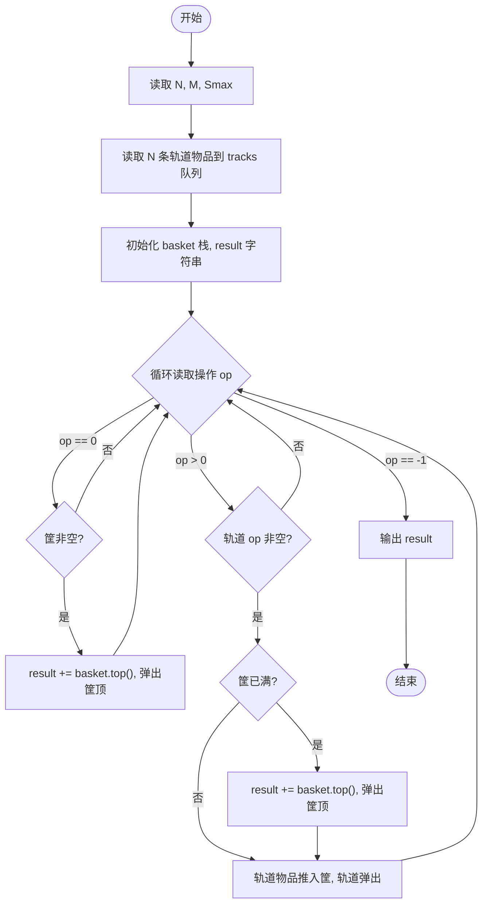
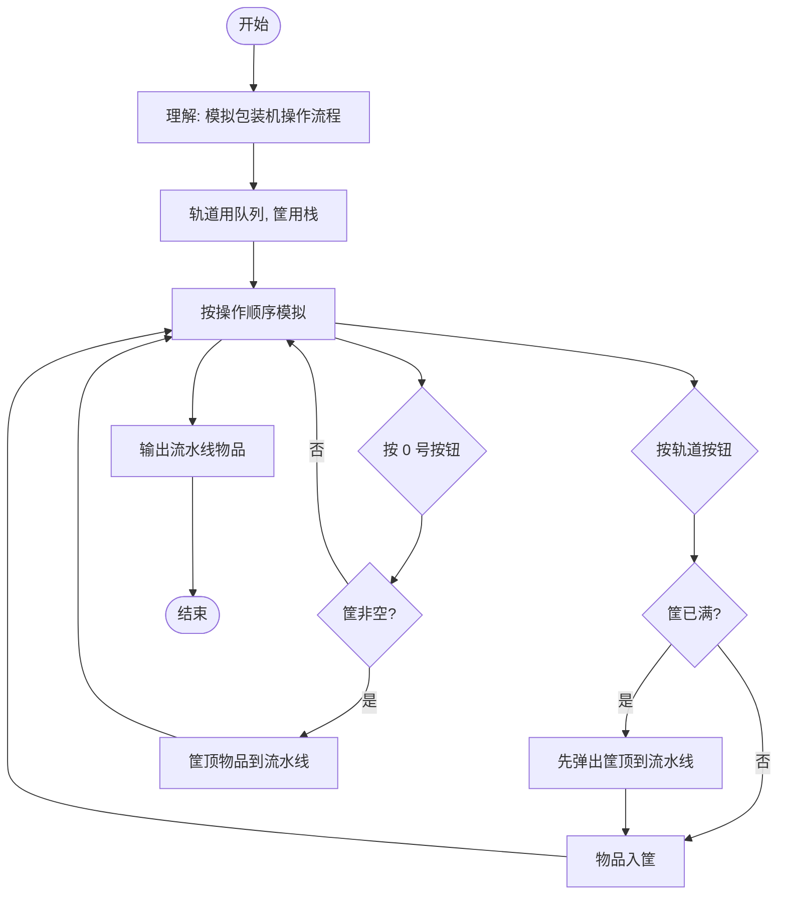

# L2-037 - 包装机（25 分）

- **时间限制**: 400 ms
- **内存限制**: 65536 KB
- **代码长度限制**: 16 KB

---

## 题目描述

一种自动包装机的结构如图 1 所示。首先机器中有 $$N$$ 条轨道，放置了一些物品。轨道下面有一个筐。当某条轨道的按钮被按下时，活塞向左推动，将轨道尽头的一件物品推落筐中。当 0 号按钮被按下时，机械手将抓取筐顶部的一件物品，放到流水线上。图 2 显示了顺序按下按钮 3、2、3、0、1、2、0 后包装机的状态。


图1 自动包装机的结构


图 2 顺序按下按钮 3、2、3、0、1、2、0 后包装机的状态

一种特殊情况是，因为筐的容量是有限的，当筐已经满了，但仍然有某条轨道的按钮被按下时，系统应强制启动 0 号键，先从筐里抓出一件物品，再将对应轨道的物品推落。此外，如果轨道已经空了，再按对应的按钮不会发生任何事；同样的，如果筐是空的，按 0 号按钮也不会发生任何事。

现给定一系列按钮操作，请你依次列出流水线上的物品。

### 输入格式:

输入第一行给出 3 个正整数 $$N$$（$$\le 100$$）、$$M$$（$$\le 1000$$）和 $$S_{max}$$（$$\le 100$$），分别为轨道的条数（于是轨道从 1 到 $$N$$ 编号）、每条轨道初始放置的物品数量、以及筐的最大容量。随后 $$N$$ 行，每行给出 $$M$$ 个英文大写字母，表示每条轨道的初始物品摆放。

最后一行给出一系列数字，顺序对应被按下的按钮编号，直到 $$-1$$ 标志输入结束，这个数字不要处理。数字间以空格分隔。题目保证至少会取出一件物品放在流水线上。

### 输出格式:

在一行中顺序输出流水线上的物品，不得有任何空格。

### 输入样例:

```in
3 4 4
GPLT
PATA
OMSA
3 2 3 0 1 2 0 2 2 0 -1
```

### 输出样例:

```out
MATA
```

## 示例

### 示例 1

**输入:**
```
3 4 4
GPLT
PATA
OMSA
3 2 3 0 1 2 0 2 2 0 -1
```

**输出:**
```
MATA
```

---

## 题目详解

### 一、解题思路

本题的 R 实现采用以下方法：按行或按字段解析输入，使用字符串或序列操作完成题目要求的变换，并按格式输出。

### 二、代码流程说明

1. 读取并解析标准输入，转换为题目所需的数据结构。
2. 按题意执行核心算法，维护中间状态并处理边界情况。
3. 整理计算结果，按照输出格式生成答案。

### 三、代码实现

```r
# 实现原理：按行或按字段解析输入，使用字符串或序列操作完成题目要求的变换，并按格式输出。
# 处理流程：读取输入 -> 建立状态 -> 执行算法 -> 按题目格式输出。
# 关键变量和循环均直接对应题目中的数据、约束或操作。

# 读取并解析标准输入。
x <- readLines("stdin", warn = FALSE)
q <- as.integer(strsplit(x[1], " ", fixed = TRUE)[[1]])
n <- q[1]
m <- q[2]
cap <- q[3]
tr <- c("", x[2:(n + 1)])
ptr <- integer(n + 1)
st <- character()
out <- character()
z <- as.integer(unlist(strsplit(paste(x[(n + 2):length(x)], collapse = " "),
    " ", fixed = TRUE)))
# 按题目约束遍历当前数据，更新中间状态。
for (k in z) {
    if (k == -1)
        break
    if (k == 0) {
        if (length(st)) {
            out <- c(out, tail(st, 1))
            st <- head(st, -1)
        }
    }
    else if (ptr[k + 1] < m) {
        if (length(st) >= cap) {
            out <- c(out, tail(st, 1))
            st <- head(st, -1)
        }
        ptr[k + 1] <- ptr[k + 1] + 1
        st <- c(st, substr(tr[k + 1], ptr[k + 1], ptr[k + 1]))
    }
}
# 严格按照题目规定的输出格式输出答案。
cat(paste(out, collapse = ""), "\n", sep = "")
```

### 四、代码流程图



### 五、解题流程图



### 六、常见易错点

- 题目描述、输入格式、输出格式和输入输出样例必须保持原文不变。
- R 语言下标从 1 开始，注意编号转换和空输入边界。
- 输出时严格保留题目规定的空格、换行和小数位数。
