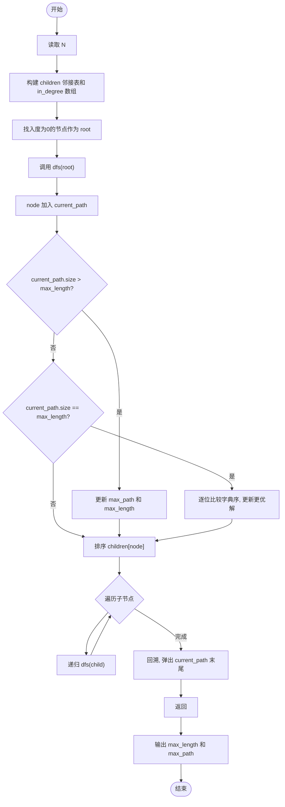
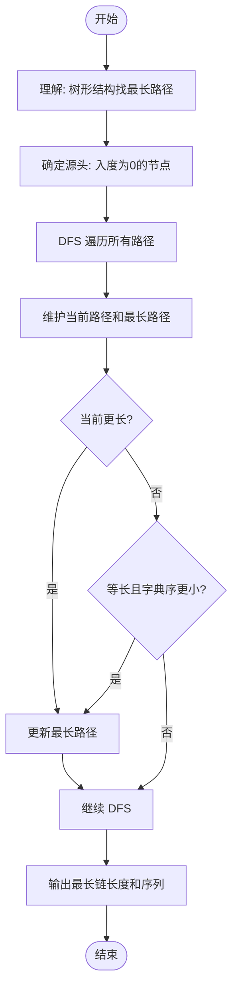

# L2-038 - 病毒溯源（25 分）

- **时间限制**: 400 ms
- **内存限制**: 65536 KB
- **代码长度限制**: 16 KB

---

## 题目描述


病毒容易发生变异。某种病毒可以通过突变产生若干变异的毒株，而这些变异的病毒又可能被诱发突变产生第二代变异，如此继续不断变化。

现给定一些病毒之间的变异关系，要求你找出其中最长的一条变异链。

在此假设给出的变异都是由突变引起的，不考虑复杂的基因重组变异问题 —— 即每一种病毒都是由唯一的一种病毒突变而来，并且不存在循环变异的情况。

### 输入格式:

输入在第一行中给出一个正整数 $$N$$（$$\le 10^4$$），即病毒种类的总数。于是我们将所有病毒从 0 到 $$N-1$$ 进行编号。

随后 $$N$$ 行，每行按以下格式描述一种病毒的变异情况：

```
k 变异株1 …… 变异株k
```

其中 `k` 是该病毒产生的变异毒株的种类数，后面跟着每种变异株的编号。第 $$i$$ 行对应编号为 $$i$$ 的病毒（$$0\le i <N$$）。题目保证病毒源头有且仅有一个。

### 输出格式:

首先输出从源头开始最长变异链的长度。

在第二行中输出从源头开始最长的一条变异链，编号间以 1 个空格分隔，行首尾不得有多余空格。如果最长链不唯一，则输出最小序列。

注：我们称序列 { $$a_1, \cdots , a_n$$ } 比序列 { $$b_1, \cdots , b_n$$ } “小”，如果存在 $$1\le k \le n$$ 满足 $$a_i = b_i$$ 对所有 $$i<k$$ 成立，且 $$a_k < b_k$$。

### 输入样例:

```in
10
3 6 4 8
0
0
0
2 5 9
0
1 7
1 2
0
2 3 1
```

### 输出样例:

```out
4
0 4 9 1
```

## 示例

### 示例 1

**输入:**
```
10
3 6 4 8
0
0
0
2 5 9
0
1 7
1 2
0
2 3 1
```

**输出:**
```
4
0 4 9 1
```

---

## 题目详解

### 一、解题思路

本题的 R 实现采用以下方法：将输入组织为矩阵或表格，按题目定义的行、列和状态关系完成计算。

### 二、代码流程说明

1. 读取并解析标准输入，转换为题目所需的数据结构。
2. 按题意执行核心算法，维护中间状态并处理边界情况。
3. 整理计算结果，按照输出格式生成答案。

### 三、代码实现

```r
# 实现原理：将输入组织为矩阵或表格，按题目定义的行、列和状态关系完成计算。
# 处理流程：读取输入 -> 建立状态 -> 执行算法 -> 按题目格式输出。
# 关键变量和循环均直接对应题目中的数据、约束或操作。

# 读取并解析标准输入。
v <- scan(file = "stdin", what = "", quiet = TRUE)
n <- v[1]
p <- 2
g <- vector("list", n)
has <- integer(n)
# 按题目约束遍历当前数据，更新中间状态。
for (i in seq_len(n)) {
    z <- as.integer(v[p])
    p <- p + 1
    g[[i]] <- if (z > 0L)
# 执行核心排序、状态转移或选择逻辑。
        sort(as.integer(v[p:(p + z - 1)]) + 1L)
    else integer()
    p <- p + z
    if (length(g[[i]]))
        has[g[[i]]] <- 1
}
root <- which(!has)[1]
dfs <- function(x) {
    if (!length(g[[x]]))
        return(x - 1L)
    paths <- lapply(g[[x]], dfs)
    lens <- vapply(paths, length, integer(1))
    best <- which.max(lens)
    c(x - 1L, paths[[best]])
}
a <- dfs(root)
# 严格按照题目规定的输出格式输出答案。
cat(length(a), "\n", sep = "")
cat(paste(a, collapse = " "), "\n", sep = "")
```

### 四、代码流程图



### 五、解题流程图



### 六、常见易错点

- 题目描述、输入格式、输出格式和输入输出样例必须保持原文不变。
- R 语言下标从 1 开始，注意编号转换和空输入边界。
- 输出时严格保留题目规定的空格、换行和小数位数。
