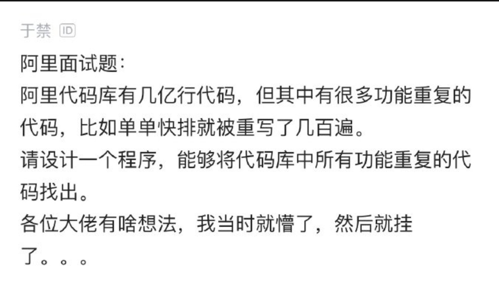
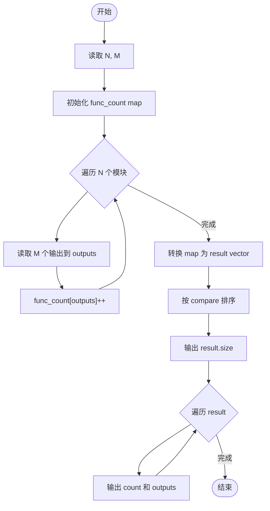
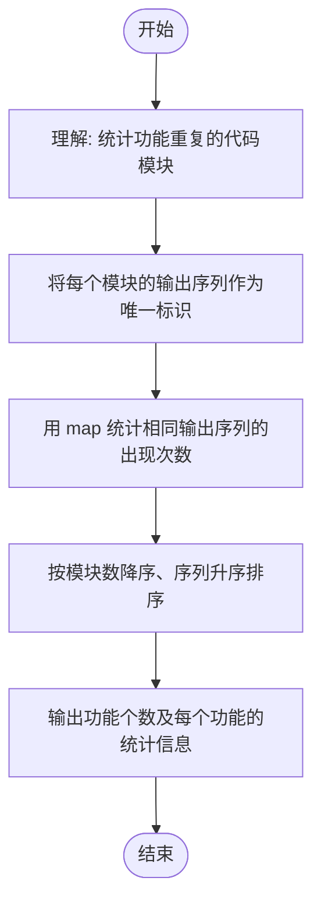

# L2-039 - 清点代码库（25 分）

- **时间限制**: 500 ms
- **内存限制**: 65536 KB
- **代码长度限制**: 16 KB

---

## 题目描述



上图转自新浪微博：“阿里代码库有几亿行代码，但其中有很多功能重复的代码，比如单单快排就被重写了几百遍。请设计一个程序，能够将代码库中所有功能重复的代码找出。各位大佬有啥想法，我当时就懵了，然后就挂了。。。”

这里我们把问题简化一下：首先假设两个功能模块如果接受同样的输入，总是给出同样的输出，则它们就是功能重复的；其次我们把每个模块的输出都简化为一个整数（在 **int** 范围内）。于是我们可以设计一系列输入，检查所有功能模块的对应输出，从而查出功能重复的代码。你的任务就是设计并实现这个简化问题的解决方案。

### 输入格式:

输入在第一行中给出 2 个正整数，依次为 $$N$$（$$\le 10^4$$）和 $$M$$（$$\le 10^2$$），对应功能模块的个数和系列测试输入的个数。

随后 $$N$$ 行，每行给出一个功能模块的 $$M$$ 个对应输出，数字间以空格分隔。

### 输出格式:

首先在第一行输出不同功能的个数 $$K$$。随后 $$K$$ 行，每行给出具有这个功能的模块的个数，以及这个功能的对应输出。数字间以 1 个空格分隔，行首尾不得有多余空格。输出首先按模块个数非递增顺序，如果有并列，则按输出序列的递增序给出。

注：所谓数列 { $$A_1$$, ..., $$A_M$$ } 比 { $$B_1$$, ..., $$B_M$$ } 大，是指存在 $$1\le i <M$$，使得 $$A_1=B_1$$，...，$$A_i=B_i$$ 成立，且 $$A_{i+1} > B_{i+1}$$。

### 输入样例:

```in
7 3
35 28 74
-1 -1 22
28 74 35
-1 -1 22
11 66 0
35 28 74
35 28 74
```

### 输出样例:

```out
4
3 35 28 74
2 -1 -1 22
1 11 66 0
1 28 74 35
```

## 示例

### 示例 1

**输入:**
```
7 3
35 28 74
-1 -1 22
28 74 35
-1 -1 22
11 66 0
35 28 74
35 28 74
```

**输出:**
```
4
3 35 28 74
2 -1 -1 22
1 11 66 0
1 28 74 35
```

---

## 题目详解

### 一、解题思路

本题的 R 实现采用以下方法：将输入组织为矩阵或表格，按题目定义的行、列和状态关系完成计算。

### 二、代码流程说明

1. 读取并解析标准输入，转换为题目所需的数据结构。
2. 按题意执行核心算法，维护中间状态并处理边界情况。
3. 整理计算结果，按照输出格式生成答案。

### 三、代码实现

```r
# 实现原理：将输入组织为矩阵或表格，按题目定义的行、列和状态关系完成计算。
# 处理流程：读取输入 -> 建立状态 -> 执行算法 -> 按题目格式输出。
# 关键变量和循环均直接对应题目中的数据、约束或操作。

# 读取并解析标准输入。
v <- scan(file = "stdin", quiet = TRUE)
n <- as.integer(v[1])
m <- as.integer(v[2])
p <- 3
keys <- character(n)
rows <- vector("list", n)
# 按题目约束遍历当前数据，更新中间状态。
for (i in seq_len(n)) {
    rows[[i]] <- as.integer(v[p:(p + m - 1L)])
    p <- p + m
    keys[i] <- paste(rows[[i]], collapse = ",")
}
counts <- table(keys)
uniq <- names(counts)
ur <- lapply(uniq, function(s) as.integer(strsplit(s, ",", fixed = TRUE)[[1]]))
ord <- do.call(order, c(list(-as.integer(counts[uniq])), lapply(seq_len(m),
    function(j) vapply(ur, `[[`, integer(1), j))))
# 严格按照题目规定的输出格式输出答案。
cat(length(uniq), "\n", sep = "")
for (i in ord) cat(paste(counts[uniq[i]], paste(ur[[i]], collapse = " ")),
    "\n", sep = "")
```

### 四、代码流程图



### 五、解题流程图



### 六、常见易错点

- 题目描述、输入格式、输出格式和输入输出样例必须保持原文不变。
- R 语言下标从 1 开始，注意编号转换和空输入边界。
- 输出时严格保留题目规定的空格、换行和小数位数。
