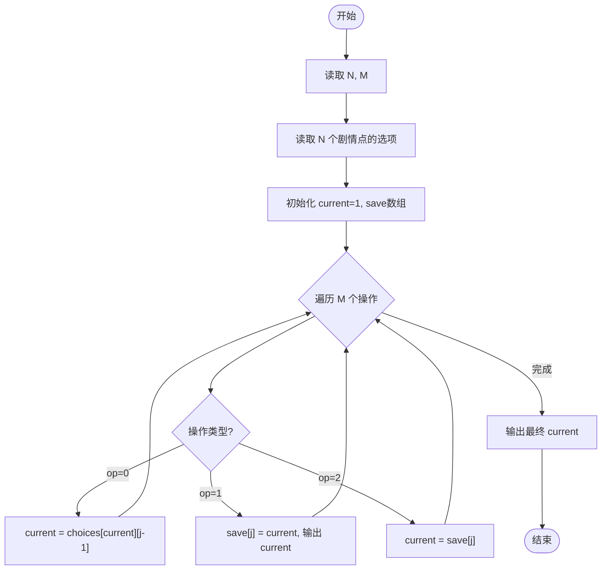
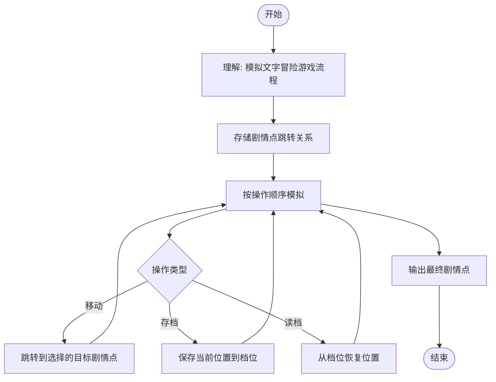

# L2-040 - 哲哲打游戏（25 分）

- **时间限制**: 400 ms
- **内存限制**: 65536 KB
- **代码长度限制**: 16 KB

---

## 题目描述

哲哲是一位硬核游戏玩家。最近一款名叫《达诺达诺》的新游戏刚刚上市，哲哲自然要快速攻略游戏，守护硬核游戏玩家的一切！

为简化模型，我们不妨假设游戏有 $$N$$ 个剧情点，通过游戏里不同的操作或选择可以从某个剧情点去往另外一个剧情点。此外，游戏还设置了一些**存档**，在某个剧情点可以将玩家的游戏进度保存在一个档位上，读取存档后可以回到剧情点，重新进行操作或者选择，到达不同的剧情点。

为了追踪硬核游戏玩家哲哲的攻略进度，你打算写一个程序来完成这个工作。假设你已经知道了游戏的全部剧情点和流程，以及哲哲的游戏操作，请你输出哲哲的游戏进度。

### 输入格式:

输入第一行是两个正整数 $$N$$ 和 $$M$$ ($$1\le N , M \le 10^5$$)，表示总共有 $$N$$ 个剧情点，哲哲有 $$M$$ 个游戏操作。

接下来的 $$N$$ 行，每行对应一个剧情点的发展设定。第 $$i$$ 行的第一个数字是 $$K_i$$，表示剧情点 $$i$$ 通过一些操作或选择能去往下面 $$K_i$$ 个剧情点；接下来有 $$K_i$$ 个数字，第 $$k$$ 个数字表示做第 $$k$$ 个操作或选择可以去往的剧情点编号。

最后有 $$M$$ 行，每行第一个数字是 0、1 或 2，分别表示：

* 0 表示哲哲做出了某个操作或选择，后面紧接着一个数字 $$j$$，表示哲哲在当前剧情点做出了第 $$j$$ 个选择。我们保证哲哲的选择永远是合法的。
* 1 表示哲哲进行了一次存档，后面紧接着是一个数字 $$j$$，表示存档放在了第 $$j$$ 个档位上。
* 2 表示哲哲进行了一次读取存档的操作，后面紧接着是一个数字 $$j$$，表示读取了放在第 $$j$$ 个位置的存档。

约定：所有操作或选择以及剧情点编号都从 1 号开始。存档的档位不超过 100 个，编号也从 1 开始。游戏默认从 1 号剧情点开始。总的选项数（即 $$\sum K_i$$）不超过 $$10^6$$。

### 输出格式:

对于每个 1（即存档）操作，在一行中输出存档的剧情点编号。

最后一行输出哲哲最后到达的剧情点编号。

### 输入样例:

```in
10 11
3 2 3 4
1 6
3 4 7 5
1 3
1 9
2 3 5
3 1 8 5
1 9
2 8 10
0
1 1
0 3
0 1
1 2
0 2
0 2
2 2
0 3
0 1
1 1
0 2
```

### 输出样例:

```out
1
3
9
10
```

## 样例解释：

简单给出样例中经过的剧情点顺序：

1 -> 4 -> 3 -> 7 -> 8 -> 3 -> 5 -> 9 -> 10。

档位 1 开始存的是 1 号剧情点；档位 2 存的是 3 号剧情点；档位 1 后来又存了 9 号剧情点。

## 示例

### 示例 1

**输入:**
```
10 11
3 2 3 4
1 6
3 4 7 5
1 3
1 9
2 3 5
3 1 8 5
1 9
2 8 10
0
1 1
0 3
0 1
1 2
0 2
0 2
2 2
0 3
0 1
1 1
0 2
```

**输出:**
```
1
3
9
10
```

---

## 题目详解

### 一、解题思路

本题的 R 实现采用以下方法：读取标准输入后建立题目所需的数据结构，按约束执行核心计算并输出结果。

### 二、代码流程说明

1. 读取并解析标准输入，转换为题目所需的数据结构。
2. 按题意执行核心算法，维护中间状态并处理边界情况。
3. 整理计算结果，按照输出格式生成答案。

### 三、代码实现

```r
# 实现原理：读取标准输入后建立题目所需的数据结构，按约束执行核心计算并输出结果。
# 处理流程：读取输入 -> 建立状态 -> 执行算法 -> 按题目格式输出。
# 关键变量和循环均直接对应题目中的数据、约束或操作。

# 读取并解析标准输入。
v <- scan(file = "stdin", quiet = TRUE)
n <- v[1]
m <- v[2]
p <- 3
g <- vector("list", n)
# 按题目约束遍历当前数据，更新中间状态。
for (i in seq_len(n)) {
    z <- v[p]
    p <- p + 1
    g[[i]] <- v[p:(p + z - 1)]
    p <- p + z
}
cur <- 1
save <- integer(101)
out <- character()
for (i in seq_len(m)) {
    typ <- v[p]
    j <- v[p + 1]
    p <- p + 2
    if (typ == 0)
        cur <- g[[cur]][j]
    else if (typ == 1) {
        save[j] <- cur
        out <- c(out, as.character(cur))
    }
    else cur <- save[j]
}
# 严格按照题目规定的输出格式输出答案。
cat(paste(c(out, cur), collapse = "\n"), "\n", sep = "")
```

### 四、代码流程图



### 五、解题流程图



### 六、常见易错点

- 题目描述、输入格式、输出格式和输入输出样例必须保持原文不变。
- R 语言下标从 1 开始，注意编号转换和空输入边界。
- 输出时严格保留题目规定的空格、换行和小数位数。
