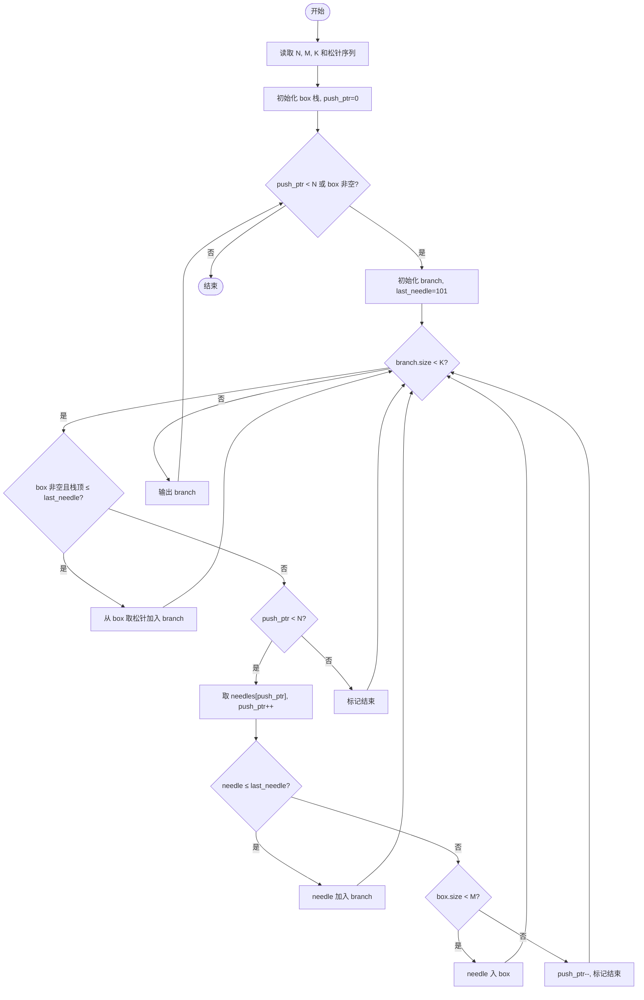
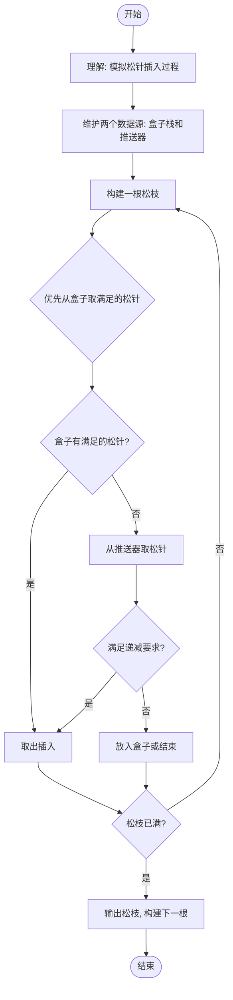

# L2-041 - 插松枝（25 分）

- **时间限制**: 400 ms
- **内存限制**: 65536 KB
- **代码长度限制**: 16 KB

---

## 题目描述


人造松枝加工场的工人需要将各种尺寸的塑料松针插到松枝干上，做成大大小小的松枝。他们的工作流程（并不）是这样的：

- 每人手边有一只小盒子，初始状态为空。
- 每人面前有用不完的松枝干和一个推送器，每次推送一片随机型号的松针片。
- 工人首先捡起一根空的松枝干，从小盒子里摸出最上面的一片松针 —— 如果小盒子是空的，就从推送器上取一片松针。将这片松针插到枝干的最下面。
- 工人在插后面的松针时，需要保证，每一步插到一根非空松枝干上的松针片，不能比前一步插上的松针片大。如果小盒子中最上面的松针满足要求，就取之插好；否则去推送器上取一片。如果推送器上拿到的仍然不满足要求，就把拿到的这片堆放到小盒子里，继续去推送器上取下一片。注意这里假设小盒子里的松针片是按放入的顺序堆叠起来的，工人每次只能取出最上面（即最后放入）的一片。
- 当下列三种情况之一发生时，工人会结束手里的松枝制作，开始做下一个：

（1）小盒子已经满了，但推送器上取到的松针仍然不满足要求。此时将手中的松枝放到成品篮里，推送器上取到的松针压回推送器，开始下一根松枝的制作。

（2）小盒子中最上面的松针不满足要求，但推送器上已经没有松针了。此时将手中的松枝放到成品篮里，开始下一根松枝的制作。

（3）手中的松枝干上已经插满了松针，将之放到成品篮里，开始下一根松枝的制作。

现在给定推送器上顺序传过来的 $$N$$ 片松针的大小，以及小盒子和松枝的容量，请你编写程序自动列出每根成品松枝的信息。

### 输入格式:

输入在第一行中给出 3 个正整数：$$N$$（$$\le 10^3$$），为推送器上松针片的数量；$$M$$（$$\le 20$$）为小盒子能存放的松针片的最大数量；$$K$$（$$\le 5$$）为一根松枝干上能插的松针片的最大数量。

随后一行给出 $$N$$ 个不超过 $$100$$ 的正整数，为推送器上顺序推出的松针片的大小。

### 输出格式:

每支松枝成品的信息占一行，顺序给出自底向上每片松针的大小。数字间以 1 个空格分隔，行首尾不得有多余空格。

### 输入样例:

```in
8 3 4
20 25 15 18 20 18 8 5

```

### 输出样例:

```out
20 15
20 18 18 8
25 5

```

## 示例

### 示例 1

**输入:**
```
8 3 4
20 25 15 18 20 18 8 5

```

**输出:**
```
20 15
20 18 18 8
25 5

```

---

## 题目详解

### 一、解题思路

本题的 R 实现采用以下方法：读取标准输入后建立题目所需的数据结构，按约束执行核心计算并输出结果。

### 二、代码流程说明

1. 读取并解析标准输入，转换为题目所需的数据结构。
2. 按题意执行核心算法，维护中间状态并处理边界情况。
3. 整理计算结果，按照输出格式生成答案。

### 三、代码实现

```r
# 实现原理：读取标准输入后建立题目所需的数据结构，按约束执行核心计算并输出结果。
# 处理流程：读取输入 -> 建立状态 -> 执行算法 -> 按题目格式输出。
# 关键变量和循环均直接对应题目中的数据、约束或操作。

# 读取并解析标准输入。
v <- scan(file = "stdin", quiet = TRUE)
n <- v[1]
m <- v[2]
lim <- v[3]
a <- v[4:(n + 3)]
i <- 1
box <- numeric()
cur <- numeric()
out <- character()
# 按题目约束遍历当前数据，更新中间状态。
while (i <= n || length(box) || length(cur)) {
    if (length(box) && (!length(cur) || tail(box, 1) <= tail(cur,
        1))) {
        cur <- c(cur, tail(box, 1))
        box <- head(box, -1)
    }
    else if (i <= n) {
        x <- a[i]
        i <- i + 1
        if (!length(cur) || x <= tail(cur, 1))
            cur <- c(cur, x)
        else if (length(box) < m)
            box <- c(box, x)
        else {
            i <- i - 1
            out <- c(out, paste(cur, collapse = " "))
            cur <- numeric()
        }
    }
    else {
        out <- c(out, paste(cur, collapse = " "))
        cur <- numeric()
    }
    if (length(cur) == lim) {
        out <- c(out, paste(cur, collapse = " "))
        cur <- numeric()
    }
}
# 严格按照题目规定的输出格式输出答案。
cat(paste(out, collapse = "\n"), "\n", sep = "")
```

### 四、代码流程图



### 五、解题流程图



### 六、常见易错点

- 题目描述、输入格式、输出格式和输入输出样例必须保持原文不变。
- R 语言下标从 1 开始，注意编号转换和空输入边界。
- 输出时严格保留题目规定的空格、换行和小数位数。
