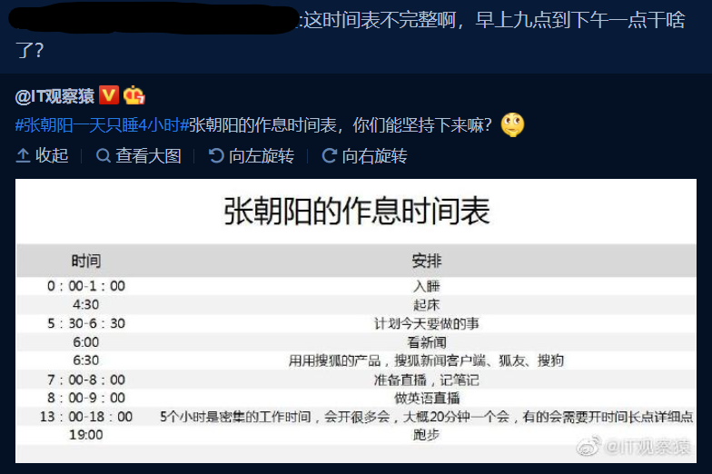
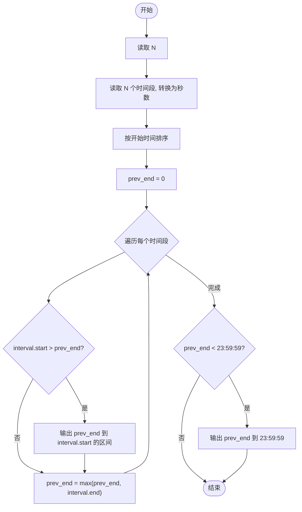
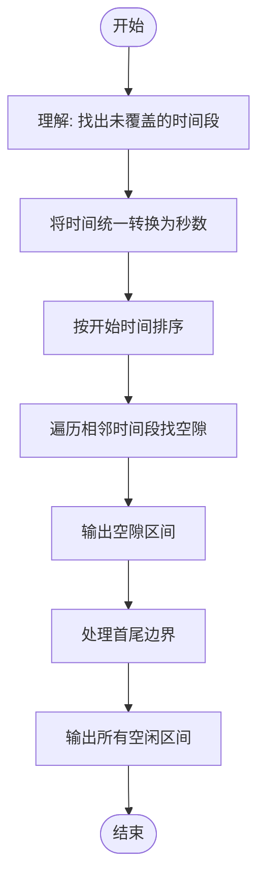

# L2-042 - 老板的作息表（25 分）

- **时间限制**: 200 ms
- **内存限制**: 65536 KB
- **代码长度限制**: 16 KB

---

## 题目描述



新浪微博上有人发了某老板的作息时间表，表示其每天 4:30 就起床了。但立刻有眼尖的网友问：这时间表不完整啊，早上九点到下午一点干啥了？

本题就请你编写程序，检查任意一张时间表，找出其中没写出来的时间段。

### 输入格式:

输入第一行给出一个正整数 $$N$$，为作息表上列出的时间段的个数。随后 $$N$$ 行，每行给出一个时间段，格式为：

```
hh:mm:ss - hh:mm:ss
```
其中 `hh`、`mm`、`ss` 分别是两位数表示的小时、分钟、秒。第一个时间是开始时间，第二个是结束时间。题目保证所有时间都在一天之内（即从 00:00:00 到 23:59:59）；每个区间间隔至少 1 秒；并且任意两个给出的时间区间最多只在一个端点有重合，没有区间重叠的情况。

### 输出格式:

按照时间顺序列出时间表中没有出现的区间，每个区间占一行，格式与输入相同。题目保证至少存在一个区间需要输出。

### 输入样例:

```in
8
13:00:00 - 18:00:00
00:00:00 - 01:00:05
08:00:00 - 09:00:00
07:10:59 - 08:00:00
01:00:05 - 04:30:00
06:30:00 - 07:10:58
05:30:00 - 06:30:00
18:00:00 - 19:00:00
```

### 输出样例:

```out
04:30:00 - 05:30:00
07:10:58 - 07:10:59
09:00:00 - 13:00:00
19:00:00 - 23:59:59
```

## 示例

### 示例 1

**输入:**
```
8
13:00:00 - 18:00:00
00:00:00 - 01:00:05
08:00:00 - 09:00:00
07:10:59 - 08:00:00
01:00:05 - 04:30:00
06:30:00 - 07:10:58
05:30:00 - 06:30:00
18:00:00 - 19:00:00
```

**输出:**
```
04:30:00 - 05:30:00
07:10:58 - 07:10:59
09:00:00 - 13:00:00
19:00:00 - 23:59:59
```

---

## 题目详解

### 一、解题思路

本题的 R 实现采用以下方法：将输入组织为矩阵或表格，按题目定义的行、列和状态关系完成计算。

### 二、代码流程说明

1. 读取并解析标准输入，转换为题目所需的数据结构。
2. 按题意执行核心算法，维护中间状态并处理边界情况。
3. 整理计算结果，按照输出格式生成答案。

### 三、代码实现

```r
# 实现原理：将输入组织为矩阵或表格，按题目定义的行、列和状态关系完成计算。
# 处理流程：读取输入 -> 建立状态 -> 执行算法 -> 按题目格式输出。
# 关键变量和循环均直接对应题目中的数据、约束或操作。

# 读取并解析标准输入。
x <- readLines("stdin", warn = FALSE)
x <- x[nchar(trimws(x)) > 0]
n <- as.integer(x[1])
sec <- function(s) {
    z <- as.integer(strsplit(trimws(s), ":", fixed = TRUE)[[1]])
    z[1] * 3600 + z[2] * 60 + z[3]
}
a <- lapply(x[2:(n + 1)], function(s) {
    z <- strsplit(s, "-", fixed = TRUE)[[1]]
    c(sec(z[1]), sec(z[2]))
})
# 执行核心排序、状态转移或选择逻辑。
a <- a[order(vapply(a, `[[`, 0, 1))]
last <- 0
fmt <- function(t) sprintf("%02d:%02d:%02d", t%/%3600, (t%/%60)%%60,
    t%%60)
out <- character()
# 按题目约束遍历当前数据，更新中间状态。
for (z in a) {
    if (z[1] > last)
        out <- c(out, paste(fmt(last), "-", fmt(z[1])))
    last <- max(last, z[2])
}
if (last < 86399) out <- c(out, paste(fmt(last), "- 23:59:59"))
# 严格按照题目规定的输出格式输出答案。
cat(paste(out, collapse = "\n"), "\n", sep = "")
```

### 四、代码流程图



### 五、解题流程图



### 六、常见易错点

- 题目描述、输入格式、输出格式和输入输出样例必须保持原文不变。
- R 语言下标从 1 开始，注意编号转换和空输入边界。
- 输出时严格保留题目规定的空格、换行和小数位数。
