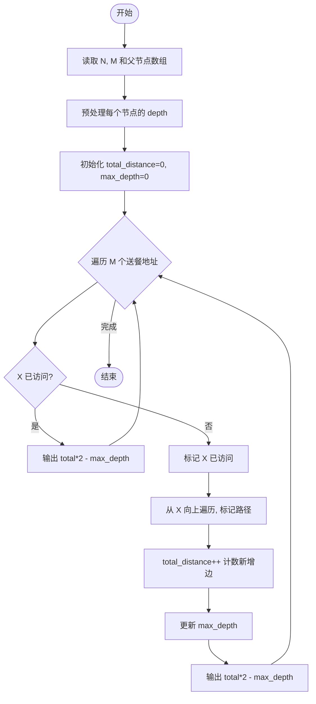
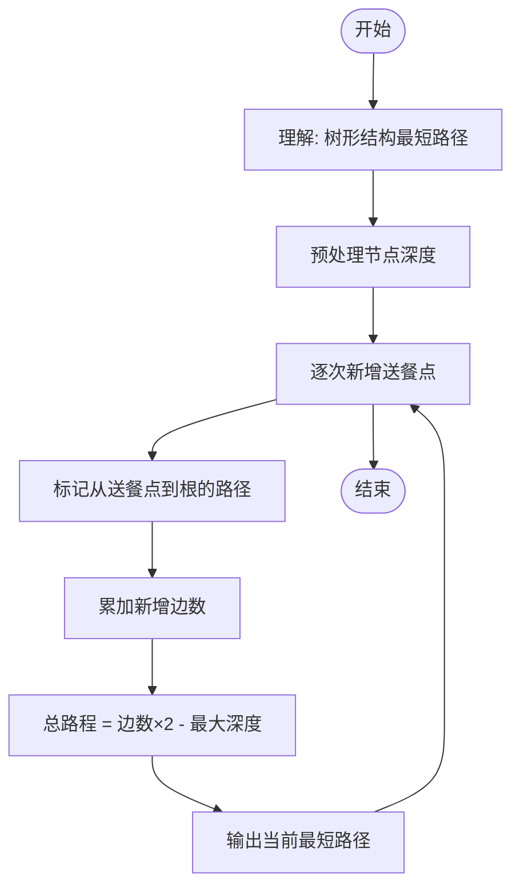

# L2-043 - 龙龙送外卖（25 分）

- **时间限制**: 400 ms
- **内存限制**: 65536 KB
- **代码长度限制**: 16 KB

---

## 题目描述

龙龙是“饱了呀”外卖软件的注册骑手，负责送帕特小区的外卖。帕特小区的构造非常特别，都是双向道路且没有构成环 —— 你可以简单地认为小区的路构成了一棵树，根结点是外卖站，树上的结点就是要送餐的地址。

每到中午 12 点，帕特小区就进入了点餐高峰。一开始，只有一两个地方点外卖，龙龙简单就送好了；但随着大数据的分析，龙龙被派了更多的单子，也就送得越来越累……

看着一大堆订单，龙龙想知道，从外卖站出发，访问所有点了外卖的地方至少一次（这样才能把外卖送到）所需的最短路程的距离到底是多少？每次新增一个点外卖的地址，他就想估算一遍整体工作量，这样他就可以搞明白新增一个地址给他带来了多少负担。

### 输入格式:

输入第一行是两个数 $N$ 和 $M$ ($2 \le N \le 10^5$, $1 \le M \le  10^5$)，分别对应树上节点的个数（包括外卖站），以及新增的送餐地址的个数。

接下来首先是一行 $N$ 个数，第 $i$ 个数表示第 $i$ 个点的双亲节点的编号。节点编号从 1 到 $N$，外卖站的双亲编号定义为 $-1$。

接下来有 $M$ 行，每行给出一个新增的送餐地点的编号 $X_i$。保证送餐地点中不会有外卖站，但地点有可能会重复。

为了方便计算，我们可以假设龙龙一开始一个地址的外卖都不用送，两个相邻的地点之间的路径长度统一设为 1，且从外卖站出发可以访问到所有地点。

注意：所有送餐地址可以按任意顺序访问，***且完成送餐后无需返回外卖站***。

### 输出格式:

对于每个新增的地点，在一行内输出题目需要求的最短路程的距离。

### 输入样例:

```in
7 4
-1 1 1 1 2 2 3
5
6
2
4
```

### 输出样例:

```out
2
4
4
6
```

## 示例

### 示例 1

**输入:**
```
7 4
-1 1 1 1 2 2 3
5
6
2
4
```

**输出:**
```
2
4
4
6
```

---

## 题目详解

### 一、解题思路

本题的 R 实现采用以下方法：读取标准输入后建立题目所需的数据结构，按约束执行核心计算并输出结果。

### 二、代码流程说明

1. 读取并解析标准输入，转换为题目所需的数据结构。
2. 按题意执行核心算法，维护中间状态并处理边界情况。
3. 整理计算结果，按照输出格式生成答案。

### 三、代码实现

```r
# 实现原理：读取标准输入后建立题目所需的数据结构，按约束执行核心计算并输出结果。
# 处理流程：读取输入 -> 建立状态 -> 执行算法 -> 按题目格式输出。
# 关键变量和循环均直接对应题目中的数据、约束或操作。

# 读取并解析标准输入。
v <- scan(file = "stdin", quiet = TRUE)
n <- v[1]
m <- v[2]
par <- v[3:(n + 2)]
k <- n + 3
used <- 1
edges <- 0
dep <- rep(0, n)
g <- vector("list", n)
# 按题目约束遍历当前数据，更新中间状态。
for (i in seq_len(n)) g[[i]] <- integer()
for (i in seq_len(n)) if (par[i] != -1) g[[par[i]]] <- c(g[[par[i]]],
    i)
q <- 1
while (length(q)) {
    u <- q[1]
    q <- q[-1]
    for (w in g[[u]]) {
        dep[w] <- dep[u] + 1
        q <- c(q, w)
    }
}
out <- character()
mx <- 0
for (i in seq_len(m)) {
    x <- v[k]
    k <- k + 1
    if (!x %in% used) {
        while (!x %in% used) {
            used <- c(used, x)
            edges <- edges + 1
            x <- par[x]
        }
    }
    mx <- max(mx, dep[v[k - 1]])
    out <- c(out, as.character(2 * edges - mx))
}
# 严格按照题目规定的输出格式输出答案。
cat(paste(out, collapse = "\n"), "\n", sep = "")
```

### 四、代码流程图



### 五、解题流程图



### 六、常见易错点

- 题目描述、输入格式、输出格式和输入输出样例必须保持原文不变。
- R 语言下标从 1 开始，注意编号转换和空输入边界。
- 输出时严格保留题目规定的空格、换行和小数位数。
