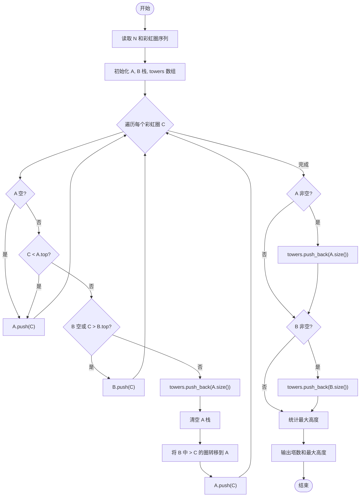
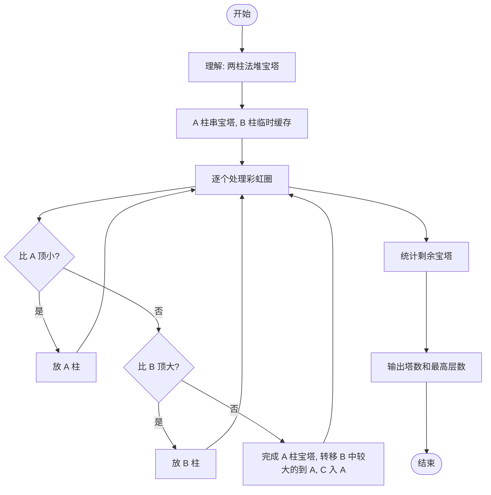

# L2-045 - 堆宝塔（25 分）

- **时间限制**: 400 ms
- **内存限制**: 65536 KB
- **代码长度限制**: 16 KB

---

## 题目描述


堆宝塔游戏是让小朋友根据抓到的彩虹圈的直径大小，按照从大到小的顺序堆起宝塔。但彩虹圈不一定是按照直径的大小顺序抓到的。聪明宝宝采取的策略如下：
- 首先准备两根柱子，一根 A 柱串宝塔，一根 B 柱用于临时叠放。
- 把第 1 块彩虹圈作为第 1 座宝塔的基座，在 A 柱放好。
- 将抓到的下一块彩虹圈 C 跟当前 A 柱宝塔最上面的彩虹圈比一下，如果比最上面的小，就直接放上去；否则把 C 跟 B 柱最上面的彩虹圈比一下：
-- 如果 B 柱是空的、或者 C 大，就在 B 柱上放好；
-- 否则把 A 柱上串好的宝塔取下来作为一件成品；然后把 B 柱上所有比 C 大的彩虹圈逐一取下放到 A 柱上，最后把 C 也放到 A 柱上。

重复此步骤，直到所有的彩虹圈都被抓完。最后 A 柱上剩下的宝塔作为一件成品，B 柱上剩下的彩虹圈被逐一取下，堆成另一座宝塔。问：宝宝一共堆出了几个宝塔？最高的宝塔有多少层？

### 输入格式:

输入第一行给出一个正整数 $$N$$（$$\le 10^3$$），为彩虹圈的个数。第二行按照宝宝抓取的顺序给出 $$N$$ 个不超过 100 的正整数，对应每个彩虹圈的直径。

### 输出格式:

在一行中输出宝宝堆出的宝塔个数，和最高的宝塔的层数。数字间以 1 个空格分隔，行首尾不得有多余空格。
### 输入样例:

```in
11
10 8 9 5 12 11 4 3 1 9 15
```
### 输出样例:

```out
4 5
```
## 样例解释：

宝宝堆成的宝塔顺次为：
- 10、8、5
- 12、11、4、3、1
- 9
- 15、9

## 示例

### 示例 1

**输入:**
```
11
10 8 9 5 12 11 4 3 1 9 15
```

**输出:**
```
4 5
```

---

## 题目详解

### 一、解题思路

本题的 R 实现采用以下方法：读取标准输入后建立题目所需的数据结构，按约束执行核心计算并输出结果。

### 二、代码流程说明

1. 读取并解析标准输入，转换为题目所需的数据结构。
2. 按题意执行核心算法，维护中间状态并处理边界情况。
3. 整理计算结果，按照输出格式生成答案。

### 三、代码实现

```r
# 实现原理：读取标准输入后建立题目所需的数据结构，按约束执行核心计算并输出结果。
# 处理流程：读取输入 -> 建立状态 -> 执行算法 -> 按题目格式输出。
# 关键变量和循环均直接对应题目中的数据、约束或操作。

# 读取并解析标准输入。
v <- scan(file = "stdin", quiet = TRUE)
n <- v[1]
a <- v[2:(n + 1)]
py_a <- a[1]
py_b <- numeric()
hs <- integer()
if (n > 1L) for (x in a[-1]) {
    if (length(py_a) && x < tail(py_a, 1))
        py_a <- c(py_a, x)
    else if (!length(py_b) || x > tail(py_b, 1))
        py_b <- c(py_b, x)
    else {
        hs <- c(hs, length(py_a))
        py_a <- numeric()
# 按题目约束遍历当前数据，更新中间状态。
        while (length(py_b) && tail(py_b, 1) > x) {
            py_a <- c(py_a, tail(py_b, 1))
            py_b <- head(py_b, -1)
        }
        py_a <- c(py_a, x)
    }
}
if (length(py_a)) hs <- c(hs, length(py_a))
if (length(py_b)) hs <- c(hs, length(py_b))
# 严格按照题目规定的输出格式输出答案。
cat(paste(length(hs), if (length(hs)) max(hs) else 0), "\n", sep = "")
```

### 四、代码流程图



### 五、解题流程图



### 六、常见易错点

- 题目描述、输入格式、输出格式和输入输出样例必须保持原文不变。
- R 语言下标从 1 开始，注意编号转换和空输入边界。
- 输出时严格保留题目规定的空格、换行和小数位数。
