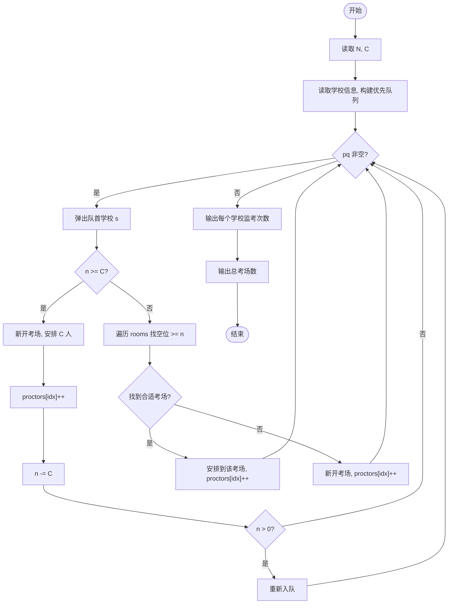
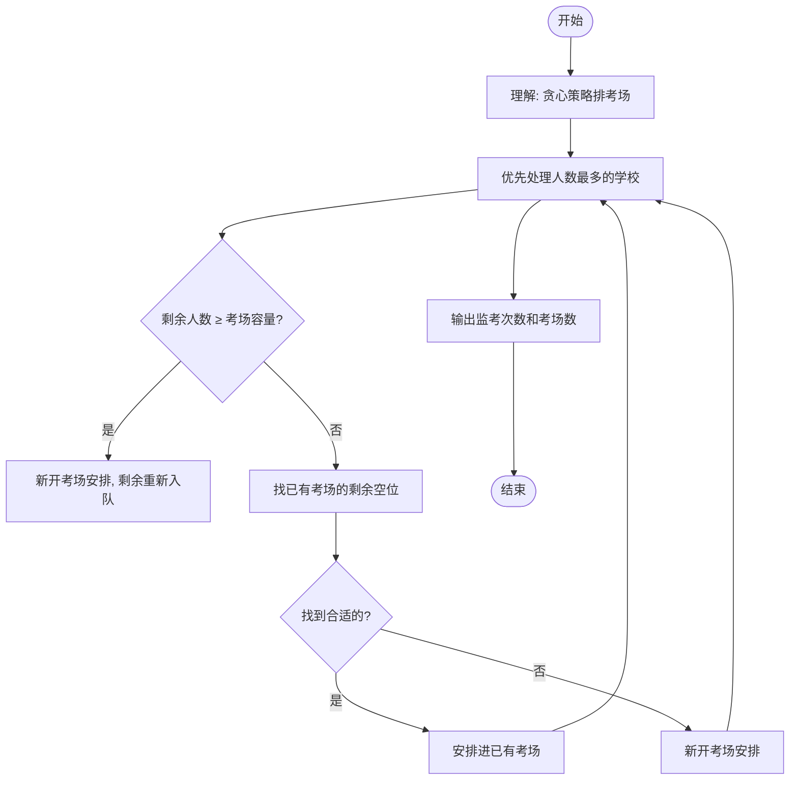

# L2-046 - 天梯赛的赛场安排（25 分）

- **时间限制**: 400 ms
- **内存限制**: 65536 KB
- **代码长度限制**: 16 KB

---

## 题目描述


天梯赛使用 OMS 监考系统，需要将参赛队员安排到系统中的虚拟赛场里，并为每个赛场分配一位监考老师。每位监考老师需要联系自己赛场内队员对应的教练们，以便发放比赛账号。为了尽可能减少教练和监考的沟通负担，我们要求赛场的安排满足以下条件：

* 每位监考老师负责的赛场里，队员人数不得超过赛场规定容量 $C$；
* 每位教练需要联系的监考人数尽可能少 —— 这里假设每所参赛学校只有一位负责联系的教练，且每个赛场的监考老师都不相同。

为此我们设计了多轮次排座算法，按照尚未安排赛场的队员人数从大到小的顺序，每一轮对当前未安排的人数最多的学校进行处理。记当前待处理的学校未安排人数为 $n$：

* 如果 $n\ge C$，则新开一个赛场，将 $C$ 位队员安排进去。剩下的人继续按人数规模排队，等待下一轮处理；
* 如果 $n<C$，则寻找剩余空位数大于等于 $n$ 的编号最小的赛场，将队员安排进去；
* 如果 $n<C$，且找不到任何非空的、剩余空位数大于等于 $n$ 的赛场了，则新开一个赛场，将队员安排进去。

由于近年来天梯赛的参赛人数快速增长，2023年超过了 480 所学校 1.6 万人，所以我们必须写个程序来处理赛场安排问题。

### 输入格式:

输入第一行给出两个正整数 $N$ 和 $C$，分别为参赛学校数量和每个赛场的规定容量，其中 $0<N\le 5000$，$10\le C \le 50$。随后 $N$ 行，每行给出一个学校的缩写（为长度不超过 6 的非空小写英文字母串）和该校参赛人数（不超过 500 的正整数），其间以空格分隔。题目保证每所学校只有一条记录。

### 输出格式:

按照输入的顺序，对每一所参赛高校，在一行中输出学校缩写和该校需要联系的监考人数，其间以 1 空格分隔。\
最后在一行中输出系统中应该开设多少个赛场。

### 输入样例:

```in
10 30
zju 30
hdu 93
pku 39
hbu 42
sjtu 21
abdu 10
xjtu 36
nnu 15
hnu 168
hsnu 20
```

### 输出样例:

```out
zju 1
hdu 4
pku 2
hbu 2
sjtu 1
abdu 1
xjtu 2
nnu 1
hnu 6
hsnu 1
16
```

## 示例

### 示例 1

**输入:**
```
10 30
zju 30
hdu 93
pku 39
hbu 42
sjtu 21
abdu 10
xjtu 36
nnu 15
hnu 168
hsnu 20
```

**输出:**
```
zju 1
hdu 4
pku 2
hbu 2
sjtu 1
abdu 1
xjtu 2
nnu 1
hnu 6
hsnu 1
16
```

---

## 题目详解

### 一、解题思路

本题的 R 实现采用以下方法：读取标准输入后建立题目所需的数据结构，按约束执行核心计算并输出结果。

### 二、代码流程说明

1. 读取并解析标准输入，转换为题目所需的数据结构。
2. 按题意执行核心算法，维护中间状态并处理边界情况。
3. 整理计算结果，按照输出格式生成答案。

### 三、代码实现

```r
# 实现原理：读取标准输入后建立题目所需的数据结构，按约束执行核心计算并输出结果。
# 处理流程：读取输入 -> 建立状态 -> 执行算法 -> 按题目格式输出。
# 关键变量和循环均直接对应题目中的数据、约束或操作。

# 读取并解析标准输入。
v <- scan(file = "stdin", what = "", quiet = TRUE)
n <- as.integer(v[1])
m <- as.integer(v[2])
p <- 3
names <- character(n)
rem <- numeric(n)
# 按题目约束遍历当前数据，更新中间状态。
for (i in seq_len(n)) {
    names[i] <- v[p]
    rem[i] <- as.numeric(v[p + 1])
    p <- p + 2
}
rooms <- numeric()
cnt <- integer(n)
while (any(rem > 0)) {
    i <- which(rem == max(rem))[1]
    x <- rem[i]
    if (x >= m) {
        rooms <- c(rooms, 0)
        rem[i] <- rem[i] - m
    }
    else {
        z <- which(rooms >= x)
        if (length(z))
            rooms[z[which.min(rooms[z])]] <- rooms[z[which.min(rooms[z])]] -
                x
        else rooms <- c(rooms, m - x)
        rem[i] <- 0
    }
    cnt[i] <- cnt[i] + 1
}
# 严格按照题目规定的输出格式输出答案。
for (i in seq_len(n)) cat(paste(names[i], cnt[i]), "\n", sep = "")
cat(length(rooms), "\n", sep = "")
```

### 四、代码流程图



### 五、解题流程图



### 六、常见易错点

- 题目描述、输入格式、输出格式和输入输出样例必须保持原文不变。
- R 语言下标从 1 开始，注意编号转换和空输入边界。
- 输出时严格保留题目规定的空格、换行和小数位数。
