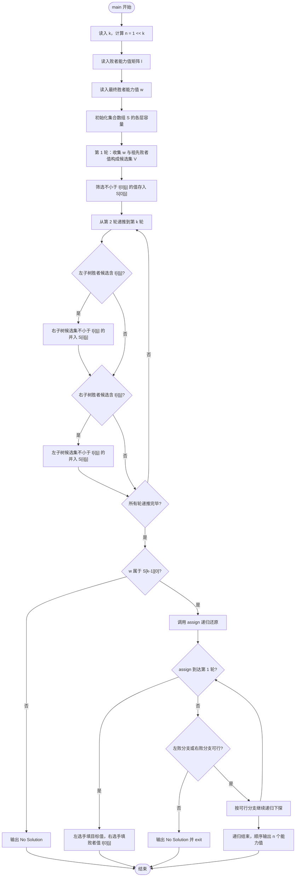
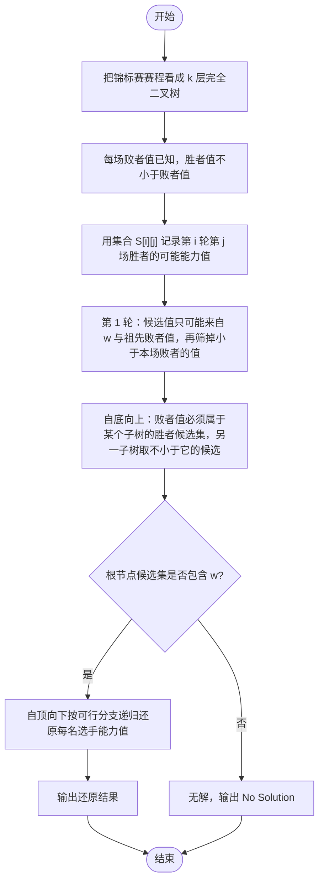

# L2-047 - 锦标赛（25 分）

- **时间限制**: 400 ms
- **内存限制**: 65536 KB
- **代码长度限制**: 16 KB

---

## 题目描述

有 $2^k$ 名选手将要参加一场锦标赛。锦标赛共有 $k$ 轮，其中第 $i$ 轮的比赛共有 $2^{k - i}$ 场，每场比赛恰有两名选手参加并从中产生一名胜者。每场比赛的安排如下：

* 对于第 $1$ 轮的第 $j$ 场比赛，由第 $(2j - 1)$ 名选手对抗第 $2j$ 名选手。
* 对于第 $i$ 轮的第 $j$ 场比赛（$i > 1$），由第 $(i - 1)$ 轮第 $(2j - 1)$ 场比赛的胜者对抗第 $(i - 1)$ 轮第 $2j$ 场比赛的胜者。

第 $k$ 轮唯一一场比赛的胜者就是整个锦标赛的最终胜者。\
举个例子，假如共有 $8$ 名选手参加锦标赛，则比赛的安排如下：

* 第 $1$ 轮共 $4$ 场比赛：选手 $1$ vs 选手 $2$，选手 $3$ vs 选手 $4$，选手 $5$ vs 选手 $6$，选手 $7$ vs 选手 $8$。
* 第 $2$ 轮共 $2$ 场比赛：第 $1$ 轮第 $1$ 场的胜者 vs 第 $1$ 轮第 $2$ 场的胜者，第 $1$ 轮第 $3$ 场的胜者 vs 第 $1$ 轮第 $4$ 场的胜者。
* 第 $3$ 轮共 $1$ 场比赛：第 $2$ 轮第 $1$ 场的胜者 vs 第 $2$ 轮第 $2$ 场的胜者。

已知每一名选手都有一个能力值，其中第 $i$ 名选手的能力值为 $a_i$。在一场比赛中，若两名选手的能力值不同，则能力值较大的选手一定会打败能力值较小的选手；若两名选手的能力值相同，则两名选手都有可能成为胜者。

令 $l_{i, j}$ 表示第 $i$ 轮第 $j$ 场比赛 **败者** 的能力值，令 $w$ 表示整个锦标赛最终胜者的能力值。给定所有满足 $1 \le i \le k$ 且 $1 \le j \le 2^{k - i}$ 的 $l_{i, j}$ 以及 $w$，请还原出 $a_1, a_2, \cdots, a_n$。

### 输入格式:

第一行输入一个整数 $k$（$1 \le k \le 18$）表示锦标赛的轮数。\
对于接下来 $k$ 行，第 $i$ 行输入 $2^{k - i}$ 个整数 $l_{i, 1}, l_{i, 2}, \cdots, l_{i, 2^{k - i}}$（$1 \le l_{i, j} \le 10^9$），其中 $l_{i, j}$ 表示第 $i$ 轮第 $j$ 场比赛 **败者** 的能力值。\
接下来一行输入一个整数 $w$（$1 \le w \le 10^9$）表示锦标赛最终胜者的能力值。

### 输出格式:

输出一行 $n$ 个由单个空格分隔的整数 $a_1, a_2, \cdots, a_n$，其中 $a_i$ 表示第 $i$ 名选手的能力值。如果有多种合法答案，请输出任意一种。如果无法还原出能够满足输入数据的答案，输出一行 `No Solution`。\
请勿在行末输出多余空格。

### 输入样例 1:

```in
3
4 5 8 5
7 6
8
9
```

### 输出样例 1:

```out
7 4 8 5 9 8 6 5
```

### 输入样例 2:

```in
2
5 8
3
9
```

### 输出样例 2:

```out
No Solution
```

## 提示:

本题返回结果若为**格式错误**均可视为**答案错误**。

## 示例

### 示例 1

**输入:**
```
3
4 5 8 5
7 6
8
9
```

**输出:**
```
7 4 8 5 9 8 6 5
```

### 示例 2

**输入:**
```
2
5 8
3
9
```

**输出:**
```
No Solution
```

---

## 题目详解

### 一、解题思路

本题的 R 实现采用以下方法：将输入组织为矩阵或表格，按题目定义的行、列和状态关系完成计算。

### 二、代码流程说明

1. 读取并解析标准输入，转换为题目所需的数据结构。
2. 按题意执行核心算法，维护中间状态并处理边界情况。
3. 整理计算结果，按照输出格式生成答案。

### 三、代码实现

```r
# 实现原理：将输入组织为矩阵或表格，按题目定义的行、列和状态关系完成计算。
# 处理流程：读取输入 -> 建立状态 -> 执行算法 -> 按题目格式输出。
# 关键变量和循环均直接对应题目中的数据、约束或操作。

# 读取并解析标准输入。
v <- scan(file = "stdin", quiet = TRUE)
k <- as.integer(v[1])
n <- 2^k
idx <- 2L
lev <- vector("list", k)
# 按题目约束遍历当前数据，更新中间状态。
for (l in seq_len(k)) {
    z <- 2^(k - l)
    lev[[l]] <- v[idx:(idx + z - 1L)]
    idx <- idx + z
}
w <- v[idx]
need <- lapply(lev, function(x) rep(Inf, length(x)))
need[[1]] <- lev[[1]]
if (k > 1L) for (l in 2:k) for (j in seq_along(lev[[l]])) {
# 执行核心排序、状态转移或选择逻辑。
    xy <- sort(need[[l - 1]][c(2 * j - 1L, 2 * j)])
    need[[l]][j] <- if (xy[1] <= lev[[l]][j])
        max(lev[[l]][j], xy[2])
    else Inf
}
# 严格按照题目规定的输出格式输出答案。
if (need[[k]][1] > w) cat("No Solution\n") else {
    ans <- numeric(n)
    go <- function(l, j, weight) {
        if (l == 1L) {
            ans[2 * j - 1L] <<- weight
            ans[2 * j] <<- lev[[1]][j]
            return()
        }
        xy <- need[[l - 1]][c(2 * j - 1L, 2 * j)]
        if (xy[1] <= xy[2]) {
            go(l - 1L, 2 * j - 1L, lev[[l]][j])
            go(l - 1L, 2 * j, weight)
        }
        else {
            go(l - 1L, 2 * j - 1L, weight)
            go(l - 1L, 2 * j, lev[[l]][j])
        }
    }
    go(k, 1L, w)
    cat(paste(ans, collapse = " "), "\n", sep = "")
}
```

### 四、代码流程图



### 五、解题流程图



### 六、常见易错点

- 题目描述、输入格式、输出格式和输入输出样例必须保持原文不变。
- R 语言下标从 1 开始，注意编号转换和空输入边界。
- 输出时严格保留题目规定的空格、换行和小数位数。
