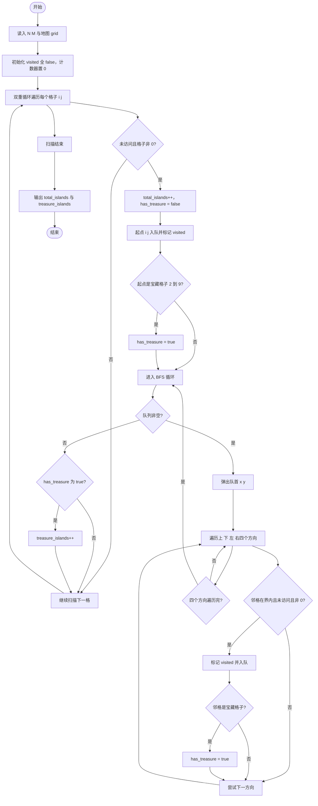
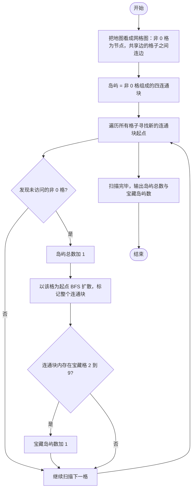

# L2-048 - 寻宝图（25 分）

- **时间限制**: 400 ms
- **内存限制**: 65536 KB
- **代码长度限制**: 16 KB

---

## 题目描述

给定一幅地图，其中有水域，有陆地。被水域完全环绕的陆地是岛屿。有些岛屿上埋藏有宝藏，这些有宝藏的点也被标记出来了。本题就请你统计一下，给定的地图上一共有多少岛屿，其中有多少是有宝藏的岛屿。

### 输入格式:

输入第一行给出 2 个正整数 $N$ 和 $M$（$1 < N\times M\le 10^5$），是地图的尺寸，表示地图由 $N$ 行 $M$ 列格子构成。随后 $N$ 行，每行给出 $M$ 位个位数，其中 `0` 表示水域，`1` 表示陆地，`2`\-`9` 表示宝藏。\
注意：两个格子共享一条边时，才是“相邻”的。宝藏都埋在陆地上。默认地图外围全是水域。

### 输出格式:

在一行中输出 2 个整数，分别是岛屿的总数量和有宝藏的岛屿的数量。

### 输入样例:

```in
10 11
01000000151
11000000111
00110000811
00110100010
00000000000
00000111000
00114111000
00110010000
00019000010
00120000001
```

### 输出样例:

```out
7 2
```

## 示例

### 示例 1

**输入:**
```
10 11
01000000151
11000000111
00110000811
00110100010
00000000000
00000111000
00114111000
00110010000
00019000010
00120000001
```

**输出:**
```
7 2
```

---

## 题目详解

### 一、解题思路

本题的 R 实现采用以下方法：将输入组织为矩阵或表格，按题目定义的行、列和状态关系完成计算。

### 二、代码流程说明

1. 读取并解析标准输入，转换为题目所需的数据结构。
2. 按题意执行核心算法，维护中间状态并处理边界情况。
3. 整理计算结果，按照输出格式生成答案。

### 三、代码实现

```r
# 实现原理：将输入组织为矩阵或表格，按题目定义的行、列和状态关系完成计算。
# 处理流程：读取输入 -> 建立状态 -> 执行算法 -> 按题目格式输出。
# 关键变量和循环均直接对应题目中的数据、约束或操作。

# 读取并解析标准输入。
v <- scan(file = "stdin", what = "", quiet = TRUE)
n <- as.integer(v[1])
m <- as.integer(v[2])
grid <- v[3:(n + 2)]
cell <- function(x, y) substr(grid[x], y, y)
seen <- matrix(FALSE, n, m)
is <- tr <- 0
# 按题目约束遍历当前数据，更新中间状态。
for (i in seq_len(n)) for (j in seq_len(m)) if (cell(i, j) !=
    "0" && !seen[i, j]) {
    is <- is + 1
    st <- matrix(c(i, j), 1, 2)
    seen[i, j] <- TRUE
    tre <- FALSE
    while (nrow(st)) {
        x <- st[1, 1]
        y <- st[1, 2]
        st <- st[-1, , drop = FALSE]
        if (cell(x, y) != "1")
            tre <- TRUE
        for (z in list(c(x - 1, y), c(x + 1, y), c(x, y - 1),
            c(x, y + 1))) {
            u <- z[1]
            w <- z[2]
            if (u >= 1 && u <= n && w >= 1 && w <= m && !seen[u,
                w] && cell(u, w) != "0") {
                seen[u, w] <- TRUE
                st <- rbind(st, c(u, w))
            }
        }
    }
    if (tre)
        tr <- tr + 1
}
# 严格按照题目规定的输出格式输出答案。
cat(paste(is, tr), "\n", sep = "")
```

### 四、代码流程图



### 五、解题流程图



### 六、常见易错点

- 题目描述、输入格式、输出格式和输入输出样例必须保持原文不变。
- R 语言下标从 1 开始，注意编号转换和空输入边界。
- 输出时严格保留题目规定的空格、换行和小数位数。
