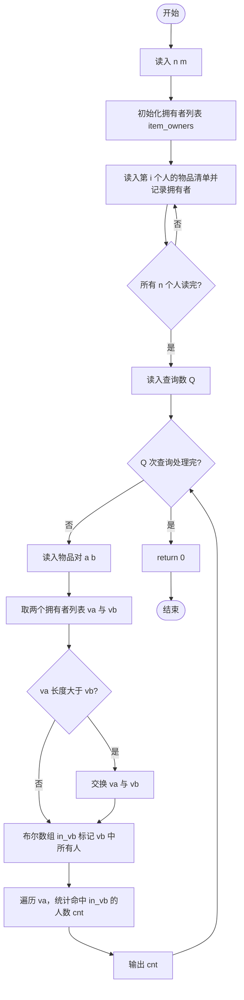
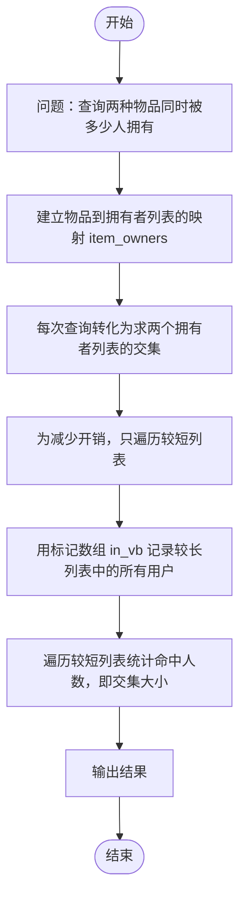

# L2-049 - 鱼与熊掌（25 分）

- **时间限制**: 400 ms
- **内存限制**: 65536 KB
- **代码长度限制**: 16 KB

---

## 题目描述


《孟子 · 告子上》有名言：“鱼，我所欲也，熊掌，亦我所欲也；二者不可得兼，舍鱼而取熊掌者也。”但这世界上还是有一些人可以做到鱼与熊掌兼得的。
给定 $n$ 个人对 $m$ 种物品的拥有关系。对其中任意一对物品种类（例如“鱼与熊掌”），请你统计有多少人能够兼得？

### 输入格式:

输入首先在第一行给出 2 个正整数，分别是：$n$（$\le 10^5$）为总人数（所有人从 1 到 $n$ 编号）、$m$（$2\le m \le 10^5$）为物品种类的总数（所有物品种类从 1 到 $m$ 编号）。
随后 $n$ 行，第 $i$ 行（$1\le i \le n$）给出编号为 $i$ 的人所拥有的物品种类清单，格式为：
```
K M[1] M[2] ... M[K]
```
其中 `K`（$\le 10^3$）是该人拥有的物品种类数量，后面的 `M[*]` 是物品种类的编号。题目保证每个人的物品种类清单中都没有重复给出的种类。
最后是查询信息：首先在一行中给出查询总量 $Q$（$\le 100$），随后 $Q$ 行，每行给出一对物品种类编号，其间以空格分隔。题目保证物品种类编号都是合法存在的。
### 输出格式:

对每一次查询，在一行中输出两种物品兼得的人数。
### 输入样例:

```in
4 8
3 4 1 8
4 7 1 8 4
5 6 5 1 2 3
4 3 2 4 8
3
2 3
7 6
8 4
```
### 输出样例:

```out
2
0
3
```

## 示例

### 示例 1

**输入:**
```
4 8
3 4 1 8
4 7 1 8 4
5 6 5 1 2 3
4 3 2 4 8
3
2 3
7 6
8 4
```

**输出:**
```
2
0
3
```

---

## 题目详解

### 一、解题思路

本题的 R 实现采用以下方法：读取标准输入后建立题目所需的数据结构，按约束执行核心计算并输出结果。

### 二、代码流程说明

1. 读取并解析标准输入，转换为题目所需的数据结构。
2. 按题意执行核心算法，维护中间状态并处理边界情况。
3. 整理计算结果，按照输出格式生成答案。

### 三、代码实现

```r
# 实现原理：读取标准输入后建立题目所需的数据结构，按约束执行核心计算并输出结果。
# 处理流程：读取输入 -> 建立状态 -> 执行算法 -> 按题目格式输出。
# 关键变量和循环均直接对应题目中的数据、约束或操作。

# 读取并解析标准输入。
v <- scan(file = "stdin", quiet = TRUE)
n <- v[1]
m <- v[2]
p <- 3
own <- vector("list", m + 1)
# 按题目约束遍历当前数据，更新中间状态。
for (i in seq_len(m + 1)) own[[i]] <- integer()
for (i in seq_len(n)) {
    z <- v[p]
    p <- p + 1
    for (j in seq_len(z)) {
        own[[v[p] + 1]] <- unique(c(own[[v[p] + 1]], i))
        p <- p + 1
    }
}
q <- v[p]
p <- p + 1
for (i in seq_len(q)) {
    a <- v[p] + 1
    b <- v[p + 1] + 1
    p <- p + 2
# 严格按照题目规定的输出格式输出答案。
    cat(length(intersect(own[[a]], own[[b]])), "\n", sep = "")
}
```

### 四、代码流程图



### 五、解题流程图



### 六、常见易错点

- 题目描述、输入格式、输出格式和输入输出样例必须保持原文不变。
- R 语言下标从 1 开始，注意编号转换和空输入边界。
- 输出时严格保留题目规定的空格、换行和小数位数。
