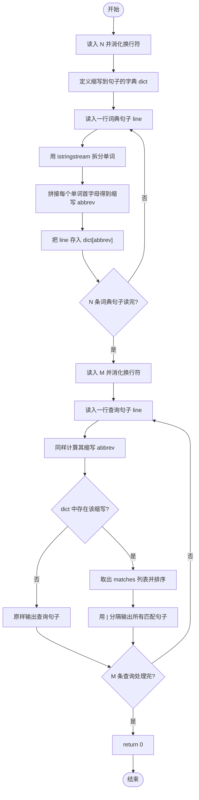
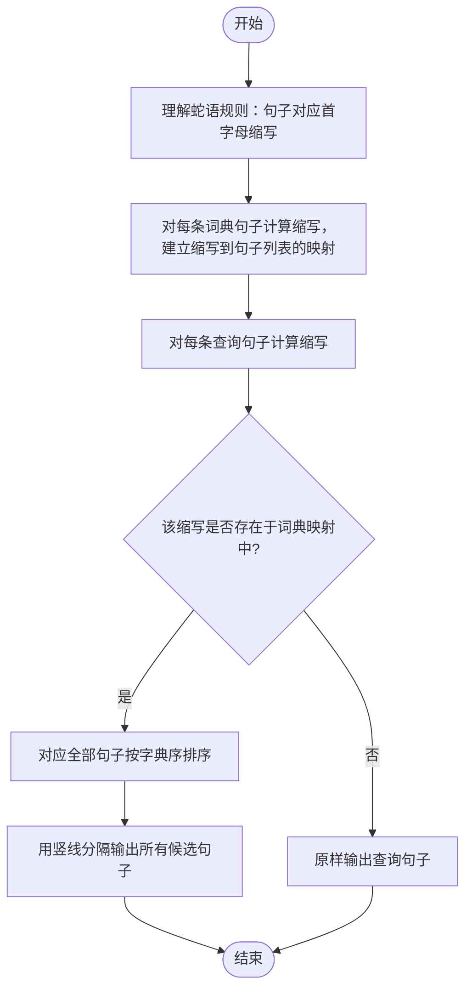

# L2-050 - 懂蛇语（25 分）

- **时间限制**: 400 ms
- **内存限制**: 65536 KB
- **代码长度限制**: 16 KB

---

## 题目描述


在《一年一度喜剧大赛》第二季中有一部作品叫《警察和我之蛇我其谁》，其中“毒蛇帮”内部用了一种加密语言，称为“蛇语”。蛇语的规则是，在说一句话 A 时，首先提取 A 的每个字的首字母，然后把整句话替换为另一句话 B，B 中每个字的首字母与 A 中提取出的字母依次相同。例如二当家说“九点下班哈”，对应首字母缩写是 `JDXBH`，他们解释为实际想说的是“京东新百货”……
本题就请你写一个蛇语的自动翻译工具，将输入的蛇语转换为实际要表达的句子。

### 输入格式:

输入第一行给出一个正整数 $$N$$（$$\le 10^5$$），为蛇语词典中句子的个数。随后 $$N$$ 行，每行用汉语拼音给出一句话。每句话由小写英文字母和空格组成，每个字的拼音由不超过 6 个小写英文字母组成，两个字的拼音之间用空格分隔。题目保证每句话总长度不超过 50 个字符，用回车结尾。注意：回车不算句中字符。
随后在一行中给出一个正整数 $$M$$（$$\le 10^3$$），为查询次数。后面跟 $$M$$ 行，每行用汉语拼音给出需要查询的一句话，格式同上。
### 输出格式:

对每一句查询，在一行中输出其对应的句子。如果句子不唯一，则按整句的字母序输出，句子间用 `|` 分隔。如果查不到，则将输入的句子原样输出。
注意：输出句子时，必须保持句中所有字符不变，包括空格。
### 输入样例:

```in
8
yong yuan de shen
yong yuan de she
jing dong xin bai huo
she yu wo ye hui shuo yi dian dian
liang wei bu yao chong dong
yi  dian dian
ni hui shuo she yu a
yong yuan de sha
7
jiu dian xia ban ha
shao ye wu ya he shui you dian duo
liu wan bu yao ci dao
ni hai shi su yan a
yao diao deng
sha ye ting bu jian
y y d s

```
### 输出样例:

```out
jing dong xin bai huo
she yu wo ye hui shuo yi dian dian
liang wei bu yao chong dong
ni hui shuo she yu a
yi  dian dian
sha ye ting bu jian
yong yuan de sha|yong yuan de she|yong yuan de shen

```

## 示例

### 示例 1

**输入:**
```
8
yong yuan de shen
yong yuan de she
jing dong xin bai huo
she yu wo ye hui shuo yi dian dian
liang wei bu yao chong dong
yi  dian dian
ni hui shuo she yu a
yong yuan de sha
7
jiu dian xia ban ha
shao ye wu ya he shui you dian duo
liu wan bu yao ci dao
ni hai shi su yan a
yao diao deng
sha ye ting bu jian
y y d s

```

**输出:**
```
jing dong xin bai huo
she yu wo ye hui shuo yi dian dian
liang wei bu yao chong dong
ni hui shuo she yu a
yi  dian dian
sha ye ting bu jian
yong yuan de sha|yong yuan de she|yong yuan de shen

```

---

## 题目详解

### 一、解题思路

本题的 R 实现采用以下方法：先解析数据并按题目规定的关键字排序，再进行顺序处理和格式化输出。

### 二、代码流程说明

1. 读取并解析标准输入，转换为题目所需的数据结构。
2. 按题意执行核心算法，维护中间状态并处理边界情况。
3. 整理计算结果，按照输出格式生成答案。

### 三、代码实现

```r
# 实现原理：先解析数据并按题目规定的关键字排序，再进行顺序处理和格式化输出。
# 处理流程：读取输入 -> 建立状态 -> 执行算法 -> 按题目格式输出。
# 关键变量和循环均直接对应题目中的数据、约束或操作。

# 读取并解析标准输入。
x <- readLines("stdin", warn = FALSE)
n <- as.integer(x[1])
dict <- list()
# 按题目约束遍历当前数据，更新中间状态。
for (i in seq_len(n)) {
    s <- x[i + 1]
    key <- paste(substr(strsplit(s, " ", fixed = TRUE)[[1]],
        1, 1), collapse = "")
# 执行核心排序、状态转移或选择逻辑。
    dict[[key]] <- sort(c(dict[[key]], s))
}
q <- as.integer(x[n + 2])
for (i in seq_len(q)) {
    s <- x[n + 2 + i]
    key <- paste(substr(strsplit(s, " ", fixed = TRUE)[[1]],
        1, 1), collapse = "")
    z <- dict[[key]]
# 严格按照题目规定的输出格式输出答案。
    cat(if (length(z))
        paste(z, collapse = "|")
    else s, "\n", sep = "")
}
```

### 四、代码流程图



### 五、解题流程图



### 六、常见易错点

- 题目描述、输入格式、输出格式和输入输出样例必须保持原文不变。
- R 语言下标从 1 开始，注意编号转换和空输入边界。
- 输出时严格保留题目规定的空格、换行和小数位数。
