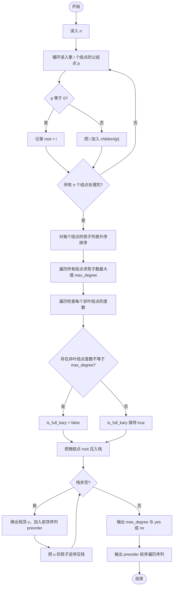
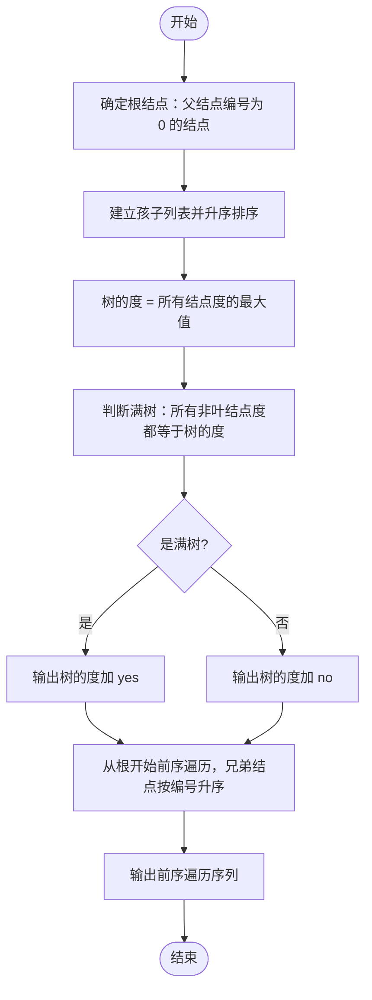

# L2-051 - 满树的遍历（25 分）

- **时间限制**: 400 ms
- **内存限制**: 65536 KB
- **代码长度限制**: 16 KB

---

## 题目描述

一棵“$k$ 阶满树”是指树中所有非叶结点的度都是 $k$ 的树。给定一棵树，你需要判断其是否为 $k$ 阶满树，并输出其前序遍历序列。

注：树中结点的度是其拥有的子树的个数，而树的度是树内各结点的度的最大值。

### 输入格式:

输入首先在第一行给出一个正整数 $n$（$\le 10^5$），是树中结点的个数。于是设所有结点从 1 到 $n$ 编号。
随后 $n$ 行，第 $i$ 行（$1\le i \le n$）给出第 $i$ 个结点的父结点编号。根结点没有父结点，则对应的父结点编号为 `0`。题目保证给出的是一棵合法多叉树，只有唯一根结点。
### 输出格式:

首先在一行中输出该树的度。如果输入的树是 $k$ 阶满树，则加 1 个空格后输出 `yes`，否则输出 `no`。最后在第二行输出该树的前序遍历序列，数字间以 1 个空格分隔，行首尾不得有多余空格。
注意：兄弟结点按编号升序访问。
### 输入样例 1:

```in
7
6
5
5
6
6
0
5
```
### 输出样例 1:

```out
3 yes
6 1 4 5 2 3 7
```
### 输入样例 2:

```in
7
6
5
5
6
6
0
4
```
### 输出样例 2:

```out
3 no
6 1 4 7 5 2 3
```

## 示例

### 示例 1

**输入:**
```
7
6
5
5
6
6
0
5
```

**输出:**
```
3 yes
6 1 4 5 2 3 7
```

### 示例 2

**输入:**
```
7
6
5
5
6
6
0
4
```

**输出:**
```
3 no
6 1 4 7 5 2 3
```

---

## 题目详解

### 一、解题思路

本题的 R 实现采用以下方法：将输入组织为矩阵或表格，按题目定义的行、列和状态关系完成计算。

### 二、代码流程说明

1. 读取并解析标准输入，转换为题目所需的数据结构。
2. 按题意执行核心算法，维护中间状态并处理边界情况。
3. 整理计算结果，按照输出格式生成答案。

### 三、代码实现

```r
# 实现原理：将输入组织为矩阵或表格，按题目定义的行、列和状态关系完成计算。
# 处理流程：读取输入 -> 建立状态 -> 执行算法 -> 按题目格式输出。
# 关键变量和循环均直接对应题目中的数据、约束或操作。

# 读取并解析标准输入。
v <- scan(file = "stdin", quiet = TRUE)
n <- v[1]
par <- v[2:(n + 1)]
g <- vector("list", n + 1L)
# 按题目约束遍历当前数据，更新中间状态。
for (i in seq_along(g)) g[[i]] <- integer()
root <- NA_integer_
for (i in seq_len(n)) if (par[i] == 0) root <- i else g[[par[i]]] <- c(g[[par[i]]],
    i)
d <- max(vapply(g, length, integer(1)))
full <- all(vapply(g, function(z) !length(z) || length(z) ==
    d, logical(1)))
out <- integer()
dfs <- function(x) {
    out <<- c(out, x)
# 执行核心排序、状态转移或选择逻辑。
    for (y in sort(g[[x]])) dfs(y)
}
dfs(root)
# 严格按照题目规定的输出格式输出答案。
cat(paste(d, if (full) "yes" else "no"), "\n", sep = "")
cat(paste(out, collapse = " "), "\n", sep = "")
```

### 四、代码流程图



### 五、解题流程图



### 六、常见易错点

- 题目描述、输入格式、输出格式和输入输出样例必须保持原文不变。
- R 语言下标从 1 开始，注意编号转换和空输入边界。
- 输出时严格保留题目规定的空格、换行和小数位数。
