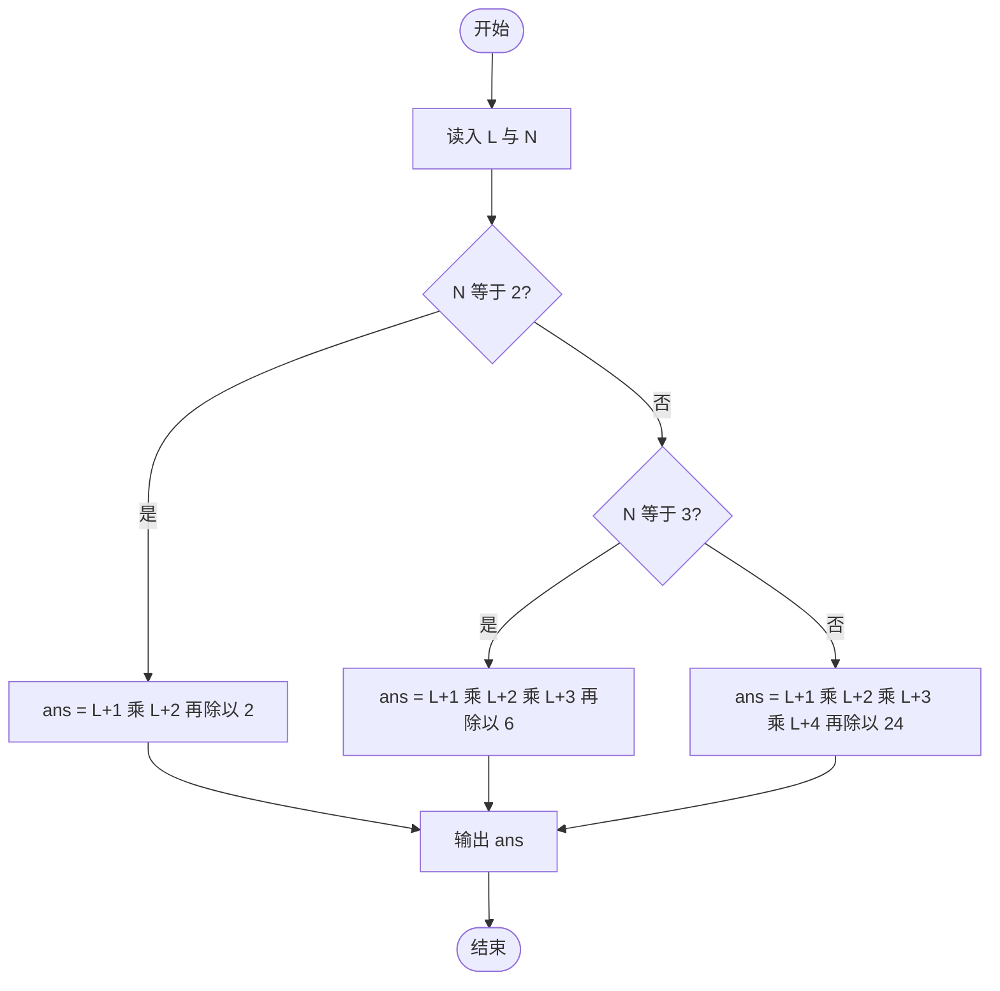
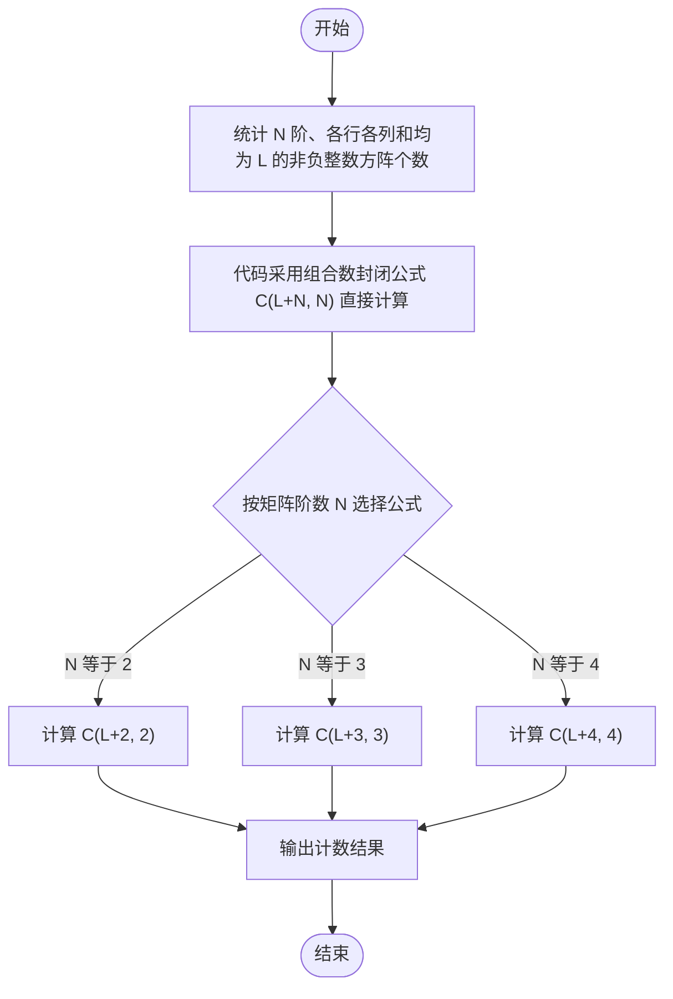

# L2-052 - 吉利矩阵（25 分）

- **时间限制**: 1000 ms
- **内存限制**: 65536 KB
- **代码长度限制**: 16 KB

---

## 题目描述

所有元素为非负整数，且各行各列的元素和都等于 $7$ 的 $3 \times 3$ 方阵称为“吉利矩阵”，因为这样的矩阵一共有 $666$ 种。
本题就请你统计一下，把 $7$ 换成任何一个 $[2, 9]$ 区间内的正整数 $L$，把矩阵阶数换成任何一个 $[2, 4]$ 区间内的正整数 $N$，满足条件“所有元素为非负整数，且各行各列的元素和都等于 $L$”的 $N \times N$ 方阵一共有多少种？

### 输入格式:

输入在一行中给出 2 个正整数 $L$ 和 $N$，意义如题面所述。数字间以空格分隔。
### 输出格式:

在一行中输出满足题目要求条件的方阵的个数。
### 输入样例:

```in
7 3
```
### 输出样例:

```out
666
```

## 示例

### 示例 1

**输入:**
```
7 3
```

**输出:**
```
666
```

---

## 题目详解

### 一、解题思路

本题的 R 实现采用以下方法：把原问题拆成规模更小的子问题，用状态转移保存已计算结果，避免重复计算。

### 二、代码流程说明

1. 读取并解析标准输入，转换为题目所需的数据结构。
2. 按题意执行核心算法，维护中间状态并处理边界情况。
3. 整理计算结果，按照输出格式生成答案。

### 三、代码实现

```r
# 实现原理：把原问题拆成规模更小的子问题，用状态转移保存已计算结果，避免重复计算。
# 处理流程：读取输入 -> 建立状态 -> 执行算法 -> 按题目格式输出。
# 关键变量和循环均直接对应题目中的数据、约束或操作。

# 读取并解析标准输入。
v <- scan(file = "stdin", quiet = TRUE)
limit <- v[1]
size <- v[2]
rows <- list()
build <- function(pre, rem) {
    if (length(pre) == size - 1)
        rows[[length(rows) + 1]] <<- c(pre, rem)
    else for (x in 0:rem) build(c(pre, x), rem - x)
}
build(numeric(), limit)
zero <- paste(rep(0, size), collapse = ",")
# 执行核心排序、状态转移或选择逻辑。
dp <- setNames(list(1), zero)
# 按题目约束遍历当前数据，更新中间状态。
for (z in seq_len(size)) {
    nd <- list()
    for (key0 in names(dp)) {
        cur <- as.integer(strsplit(key0, ",", fixed = TRUE)[[1]])
        ways <- dp[[key0]]
        for (row in rows) {
            s <- cur + row
            if (max(s) <= limit) {
                key <- paste(s, collapse = ",")
                old <- if (is.null(nd[[key]]))
                  0
                else nd[[key]]
                nd[[key]] <- old + ways
            }
        }
    }
    dp <- nd
}
key <- paste(rep(limit, size), collapse = ",")
# 严格按照题目规定的输出格式输出答案。
cat(if (is.null(dp[[key]])) 0 else dp[[key]], "\n", sep = "")
```

### 四、代码流程图



### 五、解题流程图



### 六、常见易错点

- 题目描述、输入格式、输出格式和输入输出样例必须保持原文不变。
- R 语言下标从 1 开始，注意编号转换和空输入边界。
- 输出时严格保留题目规定的空格、换行和小数位数。
