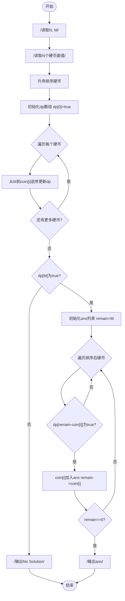
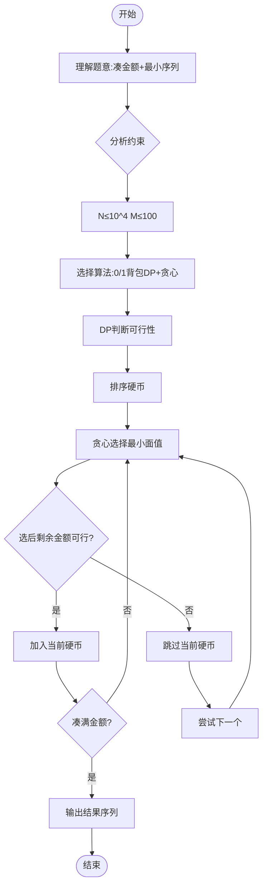

# L3-001 - 凑零钱（30 分）

- **时间限制**: 300 ms
- **内存限制**: 65536 KB
- **代码长度限制**: 16 KB

---

## 题目描述

韩梅梅喜欢满宇宙到处逛街。现在她逛到了一家火星店里，发现这家店有个特别的规矩：你可以用任何星球的硬币付钱，但是绝不找零，当然也不能欠债。韩梅梅手边有 $$10^4$$ 枚来自各个星球的硬币，需要请你帮她盘算一下，是否可能精确凑出要付的款额。

### 输入格式:

输入第一行给出两个正整数：$$N$$（$$\le 10^4$$）是硬币的总个数，$$M$$（$$\le 10^2$$）是韩梅梅要付的款额。第二行给出 $$N$$ 枚硬币的正整数面值。数字间以空格分隔。

### 输出格式:

在一行中输出硬币的面值 $$V_1 \le V_2 \le \cdots \le V_k$$，满足条件 $$V_1 + V_2 + ... + V_k = M$$。数字间以 1 个空格分隔，行首尾不得有多余空格。若解不唯一，则输出最小序列。若无解，则输出 `No Solution`。

注：我们说序列{ $$A[1], A[2], \cdots$$ }比{ $$B[1], B[2], \cdots$$ }“小”，是指存在 $$k \ge 1$$ 使得 $$A[i]=B[i]$$ 对所有 $$i < k$$ 成立，并且 $$A[k] < B[k]$$。

### 输入样例 1:

```in
8 9
5 9 8 7 2 3 4 1
```

### 输出样例 1:

```out
1 3 5
```

### 输入样例 2:

```in
4 8
7 2 4 3
```

### 输出样例 2:

```out
No Solution
```

## 示例

### 示例 1

**输入:**
```
8 9
5 9 8 7 2 3 4 1
```

**输出:**
```
1 3 5
```

### 示例 2

**输入:**
```
4 8
7 2 4 3
```

**输出:**
```
No Solution
```

---

## 题目详解

### 一、解题思路

本题的 R 实现采用以下方法：把原问题拆成规模更小的子问题，用状态转移保存已计算结果，避免重复计算。

### 二、代码流程说明

1. 读取并解析标准输入，转换为题目所需的数据结构。
2. 按题意执行核心算法，维护中间状态并处理边界情况。
3. 整理计算结果，按照输出格式生成答案。

### 三、代码实现

```r
# 实现原理：把原问题拆成规模更小的子问题，用状态转移保存已计算结果，避免重复计算。
# 处理流程：读取输入 -> 建立状态 -> 执行算法 -> 按题目格式输出。
# 关键变量和循环均直接对应题目中的数据、约束或操作。

# 读取并解析标准输入。
v <- scan(file = "stdin", quiet = TRUE)
n <- v[1]
target <- v[2]
# 执行核心排序、状态转移或选择逻辑。
coins <- sort(v[3:(n + 2)])
dp <- matrix(FALSE, n + 1, target + 1)
dp[n + 1, 1] <- TRUE
# 按题目约束遍历当前数据，更新中间状态。
for (i in n:1) for (s in 0:target) dp[i, s + 1] <- dp[i + 1,
    s + 1] || (s >= coins[i] && dp[i + 1, s - coins[i] + 1])
# 严格按照题目规定的输出格式输出答案。
if (!dp[1, target + 1]) cat("No Solution\n") else {
    ans <- numeric()
    rest <- target
    for (i in seq_len(n)) if (rest >= coins[i] && dp[i + 1, rest -
        coins[i] + 1]) {
        ans <- c(ans, coins[i])
        rest <- rest - coins[i]
    }
    cat(paste(ans, collapse = " "), "\n", sep = "")
}
```

### 四、代码流程图



### 五、解题流程图



### 六、常见易错点

- 题目描述、输入格式、输出格式和输入输出样例必须保持原文不变。
- R 语言下标从 1 开始，注意编号转换和空输入边界。
- 输出时严格保留题目规定的空格、换行和小数位数。
