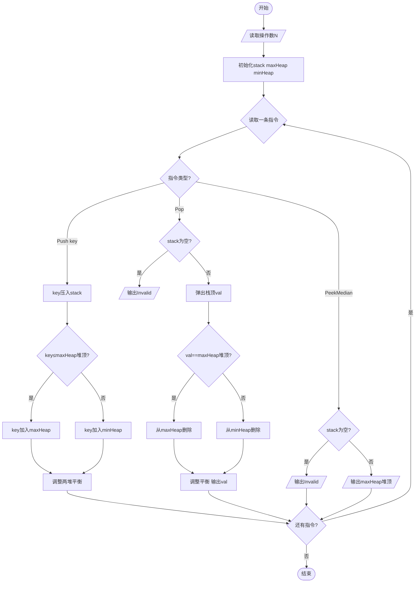
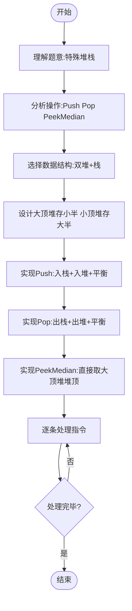

# L3-002 - 特殊堆栈（30 分）

- **时间限制**: 400 ms
- **内存限制**: 65536 KB
- **代码长度限制**: 16 KB

---

## 题目描述

堆栈是一种经典的后进先出的线性结构，相关的操作主要有“入栈”（在堆栈顶插入一个元素）和“出栈”（将栈顶元素返回并从堆栈中删除）。本题要求你实现另一个附加的操作：“取中值”——即返回所有堆栈中元素键值的中值。给定 N 个元素，如果 N 是偶数，则中值定义为第 N/2 小元；若是奇数，则为第 (N+1)/2 小元。

### 输入格式:

输入的第一行是正整数 N（$$\le 10^5$$）。随后 N 行，每行给出一句指令，为以下 3 种之一：

```
Push key
Pop
PeekMedian
```

其中 `key` 是不超过 $$10^5$$ 的正整数；`Push` 表示“入栈”；`Pop` 表示“出栈”；`PeekMedian` 表示“取中值”。

### 输出格式:

对每个 `Push` 操作，将 `key` 插入堆栈，无需输出；对每个 `Pop` 或 `PeekMedian` 操作，在一行中输出相应的返回值。若操作非法，则对应输出 `Invalid`。

### 输入样例:

```in
17
Pop
PeekMedian
Push 3
PeekMedian
Push 2
PeekMedian
Push 1
PeekMedian
Pop
Pop
Push 5
Push 4
PeekMedian
Pop
Pop
Pop
Pop
```

### 输出样例:

```out
Invalid
Invalid
3
2
2
1
2
4
4
5
3
Invalid
```

## 示例

### 示例 1

**输入:**
```
17
Pop
PeekMedian
Push 3
PeekMedian
Push 2
PeekMedian
Push 1
PeekMedian
Pop
Pop
Push 5
Push 4
PeekMedian
Pop
Pop
Pop
Pop
```

**输出:**
```
Invalid
Invalid
3
2
2
1
2
4
4
5
3
Invalid
```

---

## 题目详解

### 一、解题思路

本题的 R 实现采用以下方法：先解析数据并按题目规定的关键字排序，再进行顺序处理和格式化输出。

### 二、代码流程说明

1. 读取并解析标准输入，转换为题目所需的数据结构。
2. 按题意执行核心算法，维护中间状态并处理边界情况。
3. 整理计算结果，按照输出格式生成答案。

### 三、代码实现

```r
# 实现原理：先解析数据并按题目规定的关键字排序，再进行顺序处理和格式化输出。
# 处理流程：读取输入 -> 建立状态 -> 执行算法 -> 按题目格式输出。
# 关键变量和循环均直接对应题目中的数据、约束或操作。

# 读取并解析标准输入。
x <- readLines("stdin", warn = FALSE)
n <- as.integer(x[1])
st <- numeric()
# 按题目约束遍历当前数据，更新中间状态。
for (s in x[2:(n + 1)]) {
    q <- strsplit(s, " ", fixed = TRUE)[[1]]
    if (q[1] == "Push")
        st <- c(st, as.integer(q[2]))
    else if (q[1] == "Pop") {
        if (!length(st))
# 严格按照题目规定的输出格式输出答案。
            cat("Invalid\n")
        else {
            cat(tail(st, 1), "\n", sep = "")
            st <- head(st, -1)
        }
    }
    else if (q[1] == "PeekMedian") {
        if (!length(st))
            cat("Invalid\n")
# 执行核心排序、状态转移或选择逻辑。
        else cat(sort(st)[(length(st) + 1)%/%2], "\n", sep = "")
    }
}
```

### 四、代码流程图



### 五、解题流程图



### 六、常见易错点

- 题目描述、输入格式、输出格式和输入输出样例必须保持原文不变。
- R 语言下标从 1 开始，注意编号转换和空输入边界。
- 输出时严格保留题目规定的空格、换行和小数位数。
