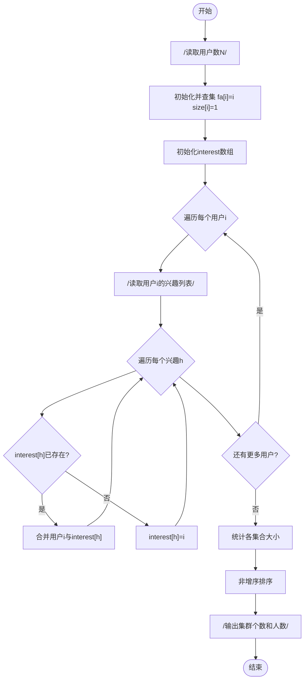
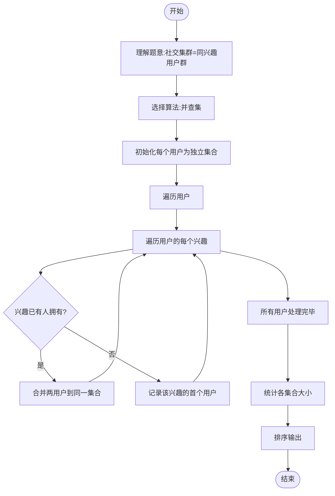

# L3-003 - 社交集群（30 分）

- **时间限制**: 1200 ms
- **内存限制**: 65536 KB
- **代码长度限制**: 16 KB

---

## 题目描述

当你在社交网络平台注册时，一般总是被要求填写你的个人兴趣爱好，以便找到具有相同兴趣爱好的潜在的朋友。一个“社交集群”是指部分兴趣爱好相同的人的集合。你需要找出所有的社交集群。

### 输入格式:

输入在第一行给出一个正整数 N（$$\le 1000$$），为社交网络平台注册的所有用户的人数。于是这些人从 1 到 N 编号。随后 N 行，每行按以下格式给出一个人的兴趣爱好列表：

$$K_i$$: $$h_i[1]$$ $$h_i[2]$$ ... $$h_i[K_i]$$

其中$$K_i (>0)$$是兴趣爱好的个数，$$h_i[j]$$是第$$j$$个兴趣爱好的编号，为区间 [1, 1000] 内的整数。

### 输出格式:

首先在一行中输出不同的社交集群的个数。随后第二行按非增序输出每个集群中的人数。数字间以一个空格分隔，行末不得有多余空格。

### 输入样例:

```in
8
3: 2 7 10
1: 4
2: 5 3
1: 4
1: 3
1: 4
4: 6 8 1 5
1: 4
```

### 输出样例:

```out
3
4 3 1
```

## 示例

### 示例 1

**输入:**
```
8
3: 2 7 10
1: 4
2: 5 3
1: 4
1: 3
1: 4
4: 6 8 1 5
1: 4
```

**输出:**
```
3
4 3 1
```

---

## 题目详解

### 一、解题思路

本题的 R 实现采用以下方法：将输入组织为矩阵或表格，按题目定义的行、列和状态关系完成计算。

### 二、代码流程说明

1. 读取并解析标准输入，转换为题目所需的数据结构。
2. 按题意执行核心算法，维护中间状态并处理边界情况。
3. 整理计算结果，按照输出格式生成答案。

### 三、代码实现

```r
# 实现原理：将输入组织为矩阵或表格，按题目定义的行、列和状态关系完成计算。
# 处理流程：读取输入 -> 建立状态 -> 执行算法 -> 按题目格式输出。
# 关键变量和循环均直接对应题目中的数据、约束或操作。

# 读取并解析标准输入。
x <- readLines("stdin", warn = FALSE)
n <- as.integer(x[1])
par <- seq_len(n)
find <- function(i) {
    if (par[i] != i)
        par[i] <<- find(par[i])
    par[i]
}
unite <- function(a, b) {
    par[find(a)] <<- find(b)
}
own <- list()
# 按题目约束遍历当前数据，更新中间状态。
for (i in seq_len(n)) {
    z <- strsplit(gsub(":", " ", x[i + 1]), " ", fixed = TRUE)[[1]]
    for (h in z[-1]) if (!is.null(own[[h]]))
        unite(i, own[[h]])
    else own[[h]] <- i
}
tb <- table(vapply(seq_len(n), find, 0))
# 严格按照题目规定的输出格式输出答案。
cat(length(tb), "\n", sep = "")
# 执行核心排序、状态转移或选择逻辑。
cat(paste(sort(as.integer(tb), decreasing = TRUE), collapse = " "),
    "\n", sep = "")
```

### 四、代码流程图



### 五、解题流程图



### 六、常见易错点

- 题目描述、输入格式、输出格式和输入输出样例必须保持原文不变。
- R 语言下标从 1 开始，注意编号转换和空输入边界。
- 输出时严格保留题目规定的空格、换行和小数位数。
