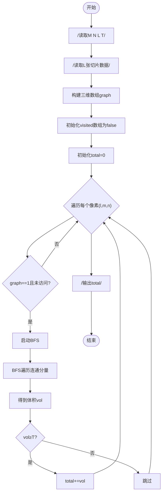
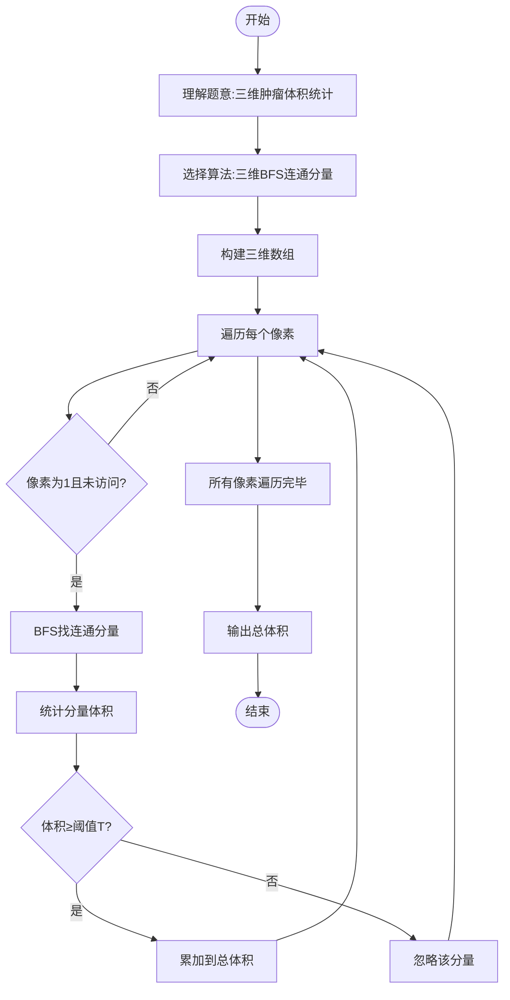

# L3-004 - 肿瘤诊断（30 分）

- **时间限制**: 600 ms
- **内存限制**: 65536 KB
- **代码长度限制**: 16 KB

---

## 题目描述

在诊断肿瘤疾病时，计算肿瘤体积是很重要的一环。给定病灶扫描切片中标注出的疑似肿瘤区域，请你计算肿瘤的体积。

### 输入格式:

输入第一行给出4个正整数：$$M$$、$$N$$、$$L$$、$$T$$，其中$$M$$和$$N$$是每张切片的尺寸（即每张切片是一个$$M\times N$$的像素矩阵。最大分辨率是$$1286\times 128$$）；$$L$$（$$\le 60$$）是切片的张数；$$T$$是一个整数阈值（若疑似肿瘤的连通体体积小于$$T$$，则该小块忽略不计）。

最后给出$$L$$张切片。每张用一个由0和1组成的$$M\times N$$的矩阵表示，其中1表示疑似肿瘤的像素，0表示正常像素。由于切片厚度可以认为是一个常数，于是我们只要数连通体中1的个数就可以得到体积了。麻烦的是，可能存在多个肿瘤，这时我们只统计那些体积不小于$$T$$的。两个像素被认为是“连通的”，如果它们有一个共同的切面，如下图所示，所有6个红色的像素都与蓝色的像素连通。


### 输出格式:

在一行中输出肿瘤的总体积。

### 输入样例:

```in
3 4 5 2
1 1 1 1
1 1 1 1
1 1 1 1
0 0 1 1
0 0 1 1
0 0 1 1
1 0 1 1
0 1 0 0
0 0 0 0
1 0 1 1
0 0 0 0
0 0 0 0
0 0 0 1
0 0 0 1
1 0 0 0
```

### 输出样例:

```out
26
```

## 示例

### 示例 1

**输入:**
```
3 4 5 2
1 1 1 1
1 1 1 1
1 1 1 1
0 0 1 1
0 0 1 1
0 0 1 1
1 0 1 1
0 1 0 0
0 0 0 0
1 0 1 1
0 0 0 0
0 0 0 0
0 0 0 1
0 0 0 1
1 0 0 0
```

**输出:**
```
26
```

---

## 题目详解

### 一、解题思路

本题的 R 实现采用以下方法：在三维网格中对未访问的阳性体素进行六邻域 BFS，统计每个连通块体素数，只累加达到阈值的肿瘤区域。

### 二、代码流程说明

1. 读取并解析标准输入，转换为题目所需的数据结构。
2. 按题意执行核心算法，维护中间状态并处理边界情况。
3. 整理计算结果，按照输出格式生成答案。

### 三、代码实现

```r
# 实现原理：在三维网格中对未访问的阳性体素进行六邻域 BFS，统计每个连通块体素数，只累加达到阈值的肿瘤区域。
# 处理流程：读取输入 -> 建立状态 -> 执行算法 -> 按题目格式输出。
# 关键变量和循环均直接对应题目中的数据、约束或操作。

# 读取并解析标准输入。
v <- scan(file = "stdin", quiet = TRUE)
m <- v[1]
n <- v[2]
l <- v[3]
a <- v[5:(4 + m * n * l)]
seen <- rep(FALSE, length(a))
idx <- function(z) z[1] * n + z[2] + m * n * z[3] + 1
ans <- 0
# 按题目约束遍历当前数据，更新中间状态。
for (i in seq_along(a)) if (a[i] && !seen[i]) {
    st <- list(c(((i - 1)%/%n)%%m, (i - 1)%%n, (i - 1)%/%(m *
        n)))
    seen[i] <- TRUE
    cnt <- 0
    while (length(st)) {
        z <- st[[1]]
        st <- st[-1]
        cnt <- cnt + 1
        for (d in list(c(1, 0, 0), c(-1, 0, 0), c(0, 1, 0), c(0,
            -1, 0), c(0, 0, 1), c(0, 0, -1))) {
            q <- z + d
            if (all(q >= 0) && q[1] < m && q[2] < n && q[3] <
                l) {
                j <- idx(q)
                if (a[j] && !seen[j]) {
                  seen[j] <- TRUE
                  st <- append(st, list(q))
                }
            }
        }
    }
    if (cnt >= v[4])
        ans <- ans + cnt
}
# 严格按照题目规定的输出格式输出答案。
cat(ans, "\n", sep = "")
```

### 四、代码流程图



### 五、解题流程图



### 六、常见易错点

- 题目描述、输入格式、输出格式和输入输出样例必须保持原文不变。
- R 语言下标从 1 开始，注意编号转换和空输入边界。
- 输出时严格保留题目规定的空格、换行和小数位数。
