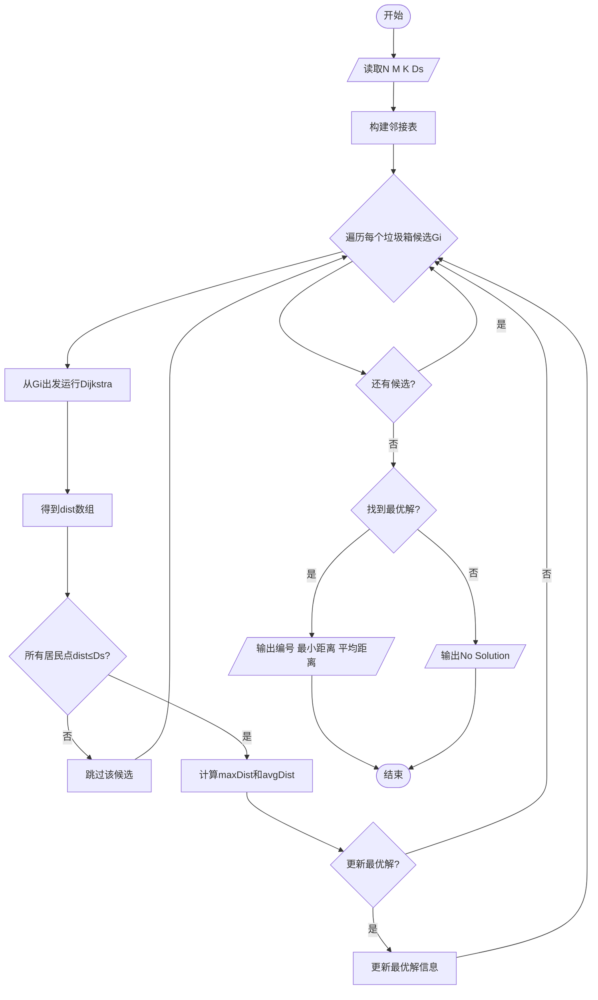
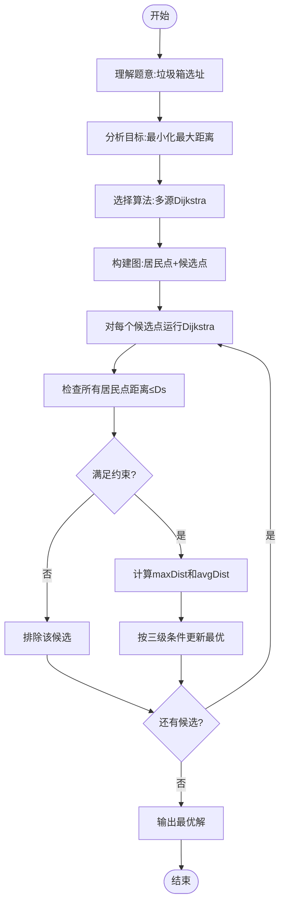

# L3-005 - 垃圾箱分布（30 分）

- **时间限制**: 200 ms
- **内存限制**: 65536 KB
- **代码长度限制**: 16 KB

---

## 题目描述

大家倒垃圾的时候，都希望垃圾箱距离自己比较近，但是谁都不愿意守着垃圾箱住。所以垃圾箱的位置必须选在到所有居民点的最短距离最长的地方，同时还要保证每个居民点都在距离它一个不太远的范围内。

现给定一个居民区的地图，以及若干垃圾箱的候选地点，请你推荐最合适的地点。如果解不唯一，则输出到所有居民点的平均距离最短的那个解。如果这样的解还是不唯一，则输出编号最小的地点。

### 输入格式:

输入第一行给出4个正整数：$$N$$（$$\le 10^3$$）是居民点的个数；$$M$$（$$\le 10$$）是垃圾箱候选地点的个数；$$K$$（$$\le 10^4$$）是居民点和垃圾箱候选地点之间的道路的条数；$$D_S$$是居民点与垃圾箱之间不能超过的最大距离。所有的居民点从1到$$N$$编号，所有的垃圾箱候选地点从$$G1$$到$$GM$$编号。

随后$$K$$行，每行按下列格式描述一条道路：
```
P1 P2 Dist
```
其中`P1`和`P2`是道路两端点的编号，端点可以是居民点，也可以是垃圾箱候选点。`Dist`是道路的长度，是一个正整数。

### 输出格式:

首先在第一行输出最佳候选地点的编号。然后在第二行输出该地点到所有居民点的最小距离和平均距离。数字间以空格分隔，保留小数点后1位。如果解不存在，则输出`No Solution`。

### 输入样例 1:

```in
4 3 11 5
1 2 2
1 4 2
1 G1 4
1 G2 3
2 3 2
2 G2 1
3 4 2
3 G3 2
4 G1 3
G2 G1 1
G3 G2 2
```

### 输出样例 1:

```out
G1
2.0 3.3
```

### 输入样例 2:

```in
2 1 2 10
1 G1 9
2 G1 20
```

### 输出样例 2:

```out
No Solution
```

## 示例

### 示例 1

**输入:**
```
4 3 11 5
1 2 2
1 4 2
1 G1 4
1 G2 3
2 3 2
2 G2 1
3 4 2
3 G3 2
4 G1 3
G2 G1 1
G3 G2 2
```

**输出:**
```
G1
2.0 3.3
```

### 示例 2

**输入:**
```
2 1 2 10
1 G1 9
2 G1 20
```

**输出:**
```
No Solution
```

---

## 题目详解

### 一、解题思路

本题的 R 实现采用以下方法：读取标准输入后建立题目所需的数据结构，按约束执行核心计算并输出结果。

### 二、代码流程说明

1. 读取并解析标准输入，转换为题目所需的数据结构。
2. 按题意执行核心算法，维护中间状态并处理边界情况。
3. 整理计算结果，按照输出格式生成答案。

### 三、代码实现

```r
# 实现原理：读取标准输入后建立题目所需的数据结构，按约束执行核心计算并输出结果。
# 处理流程：读取输入 -> 建立状态 -> 执行算法 -> 按题目格式输出。
# 关键变量和循环均直接对应题目中的数据、约束或操作。

# 读取并解析标准输入。
v <- scan(file = "stdin", what = "", quiet = TRUE)
n <- as.integer(v[1])
m <- as.integer(v[2])
roads <- as.integer(v[3])
lim <- as.integer(v[4])
tot <- n + m
g <- vector("list", tot)
# 按题目约束遍历当前数据，更新中间状态。
for (i in seq_len(tot)) g[[i]] <- list()
node <- function(s) if (substr(s, 1, 1) == "G") n + as.integer(substr(s,
    2, nchar(s))) else as.integer(s)
p <- 5
for (i in seq_len(roads)) {
    a <- node(v[p])
    b <- node(v[p + 1])
    w <- as.integer(v[p + 2])
    p <- p + 3
    g[[a]] <- append(g[[a]], list(c(b, w)))
    g[[b]] <- append(g[[b]], list(c(a, w)))
}
best <- NULL
for (st in seq_len(m)) {
    d <- rep(Inf, tot)
    d[n + st] <- 0
    used <- rep(FALSE, tot)
    for (k in seq_len(tot)) {
        cand <- which(!used)
        if (!length(cand))
            break
        u <- cand[which.min(d[cand])]
        if (is.infinite(d[u]))
            break
        used[u] <- TRUE
        for (e in g[[u]]) d[e[1]] <- min(d[e[1]], d[u] + e[2])
    }
    r <- d[seq_len(n)]
    if (all(r <= lim)) {
        mn <- min(r)
        av <- mean(r)
        better <- is.null(best) || mn > best$mn || (mn == best$mn &&
            av < best$av) || (mn == best$mn && av == best$av &&
            st < best$st)
        if (better)
            best <- list(st = st, mn = mn, av = av)
    }
}
# 严格按照题目规定的输出格式输出答案。
if (is.null(best)) cat("No Solution\n") else cat("G", best$st,
    "\n", sprintf("%.1f %.1f", best$mn + 1e-08, best$av + 1e-08),
    "\n", sep = "")
```

### 四、代码流程图



### 五、解题流程图



### 六、常见易错点

- 题目描述、输入格式、输出格式和输入输出样例必须保持原文不变。
- R 语言下标从 1 开始，注意编号转换和空输入边界。
- 输出时严格保留题目规定的空格、换行和小数位数。
