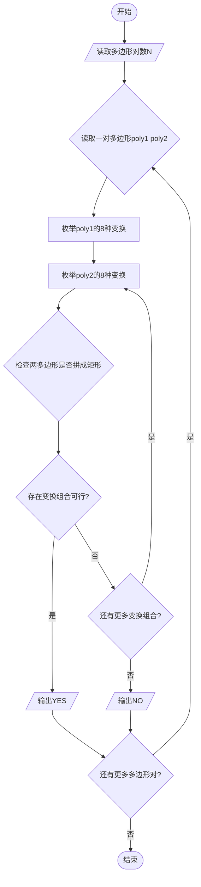
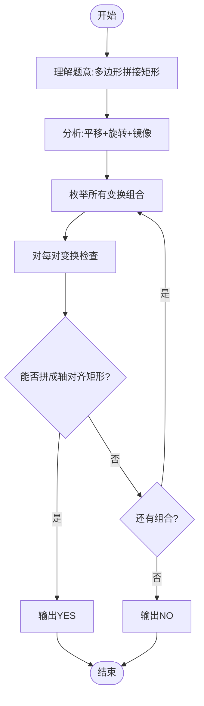

# L3-006 - 迎风一刀斩（30 分）

- **时间限制**: 150 ms
- **内存限制**: 65536 KB
- **代码长度限制**: 16 KB

---

## 题目描述

迎着一面矩形的大旗一刀斩下，如果你的刀够快的话，这笔直一刀可以切出两块多边形的残片。反过来说，如果有人拿着两块残片来吹牛，说这是自己迎风一刀斩落的，你能检查一下这是不是真的吗？

注意摆在你面前的两个多边形可不一定是端端正正摆好的，它们可能被平移、被旋转（逆时针90度、180度、或270度），或者被（镜像）翻面。

这里假设原始大旗的四边都与坐标轴是平行的。

### 输入格式:

输入第一行给出一个正整数$$N$$（$$\le 20$$），随后给出$$N$$对多边形。每个多边形按下列格式给出：

$$k\quad x_1\quad y_1\cdots x_k\quad y_k$$

其中$$k$$（$$2 < k \le 10$$）是多边形顶点个数；$$(x_i, y_i)$$（$$0 \le x_i, y_i \le 10^8$$）是顶点坐标，按照顺时针或逆时针的顺序给出。

注意：题目保证没有多余顶点。即每个多边形的顶点都是不重复的，任意3个相邻顶点不共线。

### 输出格式:

对每一对多边形，输出`YES`或者`NO`。

### 输入样例:

```in
8
3 0 0 1 0 1 1
3 0 0 1 1 0 1
3 0 0 1 0 1 1
3 0 0 1 1 0 2
4 0 4 1 4 1 0 0 0
4 4 0 4 1 0 1 0 0
3 0 0 1 1 0 1
4 2 3 1 4 1 7 2 7
5 10 10 10 12 12 12 14 11 14 10
3 28 35 29 35 29 37
3 7 9 8 11 8 9
5 87 26 92 26 92 23 90 22 87 22
5 0 0 2 0 1 1 1 2 0 2
4 0 0 1 1 2 1 2 0
4 0 0 0 1 1 1 2 0
4 0 0 0 1 1 1 2 0
```

### 输出样例:

```out
YES
NO
YES
YES
YES
YES
NO
YES
```

## 示例

### 示例 1

**输入:**
```
8
3 0 0 1 0 1 1
3 0 0 1 1 0 1
3 0 0 1 0 1 1
3 0 0 1 1 0 2
4 0 4 1 4 1 0 0 0
4 4 0 4 1 0 1 0 0
3 0 0 1 1 0 1
4 2 3 1 4 1 7 2 7
5 10 10 10 12 12 12 14 11 14 10
3 28 35 29 35 29 37
3 7 9 8 11 8 9
5 87 26 92 26 92 23 90 22 87 22
5 0 0 2 0 1 1 1 2 0 2
4 0 0 1 1 2 1 2 0
4 0 0 0 1 1 1 2 0
4 0 0 0 1 1 1 2 0
```

**输出:**
```
YES
NO
YES
YES
YES
YES
NO
YES
```

---

## 题目详解

### 一、解题思路

本题的 R 实现采用以下方法：将输入组织为矩阵或表格，按题目定义的行、列和状态关系完成计算。

### 二、代码流程说明

1. 读取并解析标准输入，转换为题目所需的数据结构。
2. 按题意执行核心算法，维护中间状态并处理边界情况。
3. 整理计算结果，按照输出格式生成答案。

### 三、代码实现

```r
# 实现原理：将输入组织为矩阵或表格，按题目定义的行、列和状态关系完成计算。
# 处理流程：读取输入 -> 建立状态 -> 执行算法 -> 按题目格式输出。
# 关键变量和循环均直接对应题目中的数据、约束或操作。

# 读取并解析标准输入。
v <- scan("stdin", what = numeric(), quiet = TRUE)
if (length(v) > 0L) {
    p <- 1L
    t <- v[p]
    p <- p + 1L
    area2 <- function(a) sum(a[, 1] * a[c(2:nrow(a), 1), 2] -
        a[, 2] * a[c(2:nrow(a), 1), 1])
    transforms <- function(a) {
        ops <- list(c(1, 1), c(1, -1), c(-1, 1), c(-1, -1))
        out <- lapply(ops, function(o) cbind(a[, 1] * o[1], a[,
            2] * o[2]))
        out <- c(out, lapply(ops, function(o) cbind(a[, 2] *
            o[1], a[, 1] * o[2])))
        out
    }
    glue <- function(a, ia, b, ib) {
        la <- nrow(a)
        lb <- nrow(b)
        a1 <- a[ia, ]
        a2 <- a[ia%%la + 1L, ]
        b1 <- b[ib, ]
        b2 <- b[ib%%lb + 1L, ]
        va <- a2 - a1
        vb <- b2 - b1
        if (!all(va == -vb))
            return(FALSE)
        bp <- sweep(b, 2L, a2 - b1, "+")
        ca <- a[((ia + 0:(la - 2L))%%la) + 1L, , drop = FALSE]
        cb <- bp[((ib + 0:(lb - 2L))%%lb) + 1L, , drop = FALSE]
        z <- rbind(ca, cb)
        if (nrow(z) < 4L)
            return(FALSE)
        nxt <- z[c(2:nrow(z), 1L), , drop = FALSE]
        if (any(z[, 1] == nxt[, 1] & z[, 2] == nxt[, 2]) || any(z[,
            1] != nxt[, 1] & z[, 2] != nxt[, 2]))
            return(FALSE)
        xs <- z[, 1]
        ys <- z[, 2]
        if (max(xs) == min(xs) || max(ys) == min(ys))
            return(FALSE)
        if (abs(area2(z)) != abs(area2(a)) + abs(area2(bp)))
            return(FALSE)
        if (abs(area2(z)) != 2 * (max(xs) - min(xs)) * (max(ys) -
            min(ys)))
            return(FALSE)
        all(xs == min(xs) | xs == max(xs) | ys == min(ys) | ys ==
            max(ys))
    }
    possible <- function(a, b) {
# 按题目约束遍历当前数据，更新中间状态。
        for (aa0 in list(a, a[nrow(a):1, , drop = FALSE])) for (bb0 in list(b,
            b[nrow(b):1, , drop = FALSE])) for (aa in transforms(aa0)) {
            bad <- which(aa[, 1] != aa[c(2:nrow(aa), 1), 1] &
                aa[, 2] != aa[c(2:nrow(aa), 1), 2])
            cutsa <- if (length(bad))
                bad
            else seq_len(nrow(aa))
            for (bb in transforms(bb0)) {
                badb <- which(bb[, 1] != bb[c(2:nrow(bb), 1),
                  1] & bb[, 2] != bb[c(2:nrow(bb), 1), 2])
                cutsb <- if (length(badb))
                  badb
                else seq_len(nrow(bb))
                if (length(bad) > 1L || length(badb) > 1L)
                  next
                for (i in cutsa) for (j in cutsb) if (glue(aa,
                  i, bb, j))
                  return(TRUE)
            }
        }
        FALSE
    }
    out <- character(t)
    for (case in seq_len(t)) {
        ka <- v[p]
        p <- p + 1L
        a <- matrix(v[seq(p, p + 2L * ka - 1L)], ncol = 2L, byrow = TRUE)
        p <- p + 2L * ka
        kb <- v[p]
        p <- p + 1L
        b <- matrix(v[seq(p, p + 2L * kb - 1L)], ncol = 2L, byrow = TRUE)
        p <- p + 2L * kb
        out[case] <- if (possible(a, b))
            "YES"
        else "NO"
    }
# 严格按照题目规定的输出格式输出答案。
    cat(paste(out, collapse = "\n"), "\n", sep = "")
}
```

### 四、代码流程图



### 五、解题流程图



### 六、常见易错点

- 题目描述、输入格式、输出格式和输入输出样例必须保持原文不变。
- R 语言下标从 1 开始，注意编号转换和空输入边界。
- 输出时严格保留题目规定的空格、换行和小数位数。
