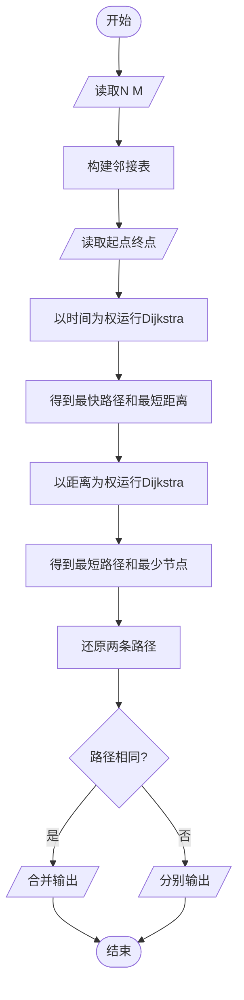
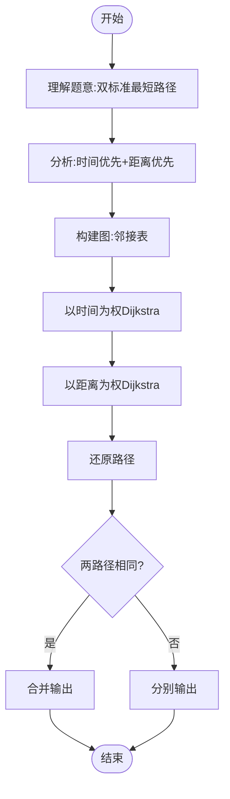

# L3-007 - 天梯地图（30 分）

- **时间限制**: 300 ms
- **内存限制**: 65536 KB
- **代码长度限制**: 16 KB

---

## 题目描述

本题要求你实现一个天梯赛专属在线地图，队员输入自己学校所在地和赛场地点后，该地图应该推荐两条路线：一条是最快到达路线；一条是最短距离的路线。题目保证对任意的查询请求，地图上都至少存在一条可达路线。

### 输入格式:

输入在第一行给出两个正整数`N`（2 $$\le$$ `N` $$\le$$ 500）和`M`，分别为地图中所有标记地点的个数和连接地点的道路条数。随后`M`行，每行按如下格式给出一条道路的信息：

```
V1 V2 one-way length time
```

其中`V1`和`V2`是道路的两个端点的编号（从0到`N`-1）；如果该道路是从`V1`到`V2`的单行线，则`one-way`为1，否则为0；`length`是道路的长度；`time`是通过该路所需要的时间。最后给出一对起点和终点的编号。

### 输出格式:

首先按下列格式输出最快到达的时间`T`和用节点编号表示的路线：

```
Time = T: 起点 => 节点1 => ... => 终点
```

然后在下一行按下列格式输出最短距离`D`和用节点编号表示的路线：

```
Distance = D: 起点 => 节点1 => ... => 终点
```

如果最快到达路线不唯一，则输出几条最快路线中最短的那条，题目保证这条路线是唯一的。而如果最短距离的路线不唯一，则输出途径节点数最少的那条，题目保证这条路线是唯一的。

如果这两条路线是完全一样的，则按下列格式输出：

```
Time = T; Distance = D: 起点 => 节点1 => ... => 终点
```

### 输入样例 1:

```in
10 15
0 1 0 1 1
8 0 0 1 1
4 8 1 1 1
5 4 0 2 3
5 9 1 1 4
0 6 0 1 1
7 3 1 1 2
8 3 1 1 2
2 5 0 2 2
2 1 1 1 1
1 5 0 1 3
1 4 0 1 1
9 7 1 1 3
3 1 0 2 5
6 3 1 2 1
5 3
```

### 输出样例 1:

```out
Time = 6: 5 => 4 => 8 => 3
Distance = 3: 5 => 1 => 3
```

### 输入样例 2:

```in
7 9
0 4 1 1 1
1 6 1 3 1
2 6 1 1 1
2 5 1 2 2
3 0 0 1 1
3 1 1 3 1
3 2 1 2 1
4 5 0 2 2
6 5 1 2 1
3 5
```

### 输出样例 2:

```out
Time = 3; Distance = 4: 3 => 2 => 5
```

## 示例

### 示例 1

**输入:**
```
10 15
0 1 0 1 1
8 0 0 1 1
4 8 1 1 1
5 4 0 2 3
5 9 1 1 4
0 6 0 1 1
7 3 1 1 2
8 3 1 1 2
2 5 0 2 2
2 1 1 1 1
1 5 0 1 3
1 4 0 1 1
9 7 1 1 3
3 1 0 2 5
6 3 1 2 1
5 3
```

**输出:**
```
Time = 6: 5 => 4 => 8 => 3
Distance = 3: 5 => 1 => 3
```

### 示例 2

**输入:**
```
7 9
0 4 1 1 1
1 6 1 3 1
2 6 1 1 1
2 5 1 2 2
3 0 0 1 1
3 1 1 3 1
3 2 1 2 1
4 5 0 2 2
6 5 1 2 1
3 5
```

**输出:**
```
Time = 3; Distance = 4: 3 => 2 => 5
```

---

## 题目详解

### 一、解题思路

本题的 R 实现采用以下方法：读取标准输入后建立题目所需的数据结构，按约束执行核心计算并输出结果。

### 二、代码流程说明

1. 读取并解析标准输入，转换为题目所需的数据结构。
2. 按题意执行核心算法，维护中间状态并处理边界情况。
3. 整理计算结果，按照输出格式生成答案。

### 三、代码实现

```r
# 实现原理：读取标准输入后建立题目所需的数据结构，按约束执行核心计算并输出结果。
# 处理流程：读取输入 -> 建立状态 -> 执行算法 -> 按题目格式输出。
# 关键变量和循环均直接对应题目中的数据、约束或操作。

# 读取并解析标准输入。
v <- scan(file = "stdin", quiet = TRUE)
n <- v[1]
m <- v[2]
p <- 3
adj <- vector("list", n)
# 按题目约束遍历当前数据，更新中间状态。
for (i in seq_len(n)) adj[[i]] <- list()
for (i in seq_len(m)) {
    u <- v[p] + 1
    b <- v[p + 1] + 1
    one <- v[p + 2]
    l <- v[p + 3]
    tm <- v[p + 4]
    p <- p + 5
    adj[[u]][[length(adj[[u]]) + 1]] <- c(b, l, tm)
    if (!one)
        adj[[b]][[length(adj[[b]]) + 1]] <- c(u, l, tm)
}
s <- v[p] + 1
t <- v[p + 1] + 1
inf <- 1e+30
dt <- rep(inf, n)
dl <- rep(inf, n)
pt <- rep(-1, n)
dt[s] <- 0
dl[s] <- 0
used <- rep(FALSE, n)
for (step in seq_len(n)) {
    cand <- which(!used)
    u <- cand[which.min(dt[cand])]
    used[u] <- TRUE
    for (e in adj[[u]]) {
        w <- as.integer(e[1])
        if (dt[u] + e[3] < dt[w] || (dt[u] + e[3] == dt[w] &&
            dl[u] + e[2] < dl[w])) {
            dt[w] <- dt[u] + e[3]
            dl[w] <- dl[u] + e[2]
            pt[w] <- u
        }
    }
}
dd <- rep(inf, n)
dc <- rep(inf, n)
pd <- rep(-1, n)
dd[s] <- 0
dc[s] <- 1
used <- rep(FALSE, n)
for (step in seq_len(n)) {
    cand <- which(!used)
    u <- cand[which.min(dd[cand])]
    used[u] <- TRUE
    for (e in adj[[u]]) {
        w <- as.integer(e[1])
        if (dd[u] + e[2] < dd[w] || (dd[u] + e[2] == dd[w] &&
            dc[u] + 1 < dc[w])) {
            dd[w] <- dd[u] + e[2]
            dc[w] <- dc[u] + 1
            pd[w] <- u
        }
    }
}
makepath <- function(pre) {
    z <- integer()
    u <- t
    while (u != -1) {
        z <- c(u, z)
        if (u == s)
            break
        u <- pre[u]
    }
    z
}
a1 <- makepath(pt)
a2 <- makepath(pd)
# 严格按照题目规定的输出格式输出答案。
if (identical(a1, a2)) cat("Time = ", dt[t], "; Distance = ",
    dd[t], ": ", paste(a1 - 1, collapse = " => "), "\n", sep = "") else {
    cat("Time = ", dt[t], ": ", paste(a1 - 1, collapse = " => "),
        "\n", sep = "")
    cat("Distance = ", dd[t], ": ", paste(a2 - 1, collapse = " => "),
        "\n", sep = "")
}
```

### 四、代码流程图



### 五、解题流程图



### 六、常见易错点

- 题目描述、输入格式、输出格式和输入输出样例必须保持原文不变。
- R 语言下标从 1 开始，注意编号转换和空输入边界。
- 输出时严格保留题目规定的空格、换行和小数位数。
