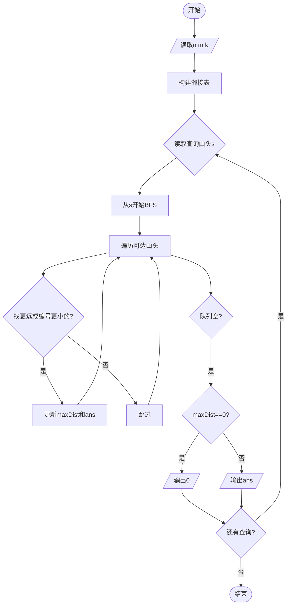
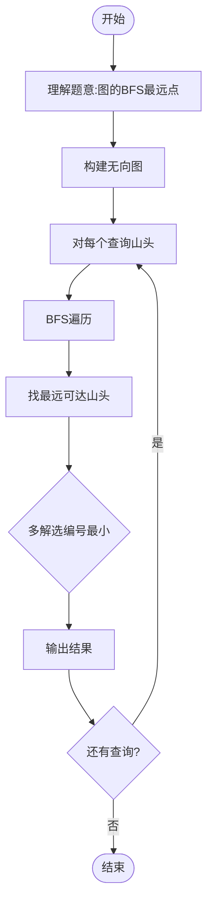

# L3-008 - 喊山（30 分）

- **时间限制**: 150 ms
- **内存限制**: 65536 KB
- **代码长度限制**: 16 KB

---

## 题目描述

喊山，是人双手围在嘴边成喇叭状，对着远方高山发出“喂—喂喂—喂喂喂……”的呼唤。呼唤声通过空气的传递，回荡于深谷之间，传送到人们耳中，发出约定俗成的“讯号”，达到声讯传递交流的目的。原来它是彝族先民用来求援呼救的“讯号”，慢慢地人们在生活实践中发现了它的实用价值，便把它作为一种交流工具世代传袭使用。（图文摘自：http://news.xrxxw.com/newsshow-8018.html）


一个山头呼喊的声音可以被临近的山头同时听到。题目假设每个山头最多有两个能听到它的临近山头。给定任意一个发出原始信号的山头，本题请你找出这个信号最远能传达到的地方。

### 输入格式:

输入第一行给出3个正整数`n`、`m`和`k`，其中`n`（$$\le$$10000）是总的山头数（于是假设每个山头从1到`n`编号）。接下来的`m`行，每行给出2个不超过`n`的正整数，数字间用空格分开，分别代表可以听到彼此的两个山头的编号。这里保证每一对山头只被输入一次，不会有重复的关系输入。最后一行给出`k`（$$\le$$10）个不超过`n`的正整数，数字间用空格分开，代表需要查询的山头的编号。

### 输出格式:

依次对于输入中的每个被查询的山头，在一行中输出其发出的呼喊能够连锁传达到的最远的那个山头。注意：被输出的首先必须是被查询的个山头能连锁传到的。若这样的山头不只一个，则输出编号最小的那个。若此山头的呼喊无法传到任何其他山头，则输出0。

### 输入样例:

```in
7 5 4
1 2
2 3
3 1
4 5
5 6
1 4 5 7
```

### 输出样例:

```out
2
6
4
0
```

## 示例

### 示例 1

**输入:**
```
7 5 4
1 2
2 3
3 1
4 5
5 6
1 4 5 7
```

**输出:**
```
2
6
4
0
```

---

## 题目详解

### 一、解题思路

本题的 R 实现采用以下方法：对每个喊山点进行 BFS 求无权图最短距离，取距离最大的点；若有多个则保留编号最小者。

### 二、代码流程说明

1. 读取并解析标准输入，转换为题目所需的数据结构。
2. 按题意执行核心算法，维护中间状态并处理边界情况。
3. 整理计算结果，按照输出格式生成答案。

### 三、代码实现

```r
# 实现原理：对每个喊山点进行 BFS 求无权图最短距离，取距离最大的点；若有多个则保留编号最小者。
# 处理流程：读取输入 -> 建立状态 -> 执行算法 -> 按题目格式输出。
# 关键变量和循环均直接对应题目中的数据、约束或操作。

# 读取并解析标准输入。
v <- scan(file = "stdin", quiet = TRUE)
n <- v[1]
m <- v[2]
q <- v[3]
p <- 4
g <- vector("list", n + 1L)
# 按题目约束遍历当前数据，更新中间状态。
for (i in seq_along(g)) g[[i]] <- integer()
for (i in seq_len(m)) {
    a <- v[p]
    b <- v[p + 1]
    p <- p + 2
    g[[a]] <- c(g[[a]], b)
    g[[b]] <- c(g[[b]], a)
}
for (i in seq_len(q)) {
    s <- v[p]
    p <- p + 1
    d <- rep(-1, n + 1L)
    d[s] <- 0
    st <- s
    while (length(st)) {
        u <- st[1]
        st <- st[-1]
        for (w in g[[u]]) if (d[w] < 0) {
            d[w] <- d[u] + 1
            st <- c(st, w)
        }
    }
    mx <- max(d[seq_len(n)])
# 严格按照题目规定的输出格式输出答案。
    cat(if (mx <= 0)
        0
    else which(d[seq_len(n)] == mx)[1], "\n", sep = "")
}
```

### 四、代码流程图



### 五、解题流程图



### 六、常见易错点

- 题目描述、输入格式、输出格式和输入输出样例必须保持原文不变。
- R 语言下标从 1 开始，注意编号转换和空输入边界。
- 输出时严格保留题目规定的空格、换行和小数位数。
