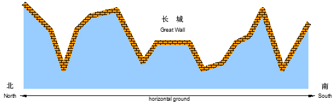
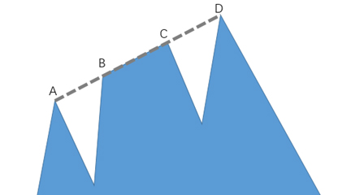
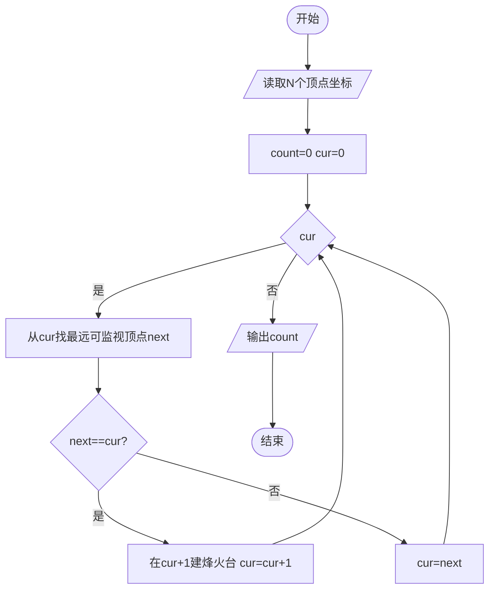
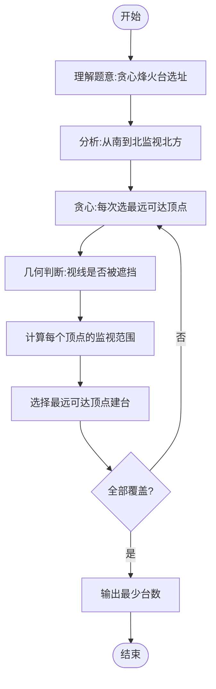

# L3-009 - 长城（30 分）

- **时间限制**: 500 ms
- **内存限制**: 65536 KB
- **代码长度限制**: 16 KB

---

## 题目描述

正如我们所知，中国古代长城的建造是为了抵御外敌入侵。在长城上，建造了许多烽火台。每个烽火台都监视着一个特定的地区范围。一旦某个地区有外敌入侵，值守在对应烽火台上的士兵就会将敌情通报给周围的烽火台，并迅速接力地传递到总部。

现在如图1所示，若水平为南北方向、垂直为海拔高度方向，假设长城就是依次相联的一系列线段，而且在此范围内的任一垂直线与这些线段有且仅有唯一的交点。



**图 1**

进一步地，假设烽火台只能建造在线段的端点处。我们认为烽火台本身是没有高度的，每个烽火台只负责向北方（图1中向左）瞭望，而且一旦有外敌入侵，只要敌人与烽火台之间未被山体遮挡，哨兵就会立即察觉。当然，按照这一军规，对于南侧的敌情各烽火台并不负责任。一旦哨兵发现敌情，他就会立即以狼烟或烽火的形式，向其南方的烽火台传递警报，直到位于最南侧的总部。

以图2中的长城为例，负责守卫的四个烽火台用蓝白圆点示意，最南侧的总部用红色圆点示意。如果红色星形标示的地方出现敌情，将被哨兵们发现并沿红色折线将警报传递到总部。当然，就这个例子而言只需两个烽火台的协作，但其他位置的敌情可能需要更多。

然而反过来，即便这里的4个烽火台全部参与，依然有不能覆盖的（黄色）区域。


**图 2**

另外，为避免歧义，我们在这里约定，与某个烽火台的视线刚好相切的区域都认为可以被该烽火台所监视。以图3中的长城为例，若A、B、C、D点均共线，且在D点设置一处烽火台，则A、B、C以及线段BC上的任何一点都在该烽火台的监视范围之内。



**图 3**

好了，倘若你是秦始皇的太尉，为不致出现更多孟姜女式的悲剧，如何在保证长城安全的前提下，使消耗的民力（建造的烽火台）最少呢？

### 输入格式:

输入在第一行给出一个正整数`N`（3 $$\le$$ `N` $$\le 10^5$$），即刻画长城边缘的折线顶点（含起点和终点）数。随后`N`行，每行给出一个顶点的`x`和`y`坐标，其间以空格分隔。注意顶点从南到北依次给出，第一个顶点为总部所在位置。坐标为区间$$[-10^9, 10^9)$$内的整数，且没有重合点。

### 输出格式:

在一行中输出所需建造烽火台（不含总部）的最少数目。

### 输入样例:

```in
10
67 32
48 -49
32 53
22 -44
19 22
11 40
10 -65
-1 -23
-3 31
-7 59
```

### 输出样例:

```out
2
```

## 示例

### 示例 1

**输入:**
```
10
67 32
48 -49
32 53
22 -44
19 22
11 40
10 -65
-1 -23
-3 31
-7 59
```

**输出:**
```
2
```

---

## 题目详解

### 一、解题思路

本题的 R 实现采用以下方法：将输入组织为矩阵或表格，按题目定义的行、列和状态关系完成计算。

### 二、代码流程说明

1. 读取并解析标准输入，转换为题目所需的数据结构。
2. 按题意执行核心算法，维护中间状态并处理边界情况。
3. 整理计算结果，按照输出格式生成答案。

### 三、代码实现

```r
# 实现原理：将输入组织为矩阵或表格，按题目定义的行、列和状态关系完成计算。
# 处理流程：读取输入 -> 建立状态 -> 执行算法 -> 按题目格式输出。
# 关键变量和循环均直接对应题目中的数据、约束或操作。

# 读取并解析标准输入。
v <- scan("stdin", what = numeric(), quiet = TRUE)
if (length(v) > 0L) {
    n <- as.integer(v[1])
    if (n <= 2L)
# 严格按照题目规定的输出格式输出答案。
        cat("0\n")
    else {
        pts <- matrix(v[seq(2L, 2L * n + 1L)], ncol = 2L, byrow = TRUE)
        cross <- function(a, b, c) (b[1] - a[1]) * (c[2] - a[2]) -
            (b[2] - a[2]) * (c[1] - a[1])
        stack <- pts[1:2, , drop = FALSE]
        ans <- 0L
# 按题目约束遍历当前数据，更新中间状态。
        for (i in 3:nrow(pts)) {
            q <- pts[i, ]
            popped <- FALSE
            while (nrow(stack) >= 2L && cross(stack[nrow(stack) -
                1L, ], stack[nrow(stack), ], q) <= 0) {
                stack <- stack[-nrow(stack), , drop = FALSE]
                popped <- TRUE
            }
            if (!popped)
                ans <- ans + 1L
            stack <- rbind(stack, q)
        }
        cat(ans, "\n", sep = "")
    }
}
```

### 四、代码流程图



### 五、解题流程图



### 六、常见易错点

- 题目描述、输入格式、输出格式和输入输出样例必须保持原文不变。
- R 语言下标从 1 开始，注意编号转换和空输入边界。
- 输出时严格保留题目规定的空格、换行和小数位数。
