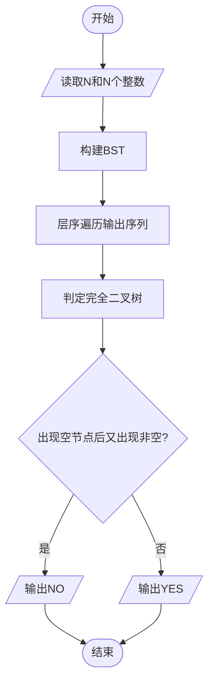
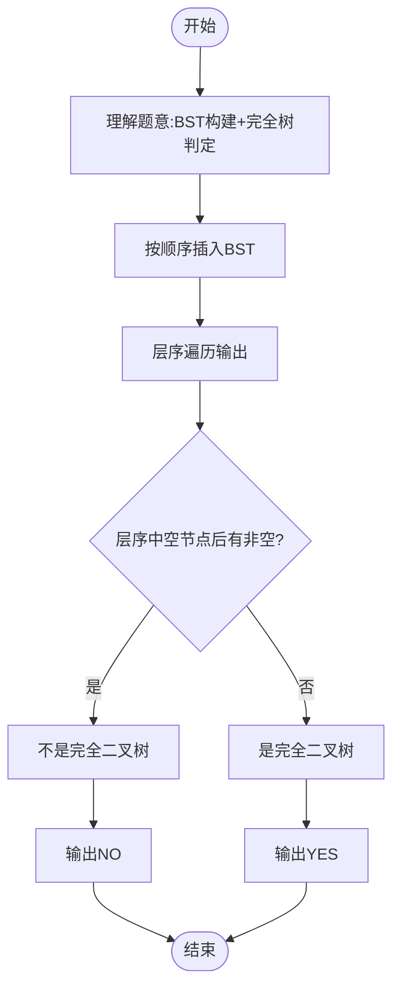

# L3-010 - 是否完全二叉搜索树（30 分）

- **时间限制**: 400 ms
- **内存限制**: 65536 KB
- **代码长度限制**: 16 KB

---

## 题目描述

将一系列给定数字顺序插入一个初始为空的二叉搜索树（定义为左子树键值大，右子树键值小），你需要判断最后的树是否一棵完全二叉树，并且给出其层序遍历的结果。

### 输入格式:

输入第一行给出一个不超过20的正整数`N`；第二行给出`N`个互不相同的正整数，其间以空格分隔。

### 输出格式:

将输入的`N`个正整数顺序插入一个初始为空的二叉搜索树。在第一行中输出结果树的层序遍历结果，数字间以1个空格分隔，行的首尾不得有多余空格。第二行输出`YES`，如果该树是完全二叉树；否则输出`NO`。

### 输入样例 1:

```in
9
38 45 42 24 58 30 67 12 51
```

### 输出样例 1:

```out
38 45 24 58 42 30 12 67 51
YES
```

### 输入样例 2:

```in
8
38 24 12 45 58 67 42 51
```

### 输出样例 2:

```out
38 45 24 58 42 12 67 51
NO
```

## 示例

### 示例 1

**输入:**
```
9
38 45 42 24 58 30 67 12 51
```

**输出:**
```
38 45 24 58 42 30 12 67 51
YES
```

### 示例 2

**输入:**
```
8
38 24 12 45 58 67 42 51
```

**输出:**
```
38 45 24 58 42 12 67 51
NO
```

---

## 题目详解

### 一、解题思路

本题的 R 实现采用以下方法：读取标准输入后建立题目所需的数据结构，按约束执行核心计算并输出结果。

### 二、代码流程说明

1. 读取并解析标准输入，转换为题目所需的数据结构。
2. 按题意执行核心算法，维护中间状态并处理边界情况。
3. 整理计算结果，按照输出格式生成答案。

### 三、代码实现

```r
# 实现原理：读取标准输入后建立题目所需的数据结构，按约束执行核心计算并输出结果。
# 处理流程：读取输入 -> 建立状态 -> 执行算法 -> 按题目格式输出。
# 关键变量和循环均直接对应题目中的数据、约束或操作。

# 读取并解析标准输入。
v <- scan(file = "stdin", quiet = TRUE)
n <- v[1]
a <- v[2:(n + 1)]
left <- integer(n)
right <- integer(n)
root <- 1
# 按题目约束遍历当前数据，更新中间状态。
for (x in a[-1]) {
    u <- root
    repeat {
        if (x > a[u]) {
            if (left[u] == 0) {
                left[u] <- which(a == x)
                break
            }
            else u <- left[u]
        }
        else {
            if (right[u] == 0) {
                right[u] <- which(a == x)
                break
            }
            else u <- right[u]
        }
    }
}
q <- root
out <- numeric()
gap <- FALSE
ok <- TRUE
while (length(q)) {
    u <- q[1]
    q <- q[-1]
    if (u == 0) {
        gap <- TRUE
        next
    }
    if (gap)
        ok <- FALSE
    out <- c(out, a[u])
    q <- c(q, left[u], right[u])
}
# 严格按照题目规定的输出格式输出答案。
cat(paste(out, collapse = " "), "\n", if (ok) "YES" else "NO",
    "\n", sep = "")
```

### 四、代码流程图



### 五、解题流程图



### 六、常见易错点

- 题目描述、输入格式、输出格式和输入输出样例必须保持原文不变。
- R 语言下标从 1 开始，注意编号转换和空输入边界。
- 输出时严格保留题目规定的空格、换行和小数位数。
