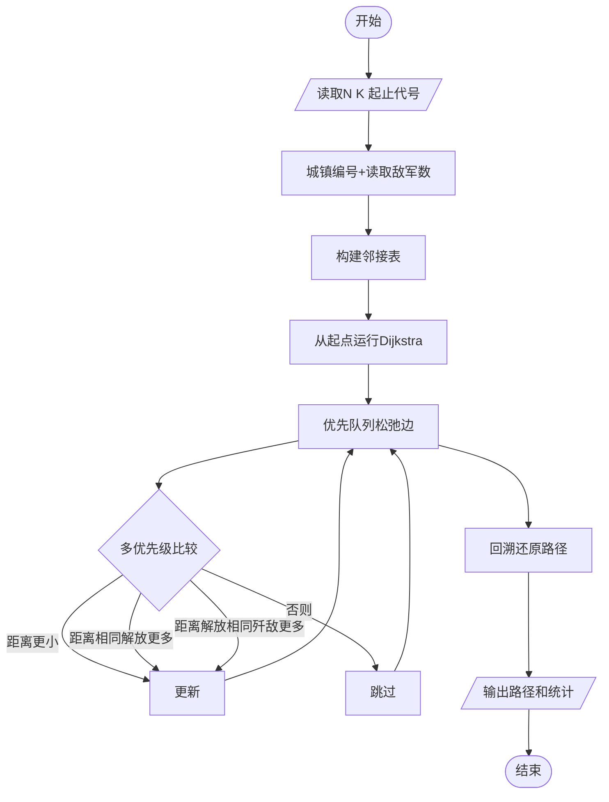
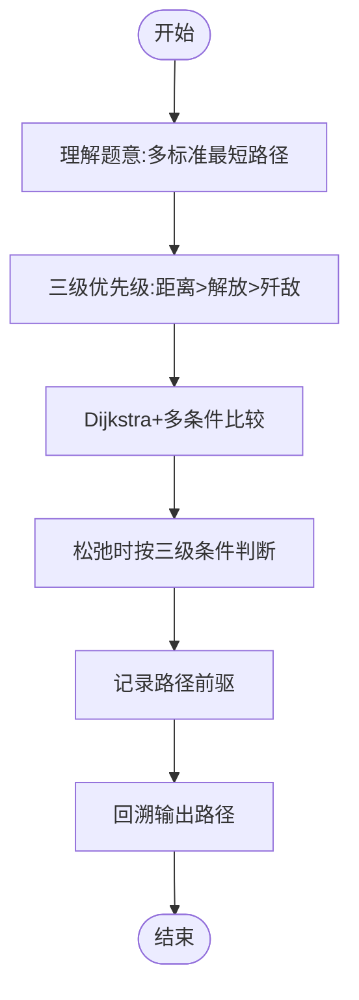

# L3-011 - 直捣黄龙（30 分）

- **时间限制**: 150 ms
- **内存限制**: 65536 KB
- **代码长度限制**: 16 KB

---

## 题目描述

本题是一部战争大片 —— 你需要从己方大本营出发，一路攻城略地杀到敌方大本营。首先时间就是生命，所以你必须选择合适的路径，以最快的速度占领敌方大本营。当这样的路径不唯一时，要求选择可以沿途解放最多城镇的路径。若这样的路径也不唯一，则选择可以有效杀伤最多敌军的路径。

### 输入格式:

输入第一行给出 2 个正整数 N（2 $$\le$$ N $$\le$$ 200，城镇总数）和 K（城镇间道路条数），以及己方大本营和敌方大本营的代号。随后 N-1 行，每行给出除了己方大本营外的一个城镇的代号和驻守的敌军数量，其间以空格分隔。再后面有 K 行，每行按格式`城镇1 城镇2 距离`给出两个城镇之间道路的长度。这里设每个城镇（包括双方大本营）的代号是由 3 个大写英文字母组成的字符串。

### 输出格式:

按照题目要求找到最合适的进攻路径（题目保证速度最快、解放最多、杀伤最强的路径是唯一的），并在第一行按照格式`己方大本营->城镇1->...->敌方大本营`输出。第二行顺序输出最快进攻路径的条数、最短进攻距离、歼敌总数，其间以 1 个空格分隔，行首尾不得有多余空格。

### 输入样例:

```in
10 12 PAT DBY
DBY 100
PTA 20
PDS 90
PMS 40
TAP 50
ATP 200
LNN 80
LAO 30
LON 70
PAT PTA 10
PAT PMS 10
PAT ATP 20
PAT LNN 10
LNN LAO 10
LAO LON 10
LON DBY 10
PMS TAP 10
TAP DBY 10
DBY PDS 10
PDS PTA 10
DBY ATP 10
```

### 输出样例:

```out
PAT->PTA->PDS->DBY
3 30 210
```

## 示例

### 示例 1

**输入:**
```
10 12 PAT DBY
DBY 100
PTA 20
PDS 90
PMS 40
TAP 50
ATP 200
LNN 80
LAO 30
LON 70
PAT PTA 10
PAT PMS 10
PAT ATP 20
PAT LNN 10
LNN LAO 10
LAO LON 10
LON DBY 10
PMS TAP 10
TAP DBY 10
DBY PDS 10
PDS PTA 10
DBY ATP 10
```

**输出:**
```
PAT->PTA->PDS->DBY
3 30 210
```

---

## 题目详解

### 一、解题思路

先用 Dijkstra 求从己方大本营出发的最短距离，同时统计每个最短距离状态的路径数；在最短距离相同的情况下，按解放城镇数和歼敌数更新最优路径及前驱。

### 二、代码流程说明

1. 建立无向带权道路图，并记录每个城镇的敌军数量。
2. Dijkstra 松弛道路，累加最短路径条数，并用城镇数、歼敌数选择前驱。
3. 沿前驱回溯路线，输出路径、路径条数、距离和歼敌总数。

### 三、代码实现

```r
# 实现原理：读取标准输入后建立题目所需的数据结构，按约束执行核心计算并输出结果。
# 处理流程：读取输入 -> 建立状态 -> 执行算法 -> 按题目格式输出。
# 关键变量和循环均直接对应题目中的数据、约束或操作。

# 读取并解析标准输入。
tokens <- scan("stdin", what = "", quiet = TRUE)
if (length(tokens) > 0L) {
    n <- as.integer(tokens[1])
    k <- as.integer(tokens[2])
    start_name <- tokens[3]
    target_name <- tokens[4]
    pos <- 5L
    names <- character(n)
    enemy <- integer(n)
    names[1] <- start_name
    enemy[1] <- 0L
    id <- setNames(seq_len(n), names[1])
# 按题目约束遍历当前数据，更新中间状态。
    for (i in 2:n) {
        names[i] <- tokens[pos]
        enemy[i] <- as.integer(tokens[pos + 1L])
        pos <- pos + 2L
        id[names[i]] <- i
    }
    graph <- vector("list", n)
    for (i in seq_len(n)) graph[[i]] <- list()
    for (i in seq_len(k)) {
        u <- unname(id[[tokens[pos]]])
        v <- unname(id[[tokens[pos + 1L]]])
        w <- as.numeric(tokens[pos + 2L])
        pos <- pos + 3L
        graph[[u]][[length(graph[[u]]) + 1L]] <- c(v, w)
        graph[[v]][[length(graph[[v]]) + 1L]] <- c(u, w)
    }
    target <- unname(id[[target_name]])
    inf <- .Machine$double.xmax/4
    dist <- rep(inf, n)
    ways <- numeric(n)
    towns <- rep(-1L, n)
    kills <- rep(-1, n)
    prev <- integer(n)
    dist[1] <- 0
    ways[1] <- 1
    towns[1] <- 0L
    kills[1] <- 0
    used <- rep(FALSE, n)
    for (step in seq_len(n)) {
        cand <- which(!used)
        if (!length(cand))
            break
        u <- cand[which.min(dist[cand])]
        if (!is.finite(dist[u]))
            break
        used[u] <- TRUE
        for (edge in graph[[u]]) {
            v <- as.integer(edge[1])
            nd <- dist[u] + edge[2]
            nt <- towns[u] + 1L
            nk <- kills[u] + enemy[v]
            if (nd < dist[v]) {
                dist[v] <- nd
                ways[v] <- ways[u]
                towns[v] <- nt
                kills[v] <- nk
                prev[v] <- u
            }
            else if (nd == dist[v]) {
                ways[v] <- ways[v] + ways[u]
                if (nt > towns[v] || (nt == towns[v] && nk >
                  kills[v])) {
                  towns[v] <- nt
                  kills[v] <- nk
                  prev[v] <- u
                }
            }
        }
    }
    route <- integer()
    u <- target
    while (u != 0L) {
        route <- c(u, route)
        u <- prev[u]
    }
# 严格按照题目规定的输出格式输出答案。
    cat(paste(names[route], collapse = "->"), "\n", sep = "")
    cat(paste(format(ways[target], scientific = FALSE, trim = TRUE),
        dist[target], kills[target]), "\n", sep = "")
}
```

### 四、代码流程图



### 五、解题流程图



### 六、常见易错点

- 题目描述、输入格式、输出格式和输入输出样例必须保持原文不变。
- R 语言下标从 1 开始，注意编号转换和空输入边界。
- 输出时严格保留题目规定的空格、换行和小数位数。
