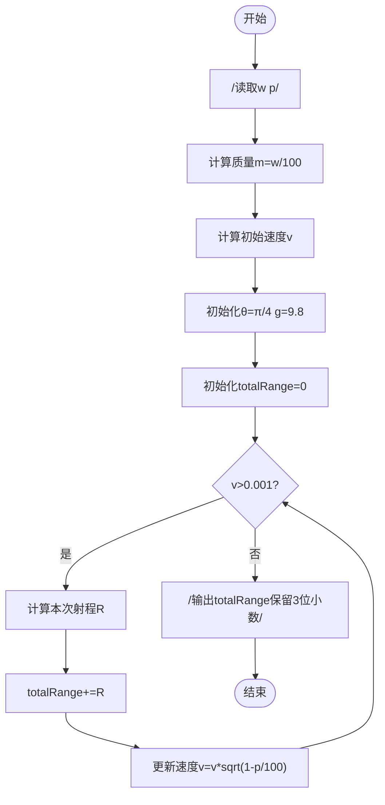
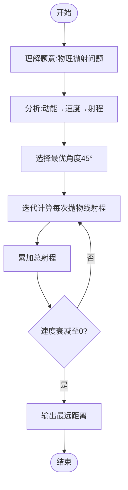

# L3-013 - 非常弹的球（30 分）

- **时间限制**: 150 ms
- **内存限制**: 65536 KB
- **代码长度限制**: 16 KB

---

## 题目描述

刚上高一的森森为了学好物理，买了一个“非常弹”的球。虽然说是非常弹的球，其实也就是一般的弹力球而已。森森玩了一会儿弹力球后突然想到，假如他在地上用力弹球，球最远能弹到多远去呢？他不太会，你能帮他解决吗？当然为了刚学习物理的森森，我们对环境做一些简化：

- 假设森森是一个质点，以森森为原点设立坐标轴，则森森位于(0, 0)点。
- 小球质量为$$w/100$$ 千克（kg），重力加速度为9.8米/秒平方（$$m/s^2$$）。
- 森森在地上用力弹球的过程可简化为球从(0, 0)点以某个森森选择的角度$$ang$$ ($$0 < ang < \pi/2$$) 向第一象限抛出，抛出时假设动能为1000 焦耳（J）。
- 小球在空中仅受重力作用，球纵坐标为0时可视作落地，落地时损失$$p\%$$动能并反弹。
- 地面可视为刚体，忽略小球形状、空气阻力及摩擦阻力等。

森森为你准备的公式：

- 动能公式：$$E = m\times v^2 / 2$$
- 牛顿力学公式：$$F = m\times a$$
- 重力：$$G = m\times g$$

其中：

- $$E$$ - 动能，单位为“焦耳”
- $$m$$ - 质量，单位为“千克”
- $$v$$ - 速度，单位为“米/秒”
- $$a$$ - 加速度，单位为“米/秒平方”
- $$g$$ - 重力加速度

### 输入格式:

输入在一行中给出两个整数：$$1 \le w \le 1000$$ 和 $$1 \le p \le 100$$，分别表示放大100倍的小球质量、以及损失动力的百分比$$p$$。

### 输出格式:

在一行输出最远的投掷距离，保留3位小数。

### 输入样例:

```in
100 90
```

### 输出样例:

```out
226.757
```

## 示例

### 示例 1

**输入:**
```
100 90
```

**输出:**
```
226.757
```

---

## 题目详解

### 一、解题思路

每次落地后动能变为原来的 (1-p/100)。抛出角度取接近 \\(\pi/4\\) 时水平射程最大，初始动能为 1000 J；将每次抛出的射程按几何级数求和即可得到总距离。

### 二、代码流程说明

1. 由动能公式计算初速度平方，并用抛体运动公式得到第一次落点距离。
2. 每次反弹后的动能乘以 (1-p/100)，因此距离也乘以同一比例。
3. 用等比数列求和，并按三位小数输出。

### 三、代码实现

```r
# 实现原理：读取标准输入后建立题目所需的数据结构，按约束执行核心计算并输出结果。
# 处理流程：读取输入 -> 建立状态 -> 执行算法 -> 按题目格式输出。
# 关键变量和循环均直接对应题目中的数据、约束或操作。

# 读取并解析标准输入。
v <- scan("stdin", what = numeric(), quiet = TRUE)
if (length(v) >= 2L) {
    w <- v[1]
    p <- v[2]
    ratio <- 1 - p/100
    first_distance <- 2000/((w/100) * 9.8)
    total_distance <- first_distance/(1 - ratio)
# 严格按照题目规定的输出格式输出答案。
    cat(sprintf("%.3f\n", total_distance))
}
```

### 四、代码流程图



### 五、解题流程图



### 六、常见易错点

- 题目描述、输入格式、输出格式和输入输出样例必须保持原文不变。
- R 语言下标从 1 开始，注意编号转换和空输入边界。
- 输出时严格保留题目规定的空格、换行和小数位数。
