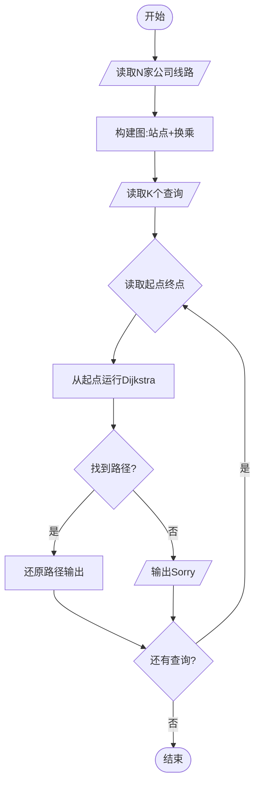
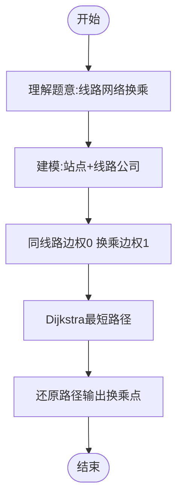

# L3-014 - 周游世界（30 分）

- **时间限制**: 200 ms
- **内存限制**: 65536 KB
- **代码长度限制**: 16 KB

---

## 题目描述

周游世界是件浪漫事，但规划旅行路线就不一定了…… 全世界有成千上万条航线、铁路线、大巴线，令人眼花缭乱。所以旅行社会选择部分运输公司组成联盟，每家公司提供一条线路，然后帮助客户规划由联盟内企业支持的旅行路线。本题就要求你帮旅行社实现一个自动规划路线的程序，使得对任何给定的起点和终点，可以找出最顺畅的路线。所谓“最顺畅”，首先是指中途经停站最少；如果经停站一样多，则取需要换乘线路次数最少的路线。

### 输入格式:

输入在第一行给出一个正整数$$N$$（$$\le 100$$），即联盟公司的数量。接下来有$$N$$行，第$$i$$行（$$i=1, \cdots , N$$）描述了第$$i$$家公司所提供的线路。格式为：

$$M$$ S[1] S[2] $$\cdots$$ S[$$M$$]

其中$$M$$（$$\le 100$$）是经停站的数量，S[$$i$$]（$$i=1, \cdots , M$$）是经停站的编号（由4位0-9的数字组成）。这里假设每条线路都是简单的一条可以双向运行的链路，并且输入保证是按照正确的经停顺序给出的 —— 也就是说，任意一对相邻的S[$$i$$]和S[$$i+1$$]（$$i=1, \cdots , M-1$$）之间都不存在其他经停站点。我们称相邻站点之间的线路为一个运营区间，每个运营区间只承包给一家公司。环线是有可能存在的，但不会不经停任何中间站点就从出发地回到出发地。当然，不同公司的线路是可能在某些站点有交叉的，这些站点就是客户的换乘点，我们假设任意换乘点涉及的不同公司的线路都不超过5条。

在描述了联盟线路之后，题目将给出一个正整数$$K$$（$$\le 10$$），随后$$K$$行，每行给出一位客户的需求，即始发地的编号和目的地的编号，中间以一空格分隔。

### 输出格式:

处理每一位客户的需求。如果没有现成的线路可以使其到达目的地，就在一行中输出“Sorry, no line is available.”；如果目的地可达，则首先在一行中输出最顺畅路线的经停站数量（始发地和目的地不包括在内），然后按下列格式给出旅行路线：

```
Go by the line of company #X1 from S1 to S2.
Go by the line of company #X2 from S2 to S3.
......
```

其中`Xi`是线路承包公司的编号，`Si`是经停站的编号。但必须只输出始发地、换乘点和目的地，不能输出中间的经停站。题目保证满足要求的路线是唯一的。

### 输入样例:

```in
4
7 1001 3212 1003 1204 1005 1306 7797
9 9988 2333 1204 2006 2005 2004 2003 2302 2001
13 3011 3812 3013 3001 1306 3003 2333 3066 3212 3008 2302 3010 3011
4 6666 8432 4011 1306
4
3011 3013
6666 2001
2004 3001
2222 6666
```

### 输出样例:

```out
2
Go by the line of company #3 from 3011 to 3013.
10
Go by the line of company #4 from 6666 to 1306.
Go by the line of company #3 from 1306 to 2302.
Go by the line of company #2 from 2302 to 2001.
6
Go by the line of company #2 from 2004 to 1204.
Go by the line of company #1 from 1204 to 1306.
Go by the line of company #3 from 1306 to 3001.
Sorry, no line is available.
```

## 示例

### 示例 1

**输入:**
```
4
7 1001 3212 1003 1204 1005 1306 7797
9 9988 2333 1204 2006 2005 2004 2003 2302 2001
13 3011 3812 3013 3001 1306 3003 2333 3066 3212 3008 2302 3010 3011
4 6666 8432 4011 1306
4
3011 3013
6666 2001
2004 3001
2222 6666
```

**输出:**
```
2
Go by the line of company #3 from 3011 to 3013.
10
Go by the line of company #4 from 6666 to 1306.
Go by the line of company #3 from 1306 to 2302.
Go by the line of company #2 from 2302 to 2001.
6
Go by the line of company #2 from 2004 to 1204.
Go by the line of company #1 from 1204 to 1306.
Go by the line of company #3 from 1306 to 3001.
Sorry, no line is available.
```

---

## 题目详解

### 一、解题思路

把“所在车站、上一段线路”作为状态，在状态图上按经停站数和换乘次数的字典序做 Dijkstra；回溯状态后把连续使用同一公司的区间合并输出。

### 二、代码流程说明

1. 为每个车站编号，并把每条线路的相邻站点加入无向图。
2. 以“站点+上一条线路”为状态，优先最少经过区间数、再最少换乘次数。
3. 回溯最优状态，合并连续线路并输出换乘点。

### 三、代码实现

```r
# 实现原理：将线路转换为站点图，在“当前线路”状态上用 Dijkstra 风格搜索，按乘坐站数优先、换乘次数次优选择最优路线。
# 处理流程：读取输入 -> 建立状态 -> 执行算法 -> 按题目格式输出。
# 关键变量和循环均直接对应题目中的数据、约束或操作。

# 读取并解析标准输入。
tok <- scan("stdin", what = "", quiet = TRUE)
if (length(tok) > 0L) {
    n <- as.integer(tok[1])
    p <- 2L
    ids <- new.env(hash = TRUE, parent = emptyenv())
    station <- character()
    graph <- list()
    get_id <- function(x) {
        if (!exists(x, envir = ids, inherits = FALSE)) {
            z <- length(station) + 1L
            assign(x, z, envir = ids)
            station <<- c(station, x)
            graph[[z]] <<- list()
        }
        get(x, envir = ids, inherits = FALSE)
    }
# 按题目约束遍历当前数据，更新中间状态。
    for (line in seq_len(n)) {
        m <- as.integer(tok[p])
        p <- p + 1L
        route <- integer(m)
        for (i in seq_len(m)) {
            route[i] <- get_id(tok[p])
            p <- p + 1L
        }
        if (m > 1L)
            for (i in seq_len(m - 1L)) {
                u <- route[i]
                v <- route[i + 1L]
                graph[[u]][[length(graph[[u]]) + 1L]] <- c(v,
                  line)
                graph[[v]][[length(graph[[v]]) + 1L]] <- c(u,
                  line)
            }
    }
    q <- as.integer(tok[p])
    p <- p + 1L
    out <- character()
    V <- length(station)
    for (case in seq_len(q)) {
        source_name <- tok[p]
        target_name <- tok[p + 1L]
        p <- p + 2L
        if (!exists(source_name, envir = ids, inherits = FALSE) ||
            !exists(target_name, envir = ids, inherits = FALSE)) {
            out <- c(out, "Sorry, no line is available.")
            next
        }
        src <- get(source_name, envir = ids, inherits = FALSE)
        dst <- get(target_name, envir = ids, inherits = FALSE)
        if (src == dst) {
            out <- c(out, "0")
            next
        }
        best_e <- matrix(Inf, nrow = V, ncol = n + 1L)
        best_t <- matrix(Inf, nrow = V, ncol = n + 1L)
        prev_v <- matrix(0L, nrow = V, ncol = n + 1L)
        prev_l <- matrix(0L, nrow = V, ncol = n + 1L)
        best_e[src, n + 1L] <- 0
        best_t[src, n + 1L] <- 0
        pq <- matrix(c(0, 0, src, n + 1L), nrow = 1L, byrow = TRUE)
        while (nrow(pq) > 0L) {
# 执行核心排序、状态转移或选择逻辑。
            take <- order(pq[, 1], pq[, 2])[1L]
            cur <- pq[take, ]
            if (nrow(pq) == 1L)
                pq <- matrix(numeric(0), nrow = 0L, ncol = 4L)
            else pq <- pq[-take, , drop = FALSE]
            e <- cur[1]
            tr <- cur[2]
            u <- as.integer(cur[3])
            old_col <- as.integer(cur[4])
            old_line <- if (old_col == n + 1L)
                0L
            else old_col
            if (e != best_e[u, old_col] || tr != best_t[u, old_col])
                next
            for (edge in graph[[u]]) {
                v <- as.integer(edge[1])
                line <- as.integer(edge[2])
                col <- line
                ne <- e + 1
                nt <- tr + as.integer(old_line != 0L && old_line !=
                  line)
                if (ne < best_e[v, col] || (ne == best_e[v, col] &&
                  nt < best_t[v, col])) {
                  best_e[v, col] <- ne
                  best_t[v, col] <- nt
                  prev_v[v, col] <- u
                  prev_l[v, col] <- old_col
                  pq <- rbind(pq, c(ne, nt, v, col))
                }
            }
        }
        ends <- which(is.finite(best_e[dst, seq_len(n)]))
        if (!length(ends)) {
            out <- c(out, "Sorry, no line is available.")
            next
        }
        best_line <- ends[order(best_e[dst, ends], best_t[dst,
            ends])[1L]]
        edge_count <- best_e[dst, best_line]
        nodes <- integer()
        lines <- integer()
        u <- dst
        col <- best_line
        while (!(u == src && col == n + 1L)) {
            nodes <- c(u, nodes)
            lines <- c(col, lines)
            pu <- prev_v[u, col]
            pl <- prev_l[u, col]
            u <- pu
            col <- pl
        }
        nodes <- c(src, nodes)
        out <- c(out, format(edge_count, scientific = FALSE,
            trim = TRUE))
        starts <- c(1L, which(diff(lines) != 0L) + 1L)
        ends_run <- c(starts[-1L] - 1L, length(lines))
        for (r in seq_along(starts)) out <- c(out, sprintf("Go by the line of company #%d from %s to %s.",
            lines[starts[r]], station[nodes[starts[r]]], station[nodes[ends_run[r] +
                1L]]))
    }
# 严格按照题目规定的输出格式输出答案。
    cat(paste(out, collapse = "\n"), "\n", sep = "")
}
```

### 四、代码流程图



### 五、解题流程图



### 六、常见易错点

- 题目描述、输入格式、输出格式和输入输出样例必须保持原文不变。
- R 语言下标从 1 开始，注意编号转换和空输入边界。
- 输出时严格保留题目规定的空格、换行和小数位数。
