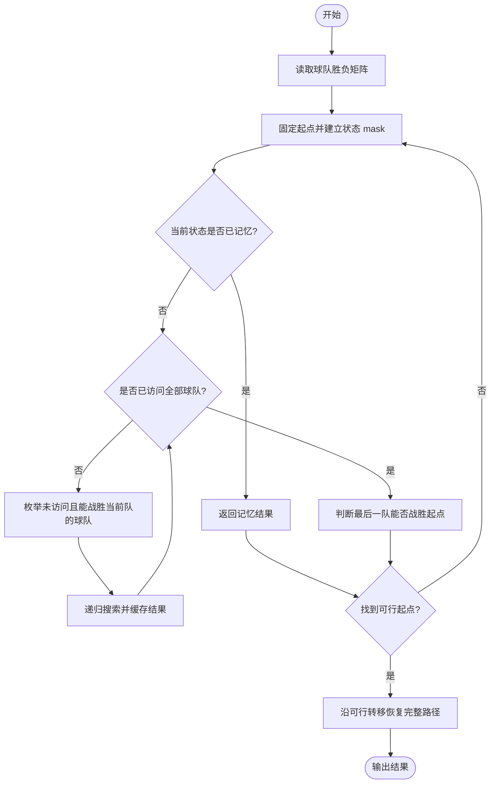
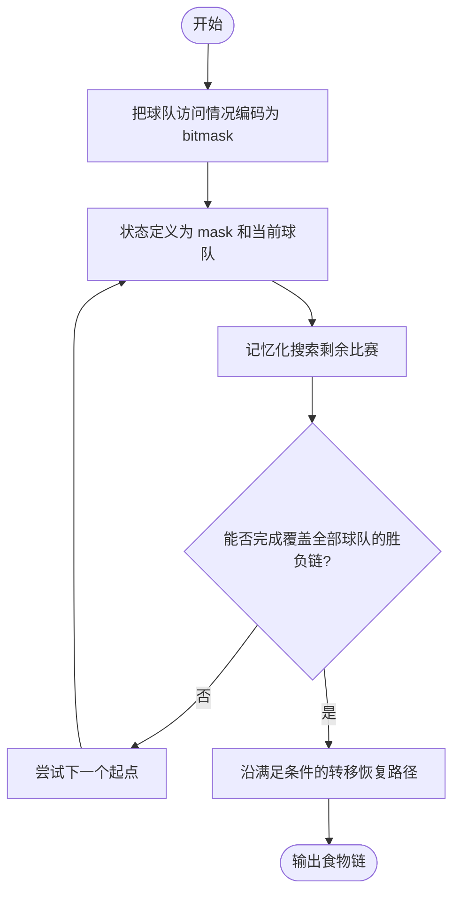

# L3-015 - 球队“食物链”（30 分）

- **时间限制**: 2000 ms
- **内存限制**: 131072 KB
- **代码长度限制**: 16 KB

---

## 题目描述

某国的足球联赛中有$$N$$支参赛球队，编号从1至$$N$$。联赛采用主客场双循环赛制，参赛球队两两之间在双方主场各赛一场。

联赛战罢，结果已经尘埃落定。此时，联赛主席突发奇想，希望从中找出一条包含所有球队的“食物链”，来说明联赛的精彩程度。“食物链”为一个1至$$N$$的排列{ $$T_1$$ $$T_2$$ $$\cdots$$ $$T_N$$ }，满足：球队$$T_1$$战胜过球队$$T_2$$，球队$$T_2$$战胜过球队$$T_3$$，$$\cdots$$，球队$$T_{(N-1)}$$战胜过球队$$T_N$$，球队$$T_N$$战胜过球队$$T_1$$。

现在主席请你从联赛结果中找出“食物链”。若存在多条“食物链”，请找出字典序最小的。

注：排列{ $$a_1$$ $$a_2$$ $$\cdots$$ $$a_N$$}在字典序上小于排列{ $$b_1$$ $$b_2$$ $$\cdots$$ $$b_N$$ }，当且仅当存在整数$$K$$（$$1 \le K \le N$$），满足：$$a_K < b_K$$且对于任意小于$$K$$的正整数$$i$$，$$a_i=b_i$$。

### 输入格式:

输入第一行给出一个整数$$N$$（$$2 \le N \le 20$$），为参赛球队数。随后$$N$$行，每行$$N$$个字符，给出了$$N\times N$$的联赛结果表，其中第$$i$$行第$$j$$列的字符为球队$$i$$在主场对阵球队$$j$$的比赛结果：`W`表示球队$$i$$战胜球队$$j$$，`L`表示球队$$i$$负于球队$$j$$，`D`表示两队打平，`-`表示无效（当$$i=j$$时）。输入中无多余空格。

### 输出格式:

按题目要求找到“食物链”$$T_1$$ $$T_2$$ $$\cdots$$ $$T_N$$，将这$$N$$个数依次输出在一行上，数字间以1个空格分隔，行的首尾不得有多余空格。若不存在“食物链”，输出“No Solution”。

### 输入样例 1:

```in
5
-LWDW
W-LDW
WW-LW
DWW-W
DDLW-
```

### 输出样例 1:

```out
1 3 5 4 2
```

### 输入样例 2:

```in
5
-WDDW
D-DWL
DD-DW
DDW-D
DDDD-
```

### 输出样例 2:

```out
No Solution
```

## 示例

### 示例 1

**输入:**
```
5
-LWDW
W-LDW
WW-LW
DWW-W
DDLW-
```

**输出:**
```
1 3 5 4 2
```

### 示例 2

**输入:**
```
5
-WDDW
D-DWL
DD-DW
DDW-D
DDDD-
```

**输出:**
```
No Solution
```

---

## 题目详解

### 一、解题思路

把球队看作有向图，W 表示一条可走的有向边。固定字典序最小的起点，使用带记忆化的深度优先搜索寻找覆盖所有顶点并回到起点的哈密顿环。

### 二、代码流程说明

1. 读取比赛结果，建立胜负有向图。
2. 按起点从小到大搜索，状态由已访问集合和当前球队组成。
3. 找到能回到起点的完整环后立即输出；所有起点失败则输出 No Solution。

### 三、代码实现

```r
# 实现原理：把原问题拆成规模更小的子问题，用状态转移保存已计算结果，避免重复计算。
# 处理流程：读取输入 -> 建立状态 -> 执行算法 -> 按题目格式输出。
# 关键变量和循环均直接对应题目中的数据、约束或操作。

# 读取并解析标准输入。
lines <- readLines("stdin", warn = FALSE)
if (length(lines) > 0L) {
    n <- as.integer(trimws(lines[1]))
    result <- NULL
    mat <- do.call(rbind, lapply(lines[seq.int(2L, n + 1L)],
        function(x) strsplit(trimws(x), "", fixed = TRUE)[[1]]))
    win <- mat == "W"
    allmask <- bitwShiftL(1L, n) - 1L
# 按题目约束遍历当前数据，更新中间状态。
    for (start in seq_len(n)) {
        memo <- new.env(hash = TRUE, parent = emptyenv())
        can <- function(mask, u) {
            key <- paste(mask, u, sep = ":")
            if (exists(key, envir = memo, inherits = FALSE))
                return(get(key, envir = memo, inherits = FALSE))
            ans <- if (mask == allmask)
                win[u, start]
            else FALSE
            if (mask != allmask && !ans)
                for (v in seq_len(n)) {
                  bit <- bitwShiftL(1L, v - 1L)
                  if (bitwAnd(mask, bit) == 0L && win[u, v] &&
                    can(bitwOr(mask, bit), v)) {
                    ans <- TRUE
                    break
                  }
                }
            assign(key, ans, envir = memo)
            ans
        }
        first_bit <- bitwShiftL(1L, start - 1L)
        if (can(first_bit, start)) {
            path <- start
            mask <- first_bit
            u <- start
            while (mask != allmask) {
                for (v in seq_len(n)) {
                  bit <- bitwShiftL(1L, v - 1L)
                  if (bitwAnd(mask, bit) == 0L && win[u, v] &&
                    can(bitwOr(mask, bit), v)) {
                    path <- c(path, v)
                    mask <- bitwOr(mask, bit)
                    u <- v
                    break
                  }
                }
            }
            result <- path
            break
        }
    }
    if (is.null(result))
# 严格按照题目规定的输出格式输出答案。
        cat("No Solution\n")
    else cat(paste(result, collapse = " "), "\n", sep = "")
}
```

### 四、代码流程图



### 五、解题流程图



### 六、常见易错点

- 题目描述、输入格式、输出格式和输入输出样例必须保持原文不变。
- R 语言下标从 1 开始，注意编号转换和空输入边界。
- 输出时严格保留题目规定的空格、换行和小数位数。
