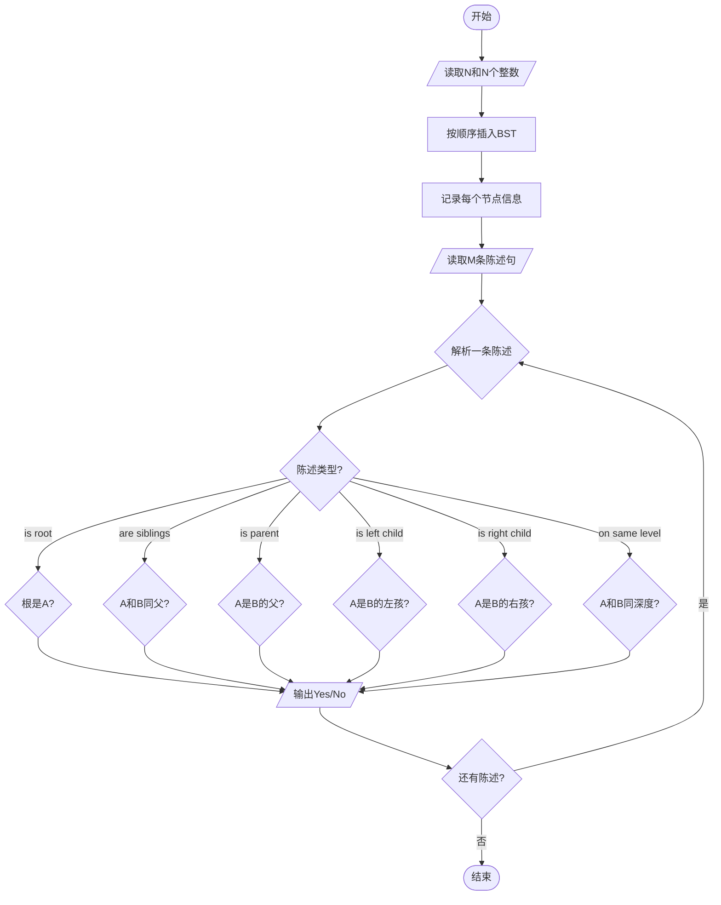
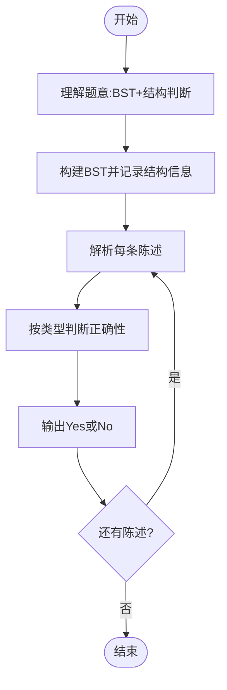

# L3-016 - 二叉搜索树的结构（30 分）

- **时间限制**: 400 ms
- **内存限制**: 65536 KB
- **代码长度限制**: 16 KB

---

## 题目描述

二叉搜索树或者是一棵空树，或者是具有下列性质的二叉树： 若它的左子树不空，则左子树上所有结点的值均小于它的根结点的值；若它的右子树不空，则右子树上所有结点的值均大于它的根结点的值；它的左、右子树也分别为二叉搜索树。（摘自百度百科）

给定一系列互不相等的整数，将它们顺次插入一棵初始为空的二叉搜索树，然后对结果树的结构进行描述。你需要能判断给定的描述是否正确。例如将{ 2 4 1 3 0 }插入后，得到一棵二叉搜索树，则陈述句如“2是树的根”、“1和4是兄弟结点”、“3和0在同一层上”（指自顶向下的深度相同）、“2是4的双亲结点”、“3是4的左孩子”都是正确的；而“4是2的左孩子”、“1和3是兄弟结点”都是不正确的。

### 输入格式:

输入在第一行给出一个正整数$$N$$（$$\le 100$$），随后一行给出$$N$$个互不相同的整数，数字间以空格分隔，要求将之顺次插入一棵初始为空的二叉搜索树。之后给出一个正整数$$M$$（$$\le 100$$），随后$$M$$行，每行给出一句待判断的陈述句。陈述句有以下6种：

- `A is the root`，即"`A`是树的根"；
- `A and B are siblings`，即"`A`和`B`是兄弟结点"；
- `A is the parent of B`，即"`A`是`B`的双亲结点"；
- `A is the left child of B`，即"`A`是`B`的左孩子"；
- `A is the right child of B`，即"`A`是`B`的右孩子"；
- `A and B are on the same level`，即"`A`和`B`在同一层上"。

题目保证所有给定的整数都在整型范围内。

### 输出格式:

对每句陈述，如果正确则输出`Yes`，否则输出`No`，每句占一行。

### 输入样例:

```in
5
2 4 1 3 0
8
2 is the root
1 and 4 are siblings
3 and 0 are on the same level
2 is the parent of 4
3 is the left child of 4
1 is the right child of 2
4 and 0 are on the same level
100 is the right child of 3
```

### 输出样例:

```out
Yes
Yes
Yes
Yes
Yes
No
No
No
```

## 示例

### 示例 1

**输入:**
```
5
2 4 1 3 0
8
2 is the root
1 and 4 are siblings
3 and 0 are on the same level
2 is the parent of 4
3 is the left child of 4
1 is the right child of 2
4 and 0 are on the same level
100 is the right child of 3
```

**输出:**
```
Yes
Yes
Yes
Yes
Yes
No
No
No
```

---

## 题目详解

### 一、解题思路

按输入顺序插入二叉搜索树，并为每个结点记录父结点、左右孩子和深度；查询时直接比较这些结构关系。

### 二、代码流程说明

1. 逐个插入整数，建立二叉搜索树及父子关系。
2. 解析每条陈述中的整数和关系类型。
3. 根据根、兄弟、父子或深度关系输出 Yes/No。

### 三、代码实现

```r
# 实现原理：按行或按字段解析输入，使用字符串或序列操作完成题目要求的变换，并按格式输出。
# 处理流程：读取输入 -> 建立状态 -> 执行算法 -> 按题目格式输出。
# 关键变量和循环均直接对应题目中的数据、约束或操作。

# 读取并解析标准输入。
lines <- readLines("stdin", warn = FALSE)
if (length(lines) > 0L) {
    n <- as.integer(trimws(lines[1]))
    values <- as.integer(strsplit(trimws(lines[2]), " +")[[1]])
    left <- right <- parent <- depth <- integer(n)
    node_value <- integer(n)
    root <- 0L
    count <- 0L
    pos <- function(x) match(as.character(x), as.character(node_value[seq_len(count)]))
# 按题目约束遍历当前数据，更新中间状态。
    for (value in values[seq_len(n)]) {
        count <- count + 1L
        node_value[count] <- value
        depth[count] <- 0L
        if (root == 0L) {
            root <- count
            next
        }
        u <- root
        repeat {
            if (value < node_value[u]) {
                if (left[u] == 0L) {
                  left[u] <- count
                  parent[count] <- u
                  depth[count] <- depth[u] + 1L
                  break
                }
                u <- left[u]
            }
            else {
                if (right[u] == 0L) {
                  right[u] <- count
                  parent[count] <- u
                  depth[count] <- depth[u] + 1L
                  break
                }
                u <- right[u]
            }
        }
    }
    m <- as.integer(trimws(lines[3]))
    out <- character(m)
    for (i in seq_len(m)) {
        parts <- strsplit(trimws(lines[3 + i]), " +")[[1]]
        a <- pos(as.integer(parts[1]))
        ok <- FALSE
        if (length(parts) >= 4L && parts[4] == "root") {
            ok <- !is.na(a) && a == root
        }
        else if (length(parts) >= 5L && parts[2] == "and" &&
            parts[5] == "siblings") {
            b <- pos(as.integer(parts[3]))
            ok <- !is.na(a) && !is.na(b) && parent[a] != 0L &&
                parent[a] == parent[b]
        }
        else if (length(parts) >= 6L && parts[4] == "parent" &&
            parts[5] == "of") {
            b <- pos(as.integer(parts[6]))
            ok <- !is.na(a) && !is.na(b) && parent[b] == a
        }
        else if (length(parts) >= 7L && parts[4] == "left" &&
            parts[5] == "child") {
            b <- pos(as.integer(parts[7]))
            ok <- !is.na(a) && !is.na(b) && left[b] == a
        }
        else if (length(parts) >= 7L && parts[4] == "right" &&
            parts[5] == "child") {
            b <- pos(as.integer(parts[7]))
            ok <- !is.na(a) && !is.na(b) && right[b] == a
        }
        else if (length(parts) >= 6L && parts[4] == "are" &&
            parts[5] == "on") {
            b <- pos(as.integer(parts[3]))
            ok <- !is.na(a) && !is.na(b) && depth[a] == depth[b]
        }
        out[i] <- if (ok)
            "Yes"
        else "No"
    }
# 严格按照题目规定的输出格式输出答案。
    cat(paste(out, collapse = "\n"), "\n", sep = "")
}
```

### 四、代码流程图



### 五、解题流程图



### 六、常见易错点

- 题目描述、输入格式、输出格式和输入输出样例必须保持原文不变。
- R 语言下标从 1 开始，注意编号转换和空输入边界。
- 输出时严格保留题目规定的空格、换行和小数位数。
