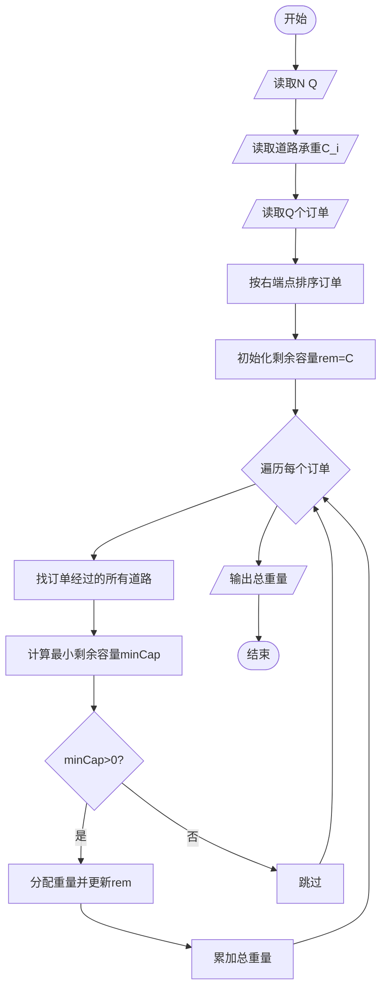
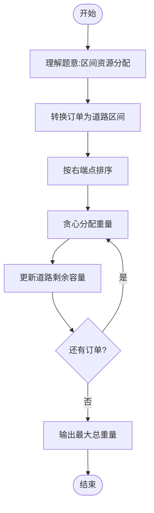

# L3-017 - 森森快递（30 分）

- **时间限制**: 400 ms
- **内存限制**: 65536 KB
- **代码长度限制**: 16 KB

---

## 题目描述

森森开了一家快递公司，叫森森快递。因为公司刚刚开张，所以业务路线很简单，可以认为是一条直线上的$$N$$个城市，这些城市从左到右依次从0到$$(N-1)$$编号。由于道路限制，第$$i$$号城市（$$i=0, \cdots , N-2$$）与第$$(i+1)$$号城市中间往返的运输货物重量在同一时刻不能超过$$C_i$$公斤。

公司开张后很快接到了$$Q$$张订单，其中$$j$$张订单描述了某些指定的货物要从$$S_j$$号城市运输到$$T_j$$号城市。这里我们简单地假设所有货物都有无限货源，森森会不定时地挑选其中一部分货物进行运输。安全起见，这些货物不会在中途卸货。

为了让公司整体效益更佳，森森想知道如何安排订单的运输，能使得运输的货物重量最大且符合道路的限制？要注意的是，发货时间有可能是任何时刻，所以我们安排订单的时候，必须保证共用同一条道路的所有货车的总重量不超载。例如我们安排1号城市到4号城市以及2号城市到4号城市两张订单的运输，则这两张订单的运输同时受2-3以及3-4两条道路的限制，因为两张订单的货物可能会同时在这些道路上运输。

### 输入格式:

输入在第一行给出两个正整数$$N$$和$$Q$$（$$2 \le N \le 10^5$$, $$1 \le Q \le 10^5$$），表示总共的城市数以及订单数量。

第二行给出$$(N-1)$$个数，顺次表示相邻两城市间的道路允许的最大运货重量$$C_i$$（$$i=0, \cdots , N-2$$）。题目保证每个$$C_i$$是不超过$$2^{31}$$的非负整数。

接下来$$Q$$行，每行给出一张订单的起始及终止运输城市编号。题目保证所有编号合法，并且不存在起点和终点重合的情况。

### 输出格式:

在一行中输出可运输货物的最大重量。

### 输入样例:

```in
10 6
0 7 8 5 2 3 1 9 10
0 9
1 8
2 7
6 3
4 5
4 2
```

### 输出样例:

```out
7
```

## 样例提示：我们选择执行最后两张订单，即把5公斤货从城市4运到城市2，并且把2公斤货从城市4运到城市5，就可以得到最大运输量7公斤。

## 示例

### 示例 1

**输入:**
```
10 6
0 7 8 5 2 3 1 9 10
0 9
1 8
2 7
6 3
4 5
4 2
```

**输出:**
```
7
```

---

## 题目详解

### 一、解题思路

将订单按终点从小到大处理。对每个订单，能安排的最大重量是其覆盖道路剩余容量的最小值；安排后对整个区间做区间减法。用带懒标记的线段树支持区间最小值查询和区间减法。

### 二、代码流程说明

1. 建立表示相邻城市道路容量的线段树。
2. 按订单终点排序，查询订单覆盖区间的最小剩余容量。
3. 将该重量从区间容量中扣除并累加答案。

### 三、代码实现

```r
# 实现原理：先解析数据并按题目规定的关键字排序，再进行顺序处理和格式化输出。
# 处理流程：读取输入 -> 建立状态 -> 执行算法 -> 按题目格式输出。
# 关键变量和循环均直接对应题目中的数据、约束或操作。

# 读取并解析标准输入。
v <- scan("stdin", what = numeric(), quiet = TRUE)
if (length(v) >= 2L) {
    n <- as.integer(v[1])
    q <- as.integer(v[2])
    cap <- v[seq.int(3L, 2L + n - 1L)]
    p <- n + 1L
    s <- integer(q)
    t <- integer(q)
# 按题目约束遍历当前数据，更新中间状态。
    for (i in seq_len(q)) {
        s[i] <- as.integer(v[p + 1L])
        t[i] <- as.integer(v[p + 2L])
        p <- p + 2L
        if (s[i] > t[i]) {
            z <- s[i]
            s[i] <- t[i]
            t[i] <- z
        }
    }
# 执行核心排序、状态转移或选择逻辑。
    ord <- order(t, seq_len(q))
    size <- n - 1L
    mn <- numeric(4L * size + 8L)
    lazy <- numeric(4L * size + 8L)
    build <- function(o, l, r) {
        if (l == r) {
            mn[o] <<- cap[l]
        }
        else {
            md <- (l + r)%/%2L
            build(o * 2L, l, md)
            build(o * 2L + 1L, md + 1L, r)
            mn[o] <<- min(mn[o * 2L], mn[o * 2L + 1L])
        }
    }
    push <- function(o) {
        if (lazy[o] != 0) {
            z <- lazy[o]
            mn[o * 2L] <<- mn[o * 2L] + z
            mn[o * 2L + 1L] <<- mn[o * 2L + 1L] + z
            lazy[o * 2L] <<- lazy[o * 2L] + z
            lazy[o * 2L + 1L] <<- lazy[o * 2L + 1L] + z
            lazy[o] <<- 0
        }
    }
    query <- function(o, l, r, ql, qr) {
        if (ql <= l && r <= qr)
            return(mn[o])
        push(o)
        md <- (l + r)%/%2L
        ans <- Inf
        if (ql <= md)
            ans <- min(ans, query(o * 2L, l, md, ql, qr))
        if (qr > md)
            ans <- min(ans, query(o * 2L + 1L, md + 1L, r, ql,
                qr))
        ans
    }
    update <- function(o, l, r, ql, qr, z) {
        if (ql <= l && r <= qr) {
            mn[o] <<- mn[o] + z
            lazy[o] <<- lazy[o] + z
            return(invisible(NULL))
        }
        push(o)
        md <- (l + r)%/%2L
        if (ql <= md)
            update(o * 2L, l, md, ql, qr, z)
        if (qr > md)
            update(o * 2L + 1L, md + 1L, r, ql, qr, z)
        mn[o] <<- min(mn[o * 2L], mn[o * 2L + 1L])
    }
    if (size > 0L)
        build(1L, 1L, size)
    ans <- 0
    for (j in ord) {
        l <- s[j] + 1L
        r <- t[j]
        take <- query(1L, 1L, size, l, r)
        if (take > 0) {
            update(1L, 1L, size, l, r, -take)
            ans <- ans + take
        }
    }
# 严格按照题目规定的输出格式输出答案。
    cat(format(ans, scientific = FALSE, trim = TRUE), "\n", sep = "")
}
```

### 四、代码流程图



### 五、解题流程图



### 六、常见易错点

- 题目描述、输入格式、输出格式和输入输出样例必须保持原文不变。
- R 语言下标从 1 开始，注意编号转换和空输入边界。
- 输出时严格保留题目规定的空格、换行和小数位数。
