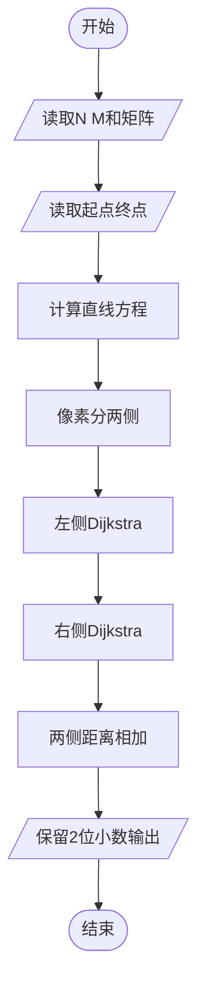
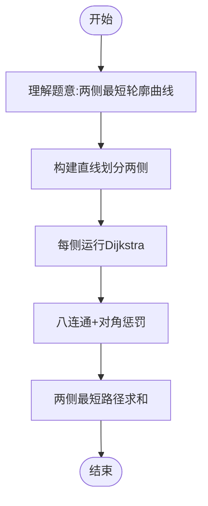

# L3-018 - 森森美图（30 分）

- **时间限制**: 400 ms
- **内存限制**: 65536 KB
- **代码长度限制**: 16 KB

---

## 题目描述

森森最近想让自己的朋友圈熠熠生辉，所以他决定自己写个美化照片的软件，并起名为森森美图。众所周知，在合照中美化自己的面部而不美化合照者的面部是让自己占据朋友圈高点的绝好方法，因此森森美图里当然得有这个功能。 这个功能的第一步是将自己的面部选中。森森首先计算出了一个图像中所有像素点与周围点的相似程度的分数，分数越低表示某个像素点越“像”一个轮廓边缘上的点。 森森认为，任意连续像素点的得分之和越低，表示它们组成的曲线和轮廓边缘的重合程度越高。为了选择出一个完整的面部，森森决定让用户选择面部上的两个像素点A和B，则连接这两个点的直线就将图像分为两部分，然后在这两部分中分别寻找一条从A到B且与轮廓重合程度最高的曲线，就可以拼出用户的面部了。 然而森森计算出来得分矩阵后，突然发现自己不知道怎么找到这两条曲线了，你能帮森森当上朋友圈的小王子吗？

为了解题方便，我们做出以下补充说明：

- 图像的左上角是坐标原点(0,0)，我们假设所有像素按矩阵格式排列，其坐标均为非负整数（即横轴向右为正，纵轴向下为正）。
- 忽略正好位于连接A和B的直线（注意不是线段）上的像素点，即不认为这部分像素点在任何一个划分部分上，因此曲线也不能经过这部分像素点。
- 曲线是八连通的（即任一像素点可与其周围的8个像素连通），但为了计算准确，某像素连接对角相邻的斜向像素时，得分**额外增加**两个像素分数和的$$\sqrt{2}$$倍减一。例如样例中，经过坐标为(3,1)和(4,2)的两个像素点的曲线，其得分应该是这两个像素点的分数和(2+2)，再加上额外的(2+2)乘以($$\sqrt{2}-1$$)，即约为5.66。

### 输入格式:

输入在第一行给出两个正整数$$N$$和$$M$$（$$5 \le N, M \le 100$$），表示像素得分矩阵的行数和列数。

接下来$$N$$行，每行$$M$$个不大于1000的非负整数，即为像素点的分值。

最后一行给出用户选择的起始和结束像素点的坐标$$(X_{start}, Y_{start})$$和$$(X_{end}, Y_{end})$$。4个整数用空格分隔。

### 输出格式:

在一行中输出划分图片后找到的轮廓曲线的得分和，保留小数点后两位。注意起点和终点的得分不要重复计算。

### 输入样例:

```in
6 6
9 0 1 9 9 9
9 9 1 2 2 9
9 9 2 0 2 9
9 9 1 1 2 9
9 9 3 3 1 1
9 9 9 9 9 9
2 1 5 4
```

### 输出样例:

```out
27.04
```

## 示例

### 示例 1

**输入:**
```
6 6
9 0 1 9 9 9
9 9 1 2 2 9
9 9 2 0 2 9
9 9 1 1 2 9
9 9 3 3 1 1
9 9 9 9 9 9
2 1 5 4
```

**输出:**
```
27.04
```

---

## 题目详解

### 一、解题思路

将像素作为八连通带权图顶点，直线两侧分别禁止经过直线上的像素和另一侧像素。用 Dijkstra 分别求两侧从 A 到 B 的最小曲线得分，再合并两条曲线的端点得分。

### 二、代码流程说明

1. 读取像素得分和 A、B 坐标，按叉积判断像素所在直线一侧。
2. 在每一侧进行八方向 Dijkstra，对斜向边加入额外代价。
3. 两侧均可达时减去重复计算的 A、B 得分，否则取可达曲线的最小值。

### 三、代码实现

```r
# 实现原理：把原问题拆成规模更小的子问题，用状态转移保存已计算结果，避免重复计算。
# 处理流程：读取输入 -> 建立状态 -> 执行算法 -> 按题目格式输出。
# 关键变量和循环均直接对应题目中的数据、约束或操作。

# 读取并解析标准输入。
v <- scan("stdin", what = numeric(), quiet = TRUE)
if (length(v) >= 6L) {
    n <- as.integer(v[1])
    m <- as.integer(v[2])
    score <- matrix(v[seq.int(3L, 2L + n * m)], nrow = n, ncol = m,
        byrow = TRUE)
    p <- 3L + n * m
    sx <- as.integer(v[p])
    sy <- as.integer(v[p + 1L])
    ex <- as.integer(v[p + 2L])
    ey <- as.integer(v[p + 3L])
    sx1 <- sx + 1L
    sy1 <- sy + 1L
    ex1 <- ex + 1L
    ey1 <- ey + 1L
    cross <- function(x, y) (ex - sx) * (y - sy) - (ey - sy) *
        (x - sx)
    run <- function(side) {
        d <- matrix(Inf, nrow = n, ncol = m)
        d[sy1, sx1] <- score[sy1, sx1]
        hd <- numeric()
        hx <- integer()
        hy <- integer()
        hs <- 0L
        push <- function(dd, xx, yy) {
            hs <<- hs + 1L
            i <- hs
# 按题目约束遍历当前数据，更新中间状态。
            while (i > 1L) {
                z <- i%/%2L
                if (hd[z] <= dd)
                  break
                hd[i] <<- hd[z]
                hx[i] <<- hx[z]
                hy[i] <<- hy[z]
                i <- z
            }
            hd[i] <<- dd
            hx[i] <<- xx
            hy[i] <<- yy
        }
        pop <- function() {
            dd <- hd[1L]
            xx <- hx[1L]
            yy <- hy[1L]
            ld <- hd[hs]
            lx <- hx[hs]
            ly <- hy[hs]
            hs <<- hs - 1L
            if (hs > 0L) {
                i <- 1L
                while (i * 2L <= hs) {
                  z <- i * 2L
                  if (z < hs && hd[z + 1L] < hd[z])
                    z <- z + 1L
                  if (hd[z] >= ld)
                    break
                  hd[i] <<- hd[z]
                  hx[i] <<- hx[z]
                  hy[i] <<- hy[z]
                  i <- z
                }
                hd[i] <<- ld
                hx[i] <<- lx
                hy[i] <<- ly
            }
            c(dd, xx, yy)
        }
        push(d[sy1, sx1], sx1, sy1)
        while (hs > 0L) {
            item <- pop()
            du <- item[1]
            x1 <- as.integer(item[2])
            y1 <- as.integer(item[3])
            if (du != d[y1, x1])
                next
            for (dx in -1:1) for (dy in -1:1) {
                if (dx == 0L && dy == 0L)
                  next
                nx <- x1 + dx
                ny <- y1 + dy
                if (nx < 1L || nx > m || ny < 1L || ny > n)
                  next
                x0 <- nx - 1L
                y0 <- ny - 1L
# 执行核心排序、状态转移或选择逻辑。
                endpoint <- (nx == sx1 && ny == sy1) || (nx ==
                  ex1 && ny == ey1)
                cr <- cross(x0, y0)
                if (!endpoint && (cr == 0 || ((cr > 0) != side)))
                  next
                extra <- if (dx != 0L && dy != 0L)
                  (score[y1, x1] + score[ny, nx]) * (sqrt(2) -
                    1)
                else 0
                nd <- du + score[ny, nx] + extra
                if (nd < d[ny, nx]) {
                  d[ny, nx] <- nd
                  push(nd, nx, ny)
                }
            }
        }
        d[ey1, ex1]
    }
    a <- run(TRUE)
    b <- run(FALSE)
    ans <- if (!is.finite(a) || !is.finite(b))
        min(a, b)
    else a + b - score[sy1, sx1] - score[ey1, ex1]
# 严格按照题目规定的输出格式输出答案。
    cat(sprintf("%.2f\n", ans))
}
```

### 四、代码流程图



### 五、解题流程图



### 六、常见易错点

- 题目描述、输入格式、输出格式和输入输出样例必须保持原文不变。
- R 语言下标从 1 开始，注意编号转换和空输入边界。
- 输出时严格保留题目规定的空格、换行和小数位数。
