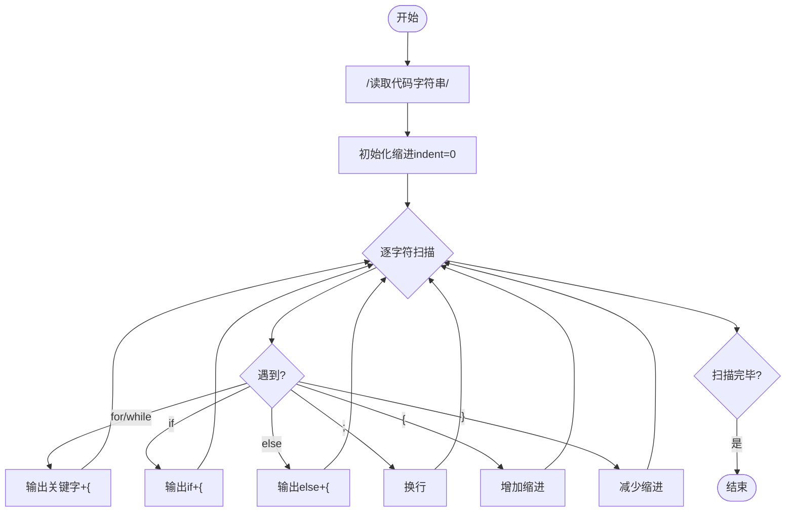
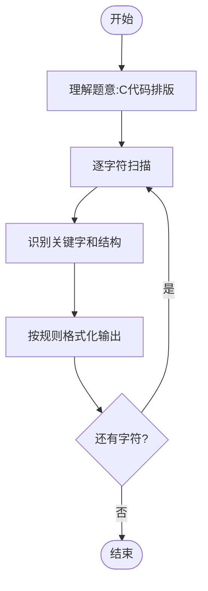

# L3-019 - 代码排版（30 分）

- **时间限制**: 150 ms
- **内存限制**: 65536 KB
- **代码长度限制**: 16 KB

---

## 题目描述

某编程大赛中设计有一个挑战环节，选手可以查看其他选手的代码，发现错误后，提交一组测试数据将对手挑落马下。为了减小被挑战的几率，有些选手会故意将代码写得很难看懂，比如把所有回车去掉，提交所有内容都在一行的程序，令挑战者望而生畏。

为了对付这种选手，现请你编写一个代码排版程序，将写成一行的程序重新排版。当然要写一个完美的排版程序可太难了，这里只简单地要求处理C语言里的for、while、if-else这三种特殊结构，而将其他所有句子都当成顺序执行的语句处理。输出的要求如下：

- 默认程序起始没有缩进；每一级缩进是 2 个空格；
- 每行开头除了规定的缩进空格外，不输出多余的空格；
- 顺序执行的程序体是以分号“;”结尾的，遇到分号就换行；
- 在一对大括号“{”和“}”中的程序体输出时，两端的大括号单独占一行，内部程序体每行加一级缩进，即：

```
{
  程序体
}
```

- for的格式为：

```
for (条件) {
  程序体
}
```

- while的格式为：

```
while (条件) {
  程序体
}
```

- if-else的格式为：

```
if (条件) {
  程序体
}
else {
  程序体
}
```

### 输入格式:

输入在一行中给出不超过 331 个字符的非空字符串，以回车结束。题目保证输入的是一个语法正确、可以正常编译运行的 main 函数模块。

### 输出格式:

按题面要求的格式，输出排版后的程序。

### 输入样例:

```in
int main()  {int n, i;  scanf("%d", &n);if( n>0)n++;else if (n<0) n--; else while(n<10)n++; for(i=0;  i<n; i++ ){ printf("n=%d\n", n);}return  0; }
```

### 输出样例:

```out
int main()
{
  int n, i;
  scanf("%d", &n);
  if ( n>0) {
    n++;
  }
  else {
    if (n<0) {
      n--;
    }
    else {
      while (n<10) {
        n++;
      }
    }
  }
  for (i=0;  i<n; i++ ) {
    printf("n=%d\n", n);
  }
  return  0;
}
```

## 示例

### 示例 1

**输入:**
```
int main()  {int n, i;  scanf("%d", &n);if( n>0)n++;else if (n<0) n--; else while(n<10)n++; for(i=0;  i<n; i++ ){ printf("n=%d\n", n);}return  0; }
```

**输出:**
```
int main()
{
  int n, i;
  scanf("%d", &n);
  if ( n>0) {
    n++;
  }
  else {
    if (n<0) {
      n--;
    }
    else {
      while (n<10) {
        n++;
      }
    }
  }
  for (i=0;  i<n; i++ ) {
    printf("n=%d\n", n);
  }
  return  0;
}
```

---

## 题目详解

### 一、解题思路

本题的 R 实现采用以下方法：按行或按字段解析输入，使用字符串或序列操作完成题目要求的变换，并按格式输出。

### 二、代码流程说明

1. 读取并解析标准输入，转换为题目所需的数据结构。
2. 按题意执行核心算法，维护中间状态并处理边界情况。
3. 整理计算结果，按照输出格式生成答案。

### 三、代码实现

```r
# 实现原理：按行或按字段解析输入，使用字符串或序列操作完成题目要求的变换，并按格式输出。
# 处理流程：读取输入 -> 建立状态 -> 执行算法 -> 按题目格式输出。
# 关键变量和循环均直接对应题目中的数据、约束或操作。

# 读取并解析标准输入。
src <- paste(readLines("stdin", warn = FALSE), collapse = "\n")
if (nzchar(trimws(src))) {
    s <- src
    n <- nchar(s)
    p <- 1L
    out <- character()
    add <- function(x) out <<- c(out, x)
    skip <- function() while (p <= n && grepl("[[:space:]]",
        substr(s, p, p))) p <<- p + 1L
    kw <- function(w) {
        e <- p + nchar(w) - 1L
        if (e > n || substr(s, p, e) != w)
            return(FALSE)
        e == n || !grepl("[[:alnum:]_]", substr(s, e + 1L, e +
            1L))
    }
    read_paren <- function() {
        start <- p
        dep <- 0L
        quote <- ""
        esc <- FALSE
# 按题目约束遍历当前数据，更新中间状态。
        while (p <= n) {
            z <- substr(s, p, p)
            if (esc)
                esc <- FALSE
            else if (nzchar(quote)) {
                if (z == "\\")
                  esc <- TRUE
                else if (z == quote)
                  quote <- ""
            }
            else if (z %in% c("\"", "'"))
                quote <- z
            else if (z == "(")
                dep <- dep + 1L
            else if (z == ")") {
                dep <- dep - 1L
                p <<- p + 1L
                if (dep == 0L)
                  break
                next
            }
            p <<- p + 1L
        }
        substr(s, start, p - 1L)
    }
    semi <- function() {
        i <- p
        dep <- 0L
        quote <- ""
        esc <- FALSE
        while (i <= n) {
            z <- substr(s, i, i)
            if (esc)
                esc <- FALSE
            else if (nzchar(quote)) {
                if (z == "\\")
                  esc <- TRUE
                else if (z == quote)
                  quote <- ""
            }
            else if (z %in% c("\"", "'"))
                quote <- z
            else if (z == "(")
                dep <- dep + 1L
            else if (z == ")")
                dep <- max(0L, dep - 1L)
            else if (z == ";" && dep == 0L)
                return(i)
            i <- i + 1L
        }
        n
    }
    one <- NULL
    stat <- NULL
    control <- NULL
    one <- function(ind) {
        skip()
        if (p > n)
            return()
        if (kw("if"))
            control("if", ind)
        else if (kw("for"))
            control("for", ind)
        else if (kw("while"))
            control("while", ind)
        else if (substr(s, p, p) == "{") {
            add(paste0(strrep("  ", ind), "{"))
            p <<- p + 1L
            stat(ind + 1L)
            skip()
            if (p <= n && substr(s, p, p) == "}") {
                add(paste0(strrep("  ", ind), "}"))
                p <<- p + 1L
            }
        }
        else {
            j <- semi()
            add(paste0(strrep("  ", ind), trimws(substr(s, p,
                j))))
            p <<- j + 1L
        }
    }
    stat <- function(ind) {
        repeat {
            skip()
            if (p > n || substr(s, p, p) == "}")
                return()
            one(ind)
        }
    }
    control <- function(name, ind) {
        p <<- p + nchar(name)
        skip()
        cond <- if (p <= n && substr(s, p, p) == "(")
            read_paren()
        else ""
        add(paste0(strrep("  ", ind), name, " ", cond, " {"))
        skip()
        if (p <= n && substr(s, p, p) == "{") {
            p <<- p + 1L
            stat(ind + 1L)
            skip()
            if (p <= n && substr(s, p, p) == "}")
                p <<- p + 1L
        }
        else one(ind + 1L)
        add(paste0(strrep("  ", ind), "}"))
        if (name == "if") {
            save <- p
            skip()
            if (kw("else")) {
                p <<- p + 4L
                skip()
                add(paste0(strrep("  ", ind), "else {"))
                if (kw("if"))
                  control("if", ind + 1L)
                else {
                  if (p <= n && substr(s, p, p) == "{") {
                    p <<- p + 1L
                    stat(ind + 1L)
                    skip()
                    if (p <= n && substr(s, p, p) == "}")
                      p <<- p + 1L
                  }
                  else one(ind + 1L)
                }
                add(paste0(strrep("  ", ind), "}"))
            }
            else p <<- save
        }
    }
    skip()
    j <- regexpr("{", s, fixed = TRUE)[1]
    if (j > 0L) {
        add(trimws(substr(s, p, j - 1L)))
        add("{")
        p <- j + 1L
        stat(1L)
        skip()
        if (p <= n && substr(s, p, p) == "}") {
            add("}")
            p <- p + 1L
        }
    }
    else stat(0L)
# 严格按照题目规定的输出格式输出答案。
    cat(paste(out, collapse = "\n"), "\n", sep = "")
}
```

### 四、代码流程图



### 五、解题流程图



### 六、常见易错点

- 题目描述、输入格式、输出格式和输入输出样例必须保持原文不变。
- R 语言下标从 1 开始，注意编号转换和空输入边界。
- 输出时严格保留题目规定的空格、换行和小数位数。
