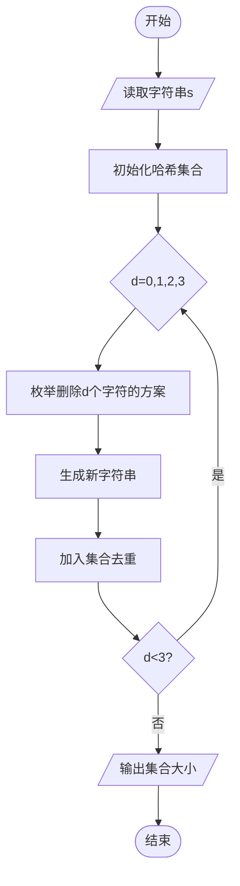
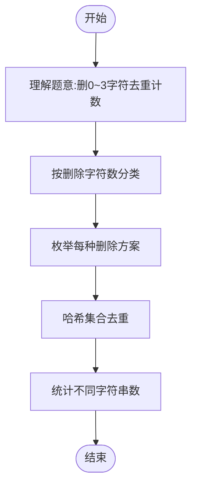

# L3-020 - 至多删三个字符（30 分）

- **时间限制**: 400 ms
- **内存限制**: 65536 KB
- **代码长度限制**: 16 KB

---

## 题目描述

给定一个全部由小写英文字母组成的字符串，允许你至多删掉其中 3 个字符，结果可能有多少种不同的字符串？

### 输入格式:

输入在一行中给出全部由小写英文字母组成的、长度在区间 [4, $$10^6$$] 内的字符串。

### 输出格式:

在一行中输出至多删掉其中 3 个字符后不同字符串的个数。

### 输入样例:

```in
ababcc
```

### 输出样例:

```out
25
```

**提示：**

删掉 0 个字符得到 "ababcc"。

删掉 1 个字符得到 "babcc", "aabcc", "abbcc", "abacc" 和 "ababc"。

删掉 2 个字符得到 "abcc", "bbcc", "bacc", "babc", "aacc", "aabc", "abbc", "abac" 和 "abab"。

删掉 3 个字符得到 "abc", "bcc", "acc", "bbc", "bac", "bab", "aac", "aab", "abb" 和 "aba"。

## 示例

### 示例 1

**输入:**
```
ababcc
```

**输出:**
```
25
```

---

## 题目详解

### 一、解题思路

用按删除字符数分层的不同子序列动态规划计数。加入当前字符时先增加“保留当前字符”和“删除当前字符”两类状态；若该字符此前出现过，则扣除会因相同结尾而重复的状态。

### 二、代码流程说明

1. 维护恰好删除 0、1、2、3 个字符的不同子序列数量。
2. 用每个字母最近一次出现前的状态扣除重复子序列，历史只需保留前 4 个删除层。
3. 汇总四层状态，得到至多删除三个字符的结果数。

### 三、代码实现

```r
# 实现原理：按字符扫描并动态维护删除次数为 0 至 3 时的不同子序列数量，利用每个字符上次出现位置消除重复计数。
# 处理流程：读取输入 -> 建立状态 -> 执行算法 -> 按题目格式输出。
# 关键变量和循环均直接对应题目中的数据、约束或操作。

# 读取并解析标准输入。
s <- readLines("stdin", warn = FALSE)
if (length(s) > 0L) {
    s <- trimws(s[1])
    chars <- strsplit(s, "", fixed = TRUE)[[1]]
    kmax <- 3L
    f <- c(1, 0, 0, 0)
    hist <- matrix(0, nrow = 5L, ncol = 4L)
    hist[1, ] <- f
    last <- rep(-1L, 26L)
# 按题目约束遍历当前数据，更新中间状态。
    for (i in seq_along(chars)) {
        code <- utf8ToInt(chars[i]) - utf8ToInt("a") + 1L
        previous <- last[code]
        nf <- numeric(4L)
        for (k in 0:3) {
            nf[k + 1L] <- f[k + 1L] + if (k > 0)
                f[k]
            else 0
            if (previous >= 0L && i - previous <= k)
                nf[k + 1L] <- nf[k + 1L] - hist[(previous - 1L)%%5L +
                  1L, k - (i - previous) + 1L]
        }
        f <- nf
        hist[i%%5L + 1L, ] <- f
        last[code] <- i
    }
# 严格按照题目规定的输出格式输出答案。
    cat(format(sum(f), scientific = FALSE, trim = TRUE), "\n",
        sep = "")
}
```

### 四、代码流程图



### 五、解题流程图



### 六、常见易错点

- 题目描述、输入格式、输出格式和输入输出样例必须保持原文不变。
- R 语言下标从 1 开始，注意编号转换和空输入边界。
- 输出时严格保留题目规定的空格、换行和小数位数。
