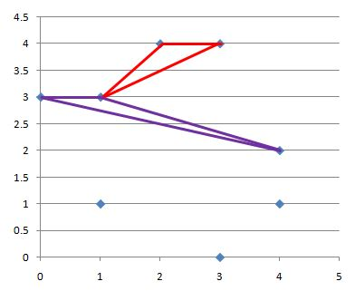
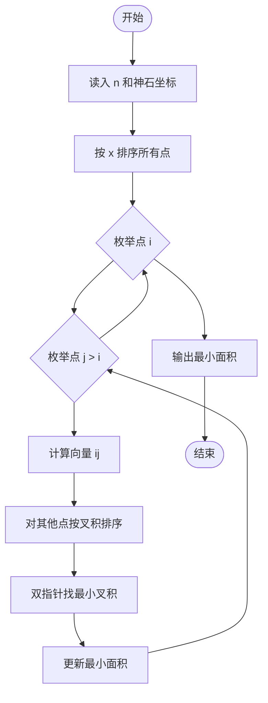
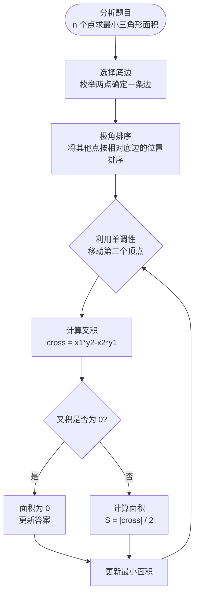

# L3-021 - 神坛（30 分）

- **时间限制**: 8000 ms
- **内存限制**: 65536 KB
- **代码长度限制**: 16 KB

---

## 题目描述

在古老的迈瑞城，巍然屹立着 n 块神石。长老们商议，选取 3 块神石围成一个神坛。因为神坛的能量强度与它的面积成反比，因此神坛的面积越小越好。特殊地，如果有两块神石坐标相同，或者三块神石共线，神坛的面积为 `0.000`。

长老们发现这个问题没有那么简单，于是委托你编程解决这个难题。

### 输入格式:

输入在第一行给出一个正整数 n（3 $$\le$$ n $$\le$$ 5000）。随后 n 行，每行有两个整数，分别表示神石的横坐标、纵坐标（$$-10^9 \le$$ 横坐标、纵坐标 $$< 10^9$$）。

### 输出格式:

在一行中输出神坛的最小面积，四舍五入保留 3 位小数。

### 输入样例:

```in
8
3 4
2 4
1 1
4 1
0 3
3 0
1 3
4 2
```

### 输出样例:

```out
0.500
```

## 示例

### 示例 1

**输入:**
```
8
3 4
2 4
1 1
4 1
0 3
3 0
1 3
4 2
```

**输出:**
```
0.500
```

## 样例解释

输出的数值等于图中红色或紫色框线的三角形的面积。



**鸣谢浙江师范大学伍泰炜补充测试数据！**

---

## 题目详解

### 一、解题思路

固定一个神石后，按极角排序其他神石。最小面积三角形的另外两个顶点必为极角序中相邻的点，因此只需检查相邻向量的叉积绝对值。

### 二、代码流程说明

1. 以每个神石为基准点，计算到其他点的极角和向量。
2. 按极角排序，检查相邻向量（含首尾相邻）的叉积。
3. 取最小二倍面积并除以 2，按三位小数输出。

### 三、代码实现

```r
# 实现原理：先解析数据并按题目规定的关键字排序，再进行顺序处理和格式化输出。
# 处理流程：读取输入 -> 建立状态 -> 执行算法 -> 按题目格式输出。
# 关键变量和循环均直接对应题目中的数据、约束或操作。

# 读取并解析标准输入。
v <- scan("stdin", what = numeric(), quiet = TRUE)
if (length(v) > 0L) {
    n <- as.integer(v[1])
    x <- v[seq(2L, 2L * n, by = 2L)]
    y <- v[seq(3L, 2L * n + 1L, by = 2L)]
    best <- Inf
# 按题目约束遍历当前数据，更新中间状态。
    for (i in seq_len(n)) {
        dx <- x[-i] - x[i]
        dy <- y[-i] - y[i]
# 执行核心排序、状态转移或选择逻辑。
        ord <- order(atan2(dy, dx))
        dx <- dx[ord]
        dy <- dy[ord]
        z <- length(dx)
        for (j in seq_len(z)) {
            h <- if (j == z)
                1L
            else j + 1L
            cross <- dx[j] * dy[h] - dy[j] * dx[h]
            if (abs(cross) < best)
                best <- abs(cross)
        }
    }
# 严格按照题目规定的输出格式输出答案。
    cat(sprintf("%.3f\n", best/2))
}
```

### 四、代码流程图



### 五、解题流程图



### 六、常见易错点

- 题目描述、输入格式、输出格式和输入输出样例必须保持原文不变。
- R 语言下标从 1 开始，注意编号转换和空输入边界。
- 输出时严格保留题目规定的空格、换行和小数位数。
