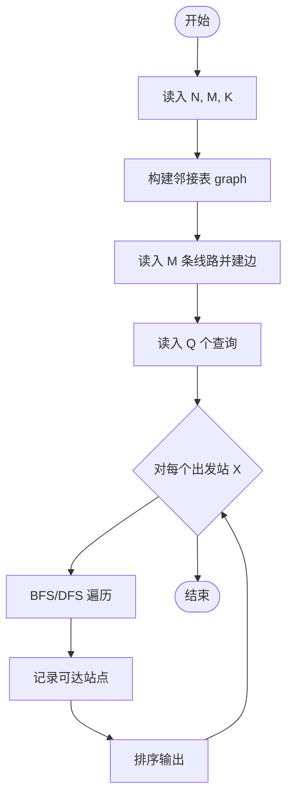
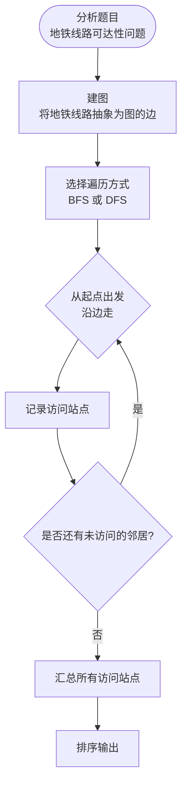

# L3-022 - 地铁一日游（30 分）

- **时间限制**: 550 ms
- **内存限制**: 65536 KB
- **代码长度限制**: 16 KB

---

## 题目描述

森森喜欢坐地铁。这个假期，他终于来到了传说中的地铁之城——魔都，打算好好过一把坐地铁的瘾！

魔都地铁的计价规则是：起步价 2 元，出发站与到达站的最短距离（即**计费距离**）每 K 公里增加 1 元车费。

例如取 **K** = 10，动安寺站离魔都绿桥站为 40 公里，则车费为 2 + 4 = 6 元。

为了获得最大的满足感，森森决定用以下的方式坐地铁：在某一站上车（不妨设为地铁站 **A**），则对于所有车费相同的到达站，森森只会在计费距离最远的站或线路末端站点出站，然后用森森美图 App 在站点外拍一张认证照，再按同样的方式前往下一个站点。

坐着坐着，森森突然好奇起来：在给定出发站的情况下（在出发时森森也会拍一张照），他的整个旅程中能够留下哪些站点的认证照？

地铁是铁路运输的一种形式，指在地下运行为主的城市轨道交通系统。一般来说，地铁由若干个站点组成，并有多条不同的线路双向行驶，可类比公交车，当两条或更多条线路经过同一个站点时，可进行**换乘**，更换自己所乘坐的线路。举例来说，魔都 1 号线和 2 号线都经过人民广场站，则乘坐 1 号线到达人民广场时就可以换乘到 2 号线前往 2 号线的各个站点。换乘不需出站（也拍不到认证照），因此森森乘坐地铁时换乘不受限制。

### 输入格式:

输入第一行是三个正整数 **N**、**M** 和 **K**，表示魔都地铁有 **N** 个车站 (1 &leq; **N** &leq; 200)，**M** 条线路 (1 &leq; **M** &leq; 1500)，最短距离每超过 **K** 公里 (1 &leq; **K** &leq; 10<sup>6</sup>)，加 1 元车费。

接下来 **M** 行，每行由以下格式组成：

<站点1><空格><距离><空格><站点2><空格><距离><空格><站点3> ... <站点X-1><空格><距离><空格><站点X>

其中站点是一个 1 到 **N** 的编号；两个站点编号之间的距离指两个站在该线路上的距离。两站之间距离是一个不大于 10<sup>6</sup> 的正整数。一条线路上的站点互不相同。

**注意**：两个站之间可能有多条直接连接的线路，且距离不一定相等。

再接下来有一个正整数 **Q** (1 &leq; **Q** &leq; 200)，表示森森尝试从 **Q** 个站点出发。

最后有 **Q** 行，每行一个正整数 **X<sub>i</sub>**，表示森森尝试从编号为 **X<sub>i</sub>** 的站点出发。

### 输出格式:

对于森森每个尝试的站点，输出一行若干个整数，表示能够到达的站点编号。站点编号从小到大排序。

### 输入样例:

```in
6 2 6
1 6 2 4 3 1 4
5 6 2 6 6
4
2
3
4
5
```

### 输出样例:

```out
1 2 4 5 6
1 2 3 4 5 6
1 2 4 5 6
1 2 4 5 6
```

## 示例

### 示例 1

**输入:**
```
6 2 6
1 6 2 4 3 1 4
5 6 2 6 6
4
2
3
4
5
```

**输出:**
```
1 2 4 5 6
1 2 3 4 5 6
1 2 4 5 6
1 2 4 5 6
```

---

## 题目详解

### 一、解题思路

先用 Floyd-Warshall 求任意两站的最短计费距离，再按每个费用档次保留最远站和线路末端站。最后在“可到达认证站”图上 BFS 求闭包。

### 二、代码流程说明

1. 将每条线路的相邻站加入无向图，并标记线路端点。
2. Floyd-Warshall 求最短距离，按费用档次分组。
3. 对每个站建立可继续到达的站点集合，逐个出发点 BFS 并升序输出。

### 三、代码实现

```r
# 实现原理：先建立图结构，再用最短路或距离状态逐步松弛，最后根据距离和题目规则输出结果。
# 处理流程：读取输入 -> 建立状态 -> 执行算法 -> 按题目格式输出。
# 关键变量和循环均直接对应题目中的数据、约束或操作。

# 读取并解析标准输入。
lines <- readLines("stdin", warn = FALSE)
if (length(lines) > 0L) {
    first <- as.integer(strsplit(trimws(lines[1]), " +")[[1]])
    n <- first[1]
    m <- first[2]
    k <- first[3]
    inf <- 1e+30
    d <- matrix(inf, nrow = n, ncol = n)
    diag(d) <- 0
    terminal <- rep(FALSE, n)
# 按题目约束遍历当前数据，更新中间状态。
    for (i in seq_len(m)) {
        z <- as.integer(strsplit(trimws(lines[i + 1L]), " +")[[1]])
        stations <- z[seq(1L, length(z), by = 2L)]
        distances <- z[seq(2L, length(z), by = 2L)]
        terminal[c(stations[1], stations[length(stations)])] <- TRUE
        if (length(stations) > 1L)
            for (j in seq_len(length(stations) - 1L)) {
                a <- stations[j]
                b <- stations[j + 1L]
                w <- distances[j]
                d[a, b] <- min(d[a, b], w)
                d[b, a] <- min(d[b, a], w)
            }
    }
    for (mid in seq_len(n)) for (i in seq_len(n)) if (d[i, mid] <
        inf)
        for (j in seq_len(n)) {
            z <- d[i, mid] + d[mid, j]
            if (z < d[i, j])
                d[i, j] <- z
        }
    successors <- vector("list", n)
    for (i in seq_len(n)) {
        successors[[i]] <- integer()
        valid <- which(seq_len(n) != i & d[i, ] < inf)
        groups <- split(valid, floor(d[i, valid]/k))
        for (g in groups) {
            far <- max(d[i, g])
            successors[[i]] <- c(successors[[i]], g[d[i, g] ==
                far | terminal[g]])
        }
    }
    q <- as.integer(lines[m + 2L])
    out <- character(q)
    for (i in seq_len(q)) {
        start <- as.integer(lines[m + 2L + i])
        seen <- rep(FALSE, n)
        seen[start] <- TRUE
        queue <- start
        head <- 1L
        while (head <= length(queue)) {
            u <- queue[head]
            head <- head + 1L
            for (w in successors[[u]]) if (!seen[w]) {
                seen[w] <- TRUE
                queue <- c(queue, w)
            }
        }
        out[i] <- paste(which(seen), collapse = " ")
    }
# 严格按照题目规定的输出格式输出答案。
    cat(paste(out, collapse = "\n"), "\n", sep = "")
}
```

### 四、代码流程图



### 五、解题流程图



### 六、常见易错点

- 题目描述、输入格式、输出格式和输入输出样例必须保持原文不变。
- R 语言下标从 1 开始，注意编号转换和空输入边界。
- 输出时严格保留题目规定的空格、换行和小数位数。
