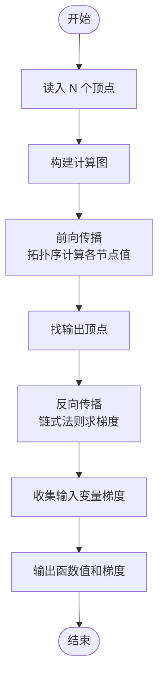
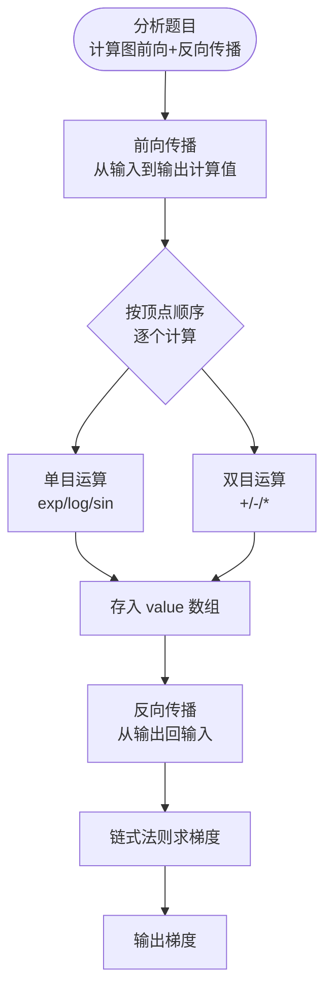

# L3-023 - 计算图（30 分）

- **时间限制**: 400 ms
- **内存限制**: 65536 KB
- **代码长度限制**: 16 KB

---

## 题目描述

“计算图”（computational graph）是现代深度学习系统的基础执行引擎，提供了一种表示任意数学表达式的方法，例如用有向无环图表示的神经网络。 图中的节点表示基本操作或输入变量，边表示节点之间的中间值的依赖性。 例如，下图就是一个函数
$$f(x_1,x_2)=\ln x_1 + x_1 x_2 - \sin x_2$$
的计算图。


现在给定一个计算图，请你根据所有输入变量计算函数值及其偏导数（即梯度）。 例如，给定输入$$ x_1 = 2, x_2 = 5 $$，上述计算图获得函数值 $$ f(2,5)=\ln (2) + 2\times 5 - \sin (5) = 11.652$$；并且根据微分链式法则，上图得到的梯度 $$\nabla f = [\partial f / \partial x_1 , \partial f / \partial x_2 ] =   [ 1/x_1 + x_2 , x_1 - \cos x_2] = [5.500,1.716]$$。

知道你已经把微积分忘了，所以这里只要求你处理几个简单的算子：加法、减法、乘法、指数（$$e^x$$，即编程语言中的 exp(x) 函数）、对数（$$\ln x$$，即编程语言中的 log(x) 函数）和正弦函数（$$\sin x$$，即编程语言中的 sin(x) 函数）。

友情提醒：

- 常数的导数是 0；$$x$$ 的导数是 1；$$e^x$$ 的导数还是 $$e^x$$；$$\ln x$$ 的导数是 $$1/x$$；$$\sin x$$ 的导数是 $$\cos x$$。
- 回顾一下什么是**偏导数**：在数学中，一个多变量的函数的偏导数，就是它关于其中一个变量的导数而保持其他变量恒定。在上面的例子中，当我们对 $$x_1$$ 求偏导数 $$\partial f / \partial x_1$$ 时，就将 $$x_2$$ 当成常数，所以得到 $$\ln x_1$$ 的导数是 $$1/x_1$$，$$x_1 x_2$$ 的导数是 $$x_2$$，$$\sin x_2$$ 的导数是 0。
- 回顾一下**链式法则**：复合函数的导数是构成复合这有限个函数在相应点的导数的乘积，即若有 $$u=f(y)$$，$$y=g(x)$$，则 $$du/dx = du/dy \cdot dy/dx$$。例如对 $$\sin (\ln x)$$ 求导，就得到 $$\cos (\ln x) \cdot (1/x)$$。

如果你注意观察，可以发现在计算图中，计算函数值是一个从左向右进行的计算，而计算偏导数则正好相反。

### 输入格式:

输入在第一行给出正整数 $$N$$（$$\le 5\times 10^4$$），为计算图中的顶点数。

以下 $$N$$ 行，第 $$i$$ 行给出第 $$i$$ 个顶点的信息，其中 $$i=0, 1, \cdots , N-1$$。第一个值是顶点的类型编号，分别为：

- 0 代表输入变量
- 1 代表加法，对应 $$x_1 + x_2$$
- 2 代表减法，对应 $$x_1 - x_2$$
- 3 代表乘法，对应 $$x_1 \times x_2$$
- 4 代表指数，对应 $$e^x$$
- 5 代表对数，对应 $$\ln x$$
- 6 代表正弦函数，对应 $$\sin x$$

对于输入变量，后面会跟它的双精度浮点数值；对于单目算子，后面会跟它对应的单个变量的顶点编号（编号从 0 开始）；对于双目算子，后面会跟它对应两个变量的顶点编号。

题目保证只有一个输出顶点（即没有出边的顶点，例如上图最右边的 `-`），且计算过程不会超过双精度浮点数的计算精度范围。

### 输出格式:

首先在第一行输出给定计算图的函数值。在第二行顺序输出函数对于每个变量的偏导数的值，其间以一个空格分隔，行首尾不得有多余空格。偏导数的输出顺序与输入变量的出现顺序相同。输出小数点后 3 位。

### 输入样例:

```in
7
0 2.0
0 5.0
5 0
3 0 1
6 1
1 2 3
2 5 4
```

### 输出样例:

```out
11.652
5.500 1.716
```

## 示例

### 示例 1

**输入:**
```
7
0 2.0
0 5.0
5 0
3 0 1
6 1
1 2 3
2 5 4
```

**输出:**
```
11.652
5.500 1.716
```

---

## 题目详解

### 一、解题思路

先按依赖关系拓扑排序并正向计算每个节点的值，再从唯一输出节点沿逆拓扑序传播梯度，应用各算子的局部导数。

### 二、代码流程说明

1. 记录节点类型、输入节点和出边，计算入度。
2. 拓扑排序后按顺序计算加减乘、exp、log、sin 的值。
3. 从唯一汇点反向传播梯度，输出各输入变量的偏导数。

### 三、代码实现

```r
# 实现原理：先对计算图拓扑排序并按依赖关系计算各结点值，再沿逆拓扑序反向传播导数，得到每个输入结点的梯度。
# 处理流程：读取输入 -> 建立状态 -> 执行算法 -> 按题目格式输出。
# 关键变量和循环均直接对应题目中的数据、约束或操作。

# 读取并解析标准输入。
lines <- readLines("stdin", warn = FALSE)
if (length(lines) > 0L) {
    n <- as.integer(strsplit(trimws(lines[1]), " +")[[1]][1])
    typ <- integer(n)
    val <- numeric(n)
    ins <- vector("list", n)
    outs <- vector("list", n)
    indeg <- integer(n)
    input_nodes <- integer()
# 按题目约束遍历当前数据，更新中间状态。
    for (i in seq_len(n)) {
        z <- as.numeric(strsplit(trimws(lines[i + 1L]), " +")[[1]])
        typ[i] <- z[1]
        if (typ[i] == 0) {
            val[i] <- z[2]
            input_nodes <- c(input_nodes, i)
        }
        else {
            cnt <- if (typ[i] <= 3)
                2L
            else 1L
            ins[[i]] <- z[seq(2L, cnt + 1L)] + 1L
            indeg[i] <- cnt
            for (u in ins[[i]]) outs[[u]] <- c(outs[[u]], i)
        }
    }
    queue <- which(indeg == 0L)
    head <- 1L
    topo <- integer()
    while (head <= length(queue)) {
        u <- queue[head]
        head <- head + 1L
        topo <- c(topo, u)
        for (w in outs[[u]]) {
            indeg[w] <- indeg[w] - 1L
            if (indeg[w] == 0L)
                queue <- c(queue, w)
        }
    }
    for (u in topo) {
        z <- ins[[u]]
        if (typ[u] == 1)
            val[u] <- val[z[1]] + val[z[2]]
        else if (typ[u] == 2)
            val[u] <- val[z[1]] - val[z[2]]
        else if (typ[u] == 3)
            val[u] <- val[z[1]] * val[z[2]]
        else if (typ[u] == 4)
            val[u] <- exp(val[z[1]])
        else if (typ[u] == 5)
            val[u] <- log(val[z[1]])
        else if (typ[u] == 6)
            val[u] <- sin(val[z[1]])
    }
    output_node <- which(lengths(outs) == 0L)[1L]
    grad <- numeric(n)
    grad[output_node] <- 1
    for (u in rev(topo)) {
        g <- grad[u]
        if (g == 0)
            next
        z <- ins[[u]]
        if (typ[u] == 1) {
            grad[z[1]] <- grad[z[1]] + g
            grad[z[2]] <- grad[z[2]] + g
        }
        else if (typ[u] == 2) {
            grad[z[1]] <- grad[z[1]] + g
            grad[z[2]] <- grad[z[2]] - g
        }
        else if (typ[u] == 3) {
            grad[z[1]] <- grad[z[1]] + g * val[z[2]]
            grad[z[2]] <- grad[z[2]] + g * val[z[1]]
        }
        else if (typ[u] == 4)
            grad[z[1]] <- grad[z[1]] + g * val[u]
        else if (typ[u] == 5)
            grad[z[1]] <- grad[z[1]] + g/val[z[1]]
        else if (typ[u] == 6)
            grad[z[1]] <- grad[z[1]] + g * cos(val[z[1]])
    }
    grad_out <- sprintf("%.3f", ifelse(abs(grad[input_nodes]) <
        5e-04, 0, grad[input_nodes]))
# 严格按照题目规定的输出格式输出答案。
    cat(sprintf("%.3f\n%s\n", val[output_node], paste(grad_out,
        collapse = " ")))
}
```

### 四、代码流程图



### 五、解题流程图



### 六、常见易错点

- 题目描述、输入格式、输出格式和输入输出样例必须保持原文不变。
- R 语言下标从 1 开始，注意编号转换和空输入边界。
- 输出时严格保留题目规定的空格、换行和小数位数。
