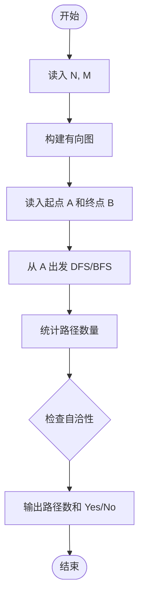
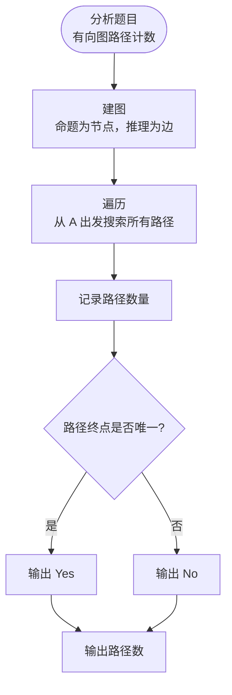

# L3-025 - 那就别担心了（30 分）

- **时间限制**: 400 ms
- **内存限制**: 65536 KB
- **代码长度限制**: 16 KB

---

## 题目描述

下图转自“英式没品笑话百科”的新浪微博 —— 所以无论有没有遇到难题，其实都不用担心。


博主将这种逻辑推演称为“逻辑自洽”，即从某个命题出发的所有推理路径都会将结论引导到同一个最终命题（开玩笑的，千万别以为这是真正的逻辑自洽的定义……）。现给定一个更为复杂的逻辑推理图，本题就请你检查从一个给定命题到另一个命题的推理是否是“逻辑自洽”的，以及存在多少种不同的推理路径。例如上图，从“你遇到难题了吗？”到“那就别担心了”就是一种“逻辑自洽”的推理，一共有 3 条不同的推理路径。

### 输入格式:

输入首先在一行中给出两个正整数 $$N$$（$$1 < N \le 500$$）和 $$M$$，分别为命题个数和推理个数。这里我们假设命题从 1 到 $$N$$ 编号。

接下来 $$M$$ 行，每行给出一对命题之间的推理关系，即两个命题的编号 `S1 S2`，表示可以从 `S1` 推出 `S2`。题目保证任意两命题之间只存在最多一种推理关系，且任一命题不能循环自证（即从该命题出发推出该命题自己）。

最后一行给出待检验的两个命题的编号 `A B`。

### 输出格式:

在一行中首先输出从 `A` 到 `B` 有多少种不同的推理路径，然后输出 `Yes` 如果推理是“逻辑自洽”的，或 `No` 如果不是。

题目保证输出数据不超过 $$10^9$$。

### 输入样例 1:

```in
7 8
7 6
7 4
6 5
4 1
5 2
5 3
2 1
3 1
7 1
```

### 输出样例 1:

```out
3 Yes
```

### 输入样例 2:

```in
7 8
7 6
7 4
6 5
4 1
5 2
5 3
6 1
3 1
7 1
```

### 输出样例 2:

```out
3 No
```

## 示例

### 示例 1

**输入:**
```
7 8
7 6
7 4
6 5
4 1
5 2
5 3
2 1
3 1
7 1
```

**输出:**
```
3 Yes
```

### 示例 2

**输入:**
```
7 8
7 6
7 4
6 5
4 1
5 2
5 3
6 1
3 1
7 1
```

**输出:**
```
3 No
```

---

## 题目详解

### 一、解题思路

在从 A 可达的子图上检查有向环，并反向标记能到达 B 的节点。只有该子图无环且每个可达节点都能到 B 时才逻辑自洽；同时用拓扑序动态规划统计路径数。

### 二、代码流程说明

1. BFS 求 A 的可达节点，并检查可达子图中的有向环。
2. 从 B 反向搜索，判断所有可达节点是否都能到达 B。
3. 对可达 DAG 做拓扑排序和路径数 DP，输出数量及一致性。

### 三、代码实现

```r
# 实现原理：限定在起点可达子图中检测环，并从终点反向标记可达结点；无环且所有可达点能到终点时，用拓扑序累计路径数。
# 处理流程：读取输入 -> 建立状态 -> 执行算法 -> 按题目格式输出。
# 关键变量和循环均直接对应题目中的数据、约束或操作。

# 读取并解析标准输入。
v <- scan("stdin", what = integer(), quiet = TRUE)
if (length(v) > 0L) {
    n <- v[1]
    m <- v[2]
    p <- 3L
    graph <- vector("list", n)
    revg <- vector("list", n)
# 按题目约束遍历当前数据，更新中间状态。
    for (i in seq_len(n)) {
        graph[[i]] <- integer()
        revg[[i]] <- integer()
    }
    if (m > 0L)
        for (i in seq_len(m)) {
            a <- v[p]
            b <- v[p + 1L]
            p <- p + 2L
            graph[[a]] <- c(graph[[a]], b)
            revg[[b]] <- c(revg[[b]], a)
        }
    s <- v[p]
    target <- v[p + 1L]
    reachable <- rep(FALSE, n)
    reachable[s] <- TRUE
    queue <- s
    head <- 1L
    while (head <= length(queue)) {
        u <- queue[head]
        head <- head + 1L
        for (w in graph[[u]]) if (!reachable[w]) {
            reachable[w] <- TRUE
            queue <- c(queue, w)
        }
    }
    color <- integer(n)
    cycle <- FALSE
    dfs <- function(u) {
        color[u] <<- 1L
        for (w in graph[[u]]) if (reachable[w]) {
            if (color[w] == 1L)
                cycle <<- TRUE
            else if (color[w] == 0L)
                dfs(w)
        }
        color[u] <<- 2L
    }
    for (u in which(reachable)) if (color[u] == 0L)
        dfs(u)
    can <- rep(FALSE, n)
    can[target] <- TRUE
    queue <- target
    head <- 1L
    while (head <= length(queue)) {
        u <- queue[head]
        head <- head + 1L
        for (w in revg[[u]]) if (!can[w]) {
            can[w] <- TRUE
            queue <- c(queue, w)
        }
    }
    consistent <- !cycle && all(can[which(reachable)])
    indeg <- integer(n)
    for (u in which(reachable)) for (w in graph[[u]]) if (reachable[w])
        indeg[w] <- indeg[w] + 1L
    queue <- which(reachable & indeg == 0L)
    head <- 1L
    topo <- integer()
    while (head <= length(queue)) {
        u <- queue[head]
        head <- head + 1L
        topo <- c(topo, u)
        for (w in graph[[u]]) if (reachable[w]) {
            indeg[w] <- indeg[w] - 1L
            if (indeg[w] == 0L)
                queue <- c(queue, w)
        }
    }
    ways <- numeric(n)
    ways[s] <- 1
    for (u in topo) if (u != target)
        for (w in graph[[u]]) if (reachable[w])
            ways[w] <- ways[w] + ways[u]
# 严格按照题目规定的输出格式输出答案。
    cat(format(ways[target], scientific = FALSE, trim = TRUE),
        if (consistent)
            " Yes\n"
        else " No\n", sep = "")
}
```

### 四、代码流程图



### 五、解题流程图



### 六、常见易错点

- 题目描述、输入格式、输出格式和输入输出样例必须保持原文不变。
- R 语言下标从 1 开始，注意编号转换和空输入边界。
- 输出时严格保留题目规定的空格、换行和小数位数。
