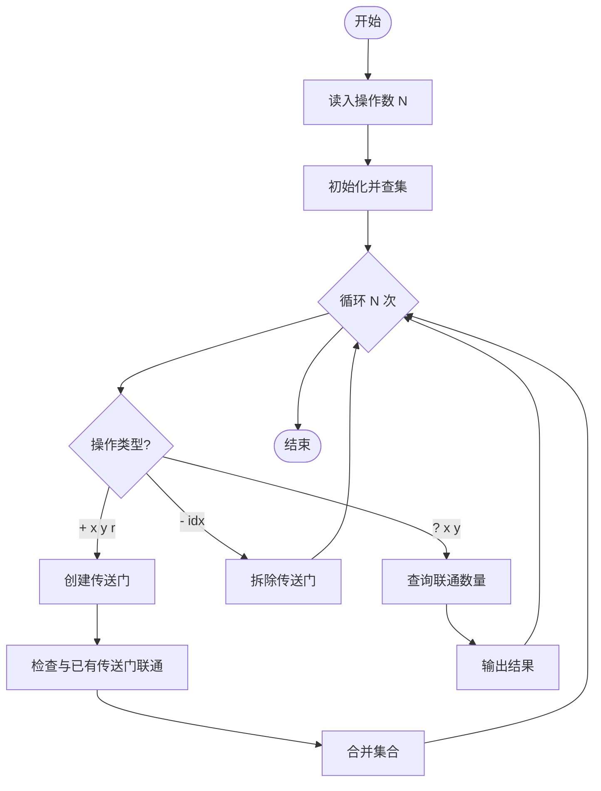
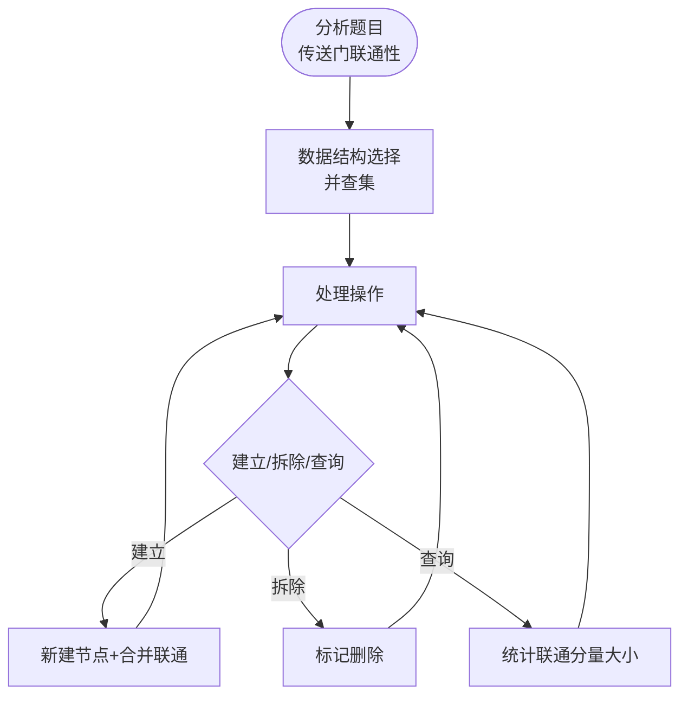

# L3-026 - 传送门（30 分）

- **时间限制**: 3500 ms
- **内存限制**: 524288 KB
- **代码长度限制**: 16 KB

---

## 题目描述

平面上有 $$2n$$ 个点，它们的坐标分别是 $$(1, 0), (2, 0), \cdots (n, 0)$$ 和 $$(1, 10^9), (2, 10^9), \cdots, (n, 10^9)$$。我们称这些点中所有 $$y$$ 坐标为 $$0$$ 的点为“起点”，所有 $$y$$ 坐标为 $$10^9$$ 的点为终点。一个机器人将从坐标为 $$(x, 0)$$ 的起点出发向 $$y$$ 轴正方向移动。显然，该机器人最后会到达某个终点，我们设该终点的 $$x$$ 坐标为 $$f(x)$$。

在上述条件下，显然有 $$f(x) = x$$。不过这样的数学模型就太无趣了，因此我们对上述数学模型做一些小小的改变。我们将会对模型进行 $$q$$ 次修改，每一次修改都是以下两种操作之一：

* \+ $$x'$$ $$x''$$ $$y$$: 在 $$(x', y)$$ 与 $$(x'', y)$$ 处增加一对传送门。当机器人碰到其中一个传送门时，它会立刻被传送到另一个传送门处。数据保证进行该操作时，$$(x', y)$$ 与 $$(x'', y)$$ 处当前不存在传送门。
* \- $$x'$$ $$x''$$ $$y$$: 移除 $$(x', y)$$ 与 $$(x'', y)$$ 处的一对传送门。数据保证这对传送门存在。

求每次修改后 $$\sum\limits_{x=1}^n xf(x)$$ 的值。

### 输入格式:

第一行输入两个整数 $$n$$ 与 $$q$$ ($$2 \le n \le 10^5$$, $$1 \le q \le 10^5$$)，代表起点和终点的数量以及修改的次数。

接下来 $$q$$ 行中，第 $$i$$ 行输入一个字符 $$op_i$$ 以及三个整数 $$x'_i$$, $$x''_i$$ and $$y_i$$ ($$op_i \in \{\text{`+' (ascii: 43)}, \text{`-' (ascii: 45)}\}$$, $$1 \le x'_i < x''_i \le n$$, $$1 \le y_i < 10^9$$)，代表第 $$i$$ 次修改的内容。修改顺序与输入顺序相同。

### 输出格式:

输出 $$q$$ 行，其中第 $$i$$ 行包含一个整数代表第 $$i$$ 次修改后的答案。

### 输入样例:

```in
5 4
+ 1 3 1
+ 1 4 3
+ 2 5 2
- 1 4 3
```

### 输出样例:

```out
51
48
39
42
```

## 样例解释：

修改 | $$f(1)$$ | $$f(2)$$ | $$f(3)$$ | $$f(4)$$ | $$f(5)$$ | 结果
--- | ---
\+ 1 3 1 | 3 | 2 | 1 | 4 | 5 | 51
\+ 1 4 3 | 3 | 2 | 4 | 1 | 5 | 48
\+ 2 5 2 | 3 | 5 | 4 | 1 | 2 | 39
\- 1 4 3 | 3 | 5 | 1 | 4 | 2 | 42

## 示例

### 示例 1

**输入:**
```
5 4
+ 1 3 1
+ 1 4 3
+ 2 5 2
- 1 4 3
```

**输出:**
```
51
48
39
42
```

---

## 题目详解

### 一、解题思路

本题的 R 实现采用以下方法：将输入组织为矩阵或表格，按题目定义的行、列和状态关系完成计算。

### 二、代码流程说明

1. 读取并解析标准输入，转换为题目所需的数据结构。
2. 按题意执行核心算法，维护中间状态并处理边界情况。
3. 整理计算结果，按照输出格式生成答案。

### 三、代码实现

```r
# 实现原理：将输入组织为矩阵或表格，按题目定义的行、列和状态关系完成计算。
# 处理流程：读取输入 -> 建立状态 -> 执行算法 -> 按题目格式输出。
# 关键变量和循环均直接对应题目中的数据、约束或操作。

# 读取并解析标准输入。
v <- scan("stdin", what = "", quiet = TRUE)
if (length(v) > 0L) {
    n <- as.integer(v[1])
    q <- as.integer(v[2])
    p <- 3L
    active <- matrix(numeric(), nrow = 0L, ncol = 3L)
    out <- numeric(q)
# 按题目约束遍历当前数据，更新中间状态。
    for (step in seq_len(q)) {
        op <- v[p]
        x <- as.integer(v[p + 1L])
        y <- as.integer(v[p + 2L])
        level <- as.integer(v[p + 3L])
        p <- p + 4L
        same <- nrow(active) > 0L & active[, 1] == x & active[,
            2] == y & active[, 3] == level
        if (op == "+")
            active <- rbind(active, c(x, y, level))
        else active <- active[!same, , drop = FALSE]
        if (nrow(active))
# 执行核心排序、状态转移或选择逻辑。
            active <- active[order(active[, 3], seq_len(nrow(active))),
                , drop = FALSE]
        where <- seq_len(n)
        for (i in seq_len(nrow(active))) {
            a <- active[i, 1]
            b <- active[i, 2]
            z <- where[a]
            where[a] <- where[b]
            where[b] <- z
        }
        out[step] <- sum((seq_len(n)) * where)
    }
# 严格按照题目规定的输出格式输出答案。
    cat(paste(format(out, scientific = FALSE, trim = TRUE), collapse = "\n"),
        "\n", sep = "")
}
```

### 四、代码流程图



### 五、解题流程图



### 六、常见易错点

- 题目描述、输入格式、输出格式和输入输出样例必须保持原文不变。
- R 语言下标从 1 开始，注意编号转换和空输入边界。
- 输出时严格保留题目规定的空格、换行和小数位数。
