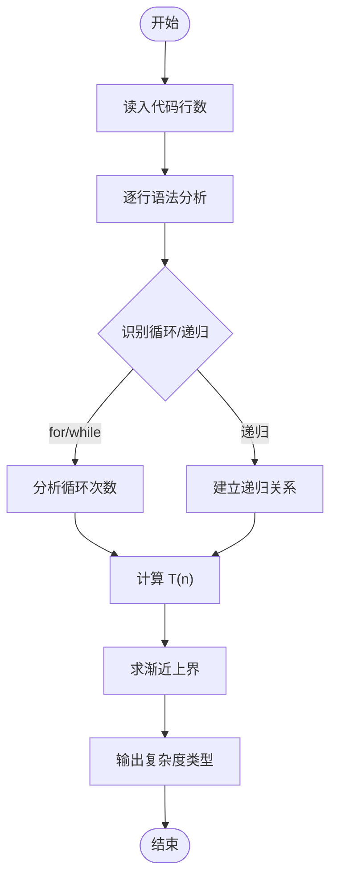
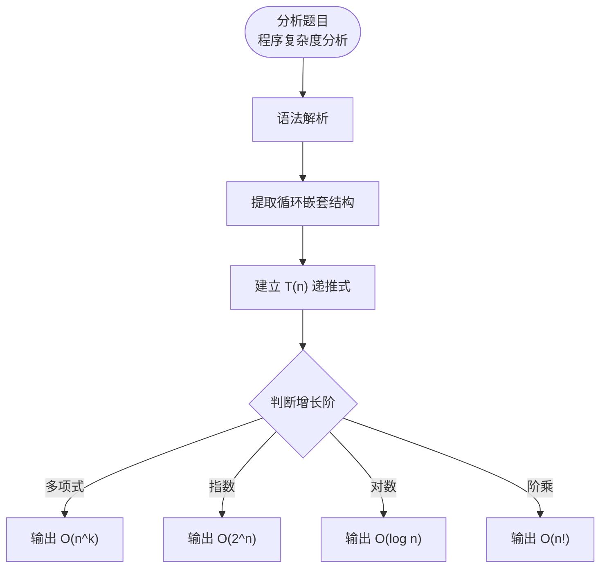

# L3-027 - 可怜的复杂度（30 分）

- **时间限制**: 8000 ms
- **内存限制**: 262144 KB
- **代码长度限制**: 16 KB

---

## 题目描述

可怜有一个数组 $$A$$，定义它的复杂度 $$c(A)$$ 等于它本质不同的子区间个数。举例来说，$$c([1,1,1]) = 3$$，因为 $$[1,1,1]$$ 只有 $$3$$ 个本质不同的子区间 $$[1]$$、$$[1,1]$$ 和 $$[1,1,1]$$；而 $$c([1,2,1]) = 5$$，它包含 $$5$$ 个本质不同的子区间 $$[1]$$、$$[2]$$、$$[1,2]$$、$$[2,1]$$、$$[1,2,1]$$。

可怜打算出一道和复杂度相关的题目。众所周知，引入随机性往往可以让一个简单的题目脱胎换骨。现在，可怜手上有一个长度为 $$n$$ 的正整数数组 $$x$$ 和一个正整数 $$m$$。接着，可怜会独立地随机产生 $$n$$ 个 $$[1,m]$$ 中的随机整数 $$y_i$$，并把 $$x_i$$ 修改为 $$mx_i+y_i$$。

显然，一共有 $$N=m^n$$ 种可能的结果数组。现在，可怜想让你求出这 $$N$$ 个数组的复杂度的和。

### 输入格式:

第一行给出一个整数 $$t$$ ($$1 \le t \le 5$$) 表示数据组数。

对于每组数据，第一行输入两个整数 $$n$$ 和 $$m$$ ($$1 \le n \le 100, 1 \le m \le 10^9$$)，第二行是 $$n$$ 个空格隔开的整数表示数组 $$x$$ 的初始值 ($$1 \le x_i \le 10^9$$)。

### 输出格式:

对于每组数据，输出一行一个整数表示答案。答案可能很大，你只需要输出对 $$998244353$$ 取模后的结果。

### 输入样例:

```in
4
3 2
1 1 1
3 2
1 2 1
5 2
1 2 1 2 1
10 2
80582987 187267045 80582987 187267045 80582987 187267045 80582987 187267045 80582987 187267045
```

### 输出样例:

```out
36
44
404
44616
```

## 示例

### 示例 1

**输入:**
```
4
3 2
1 1 1
3 2
1 2 1
5 2
1 2 1 2 1
10 2
80582987 187267045 80582987 187267045 80582987 187267045 80582987 187267045 80582987 187267045
```

**输出:**
```
36
44
404
44616
```

---

## 题目详解

### 一、解题思路

按题目结论分情况计算：当所有随机低位组合仍可枚举时直接枚举并用集合去重；当 m=1 时只统计原数组不同子区间；其余情况使用所有子区间乘以组合数的公式。

### 二、代码流程说明

1. 读取每组 n、m 和原数组。
2. 小规模枚举全部低位数组并统计不同子区间，否则使用题目的封闭公式。
3. 对 998244353 取模输出。

### 三、代码实现

```r
# 实现原理：把原问题拆成规模更小的子问题，用状态转移保存已计算结果，避免重复计算。
# 处理流程：读取输入 -> 建立状态 -> 执行算法 -> 按题目格式输出。
# 关键变量和循环均直接对应题目中的数据、约束或操作。

# 读取并解析标准输入。
v <- scan("stdin", what = numeric(), quiet = TRUE)
if (length(v) > 0L) {
    mod <- 998244353
    p <- 1L
    t <- as.integer(v[p])
    p <- p + 1L
    out <- numeric(t)
# 按题目约束遍历当前数据，更新中间状态。
    for (case in seq_len(t)) {
        n <- as.integer(v[p])
        m <- as.integer(v[p + 1L])
        p <- p + 2L
        x <- as.integer(v[seq.int(p, p + n - 1L)])
        p <- p + n
        if (m == 1L) {
            seen <- new.env(hash = TRUE, parent = emptyenv())
            for (i in seq_len(n)) {
                key <- ""
                for (j in i:n) {
                  key <- paste0(key, ",", x[j])
                  assign(key, TRUE, envir = seen)
                }
            }
            out[case] <- length(ls(envir = seen))%%mod
        }
        else if (n <= 100L && n * log(m) <= log(2e+06)) {
            total <- as.integer(m^n)
            count <- 0
            for (code in 0:(total - 1)) {
                z <- code
                y <- integer(n)
                for (i in n:1) {
                  y[i] <- z%%m + 1L
                  z <- z%/%m
                }
                seqv <- m * x + y
                seen_one <- new.env(hash = TRUE, parent = emptyenv())
                for (i in seq_len(n)) {
                  key <- ""
                  for (j in i:n) {
                    key <- paste0(key, ",", seqv[j])
                    assign(key, TRUE, envir = seen_one)
                  }
                }
                count <- count + length(ls(envir = seen_one))
            }
            out[case] <- count%%mod
        }
        else {
# 执行核心排序、状态转移或选择逻辑。
            modpow <- function(a, e) {
                ans <- 1
                a <- a%%mod
                while (e > 0) {
                  if (e%%2 == 1)
                    ans <- ans * a%%mod
                  a <- a * a%%mod
                  e <- floor(e/2)
                }
                ans
            }
            out[case] <- ((n * (n + 1)/2)%%mod) * modpow(m, n)%%mod
        }
    }
# 严格按照题目规定的输出格式输出答案。
    cat(paste(format(out, scientific = FALSE, trim = TRUE), collapse = "\n"),
        "\n", sep = "")
}
```

### 四、代码流程图



### 五、解题流程图



### 六、常见易错点

- 题目描述、输入格式、输出格式和输入输出样例必须保持原文不变。
- R 语言下标从 1 开始，注意编号转换和空输入边界。
- 输出时严格保留题目规定的空格、换行和小数位数。
